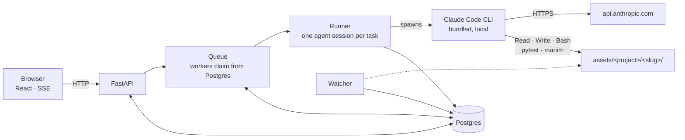
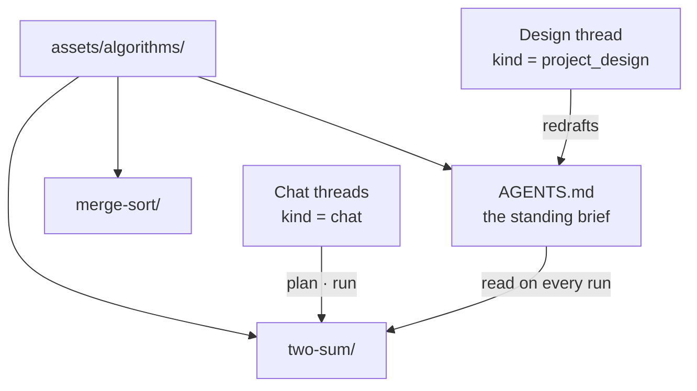
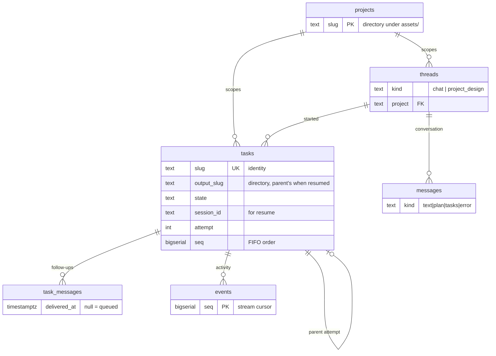
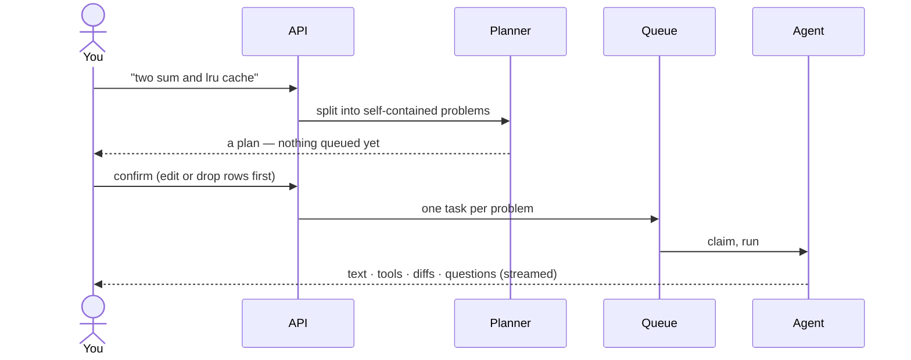
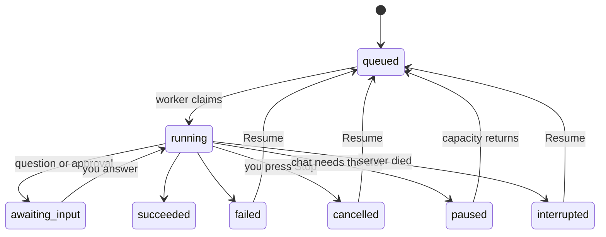
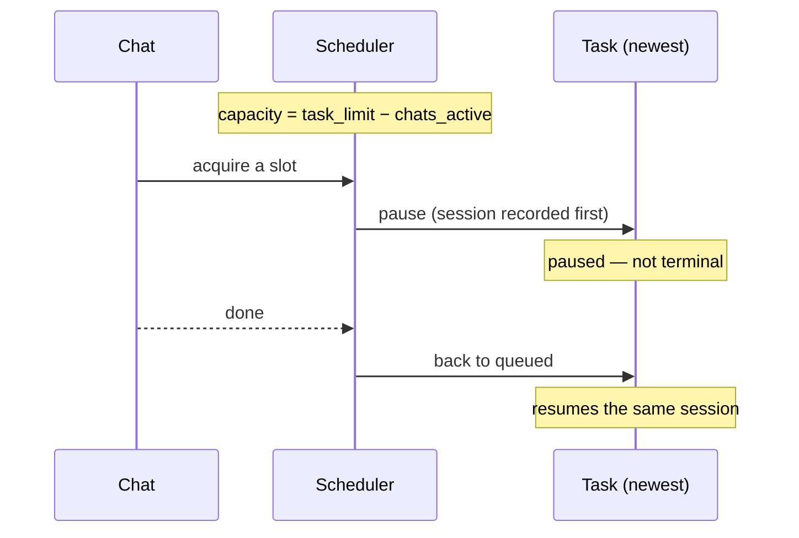
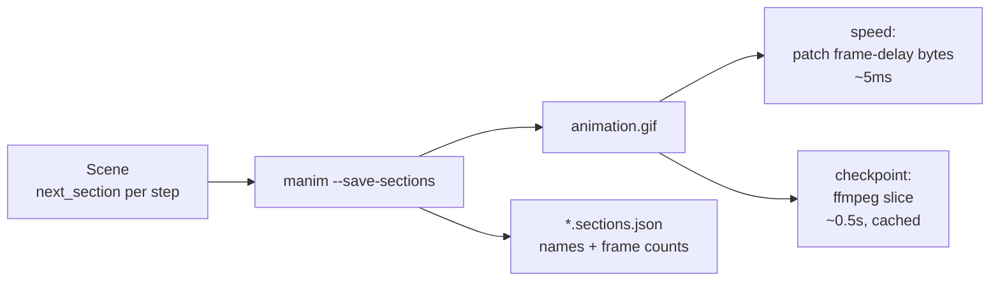

# dex — design

dex turns an interview-style algorithm problem into a study package: several
solutions, a test suite it actually runs, an explanation with mermaid diagrams,
and manim animations you can step through. You drive it from a phone or a
browser; the work happens on your machine.

---

## 1. Shape of the system



Only inference leaves the machine. The agent loop, every tool call, the test
runs and the renders are local, in the task's own directory.

**Modules.** `api` (HTTP + SSE) · `queue` (claiming, the priority ladder) ·
`runner` (one task through the SDK) · `store` (all reads and writes) ·
`bus` (events) · `permissions` · `planner` · `prompts` · `feed` ·
`animation` + `gifinfo` · `watcher` · `fake_agent` (scripted, for offline work).

---

## 1a. Projects

A **project** is a named body of work: a subdirectory of `assets/` holding its
own `AGENTS.md` and one directory per task.



Switching project switches everything the UI shows: its threads, its feed, its
guide. Each project has exactly one design thread, created with the project and
pinned above the rest — it is the conversation that shapes the guide rather than
one that produces work. A design turn is a single tool-less call: the model gets
the current guide and answers with the whole guide back plus a note on what
changed; dex writes the file. There is one file in play, so filesystem tools
would add risk and nothing else.

---

## 2. Data model



Two more tables stand alone: `settings` (key/value: concurrency limits, model,
auto-approve, animation speed) and `topic_reviews` (spaced repetition per
project and topic).

**The one distinction worth remembering:** `slug` is a task's identity and is
unique; `output_slug` is the directory it writes into. A resumed attempt has its
own slug but keeps its parent's directory, so it continues the package instead
of opening an empty one beside it. Anything keyed on the wrong one looks in the
wrong place.

---

## 3. From a message to a package



Planning is a separate, tool-less, single-turn call: it reads nothing and writes
nothing, so it cannot wander into the filesystem. Its output is a proposal —
tasks exist only once you confirm.

---

## 4. Task lifecycle



`paused` and `interrupted` both mean *nothing went wrong with the work*.
`paused` resolves itself; `interrupted` waits for you. A resumed attempt passes
`resume=<session_id>` to the SDK, so the agent keeps what it had worked out.

---

## 5. The priority ladder

A chat is short and someone is waiting on it. A task is long and nobody is.



The newest task is displaced because the least work is lost. The chat gate and
the task gate are separate locks, so a claim is re-checked after it is made and
handed back if a chat took the last slot meanwhile.

---

## 6. Events: one stream, replayable

Every event is written to Postgres **before** it is delivered, and `seq` comes
from the database. So `?after=<seq>` means the same thing to a client
reconnecting after a server restart as to one that never dropped — which is what
makes a reloaded page show a run's full history instead of a blank panel.

```
runner ──emit──▶ bus queue ──single writer──▶ INSERT … RETURNING seq ──▶ subscribers (SSE)
```

Twenty-two event types, all rendered by a UI that never sees an SDK message:
prose (`text_delta`), reasoning (`thinking_delta`), `tool`, `diff`, `approval`,
`question`, `cost`, `asset`, `task_state`. The runner is the only place that
knows the SDK's shape.

---

## 7. Permissions

An unattended run cannot prompt for everything and must not be handed the
machine. So:

| | |
|---|---|
| Reads, search, `TodoWrite` | allowed |
| Writes | only inside the task's own directory |
| Shell | an allowlist (`python`, `pytest`, `manim`, …), **never** chained (`&&`, `\|`, backticks, `$()`) |
| Anything else | escalated to you; the agent parks until answered |

The **auto-approve** toggle is enforced here, in the permission callback — not
in the UI. A client that merely hid the prompt would leave the agent parked
forever. It is read at each decision, so turning it on frees runs already in
flight; clarifying questions are deliberately excluded, because those need a
person.

---

## 8. Animations

Manim writes one GIF per approach and records the scene's `next_section()`
boundaries. Those sections become the checkpoints you step through.



A GIF has no seek and plays at its baked-in delays, so both controls are derived
server-side. Speed touches only the Graphic Control Extension bytes — no decode.
Slicing needs a real decode because frames are deltas; ffmpeg does it in about
half a second where an image tool took thirteen. `dex-warm` builds every slice up
front.

Without sections the viewer falls back to equal unnamed slices, so
`assets/algorithms/AGENTS.md` tells the agent to mark its steps — and is re-read
on every run, including resumes.

---

## 9. The review feed

Finished packages become a vertical reel: animation, complexity table, then links
to the code, tests, and explanation. Ordering is a small SM-2 — most overdue
first, then never seen, then soonest due. A reel runs for as long as its
animation, holds five seconds, then advances and records the view.

---

## 10. Decisions worth knowing

- **Postgres holds the queue, not memory.** Work queued before a restart is
  picked up after it; a task the server died on becomes `interrupted` rather
  than vanishing. Claiming uses `FOR UPDATE SKIP LOCKED`, ordered by a
  `BIGSERIAL` — `created_at` is the transaction clock and tasks submitted
  together can share it.
- **Limits are settings, not config.** Task and chat concurrency, the model, the
  animation speed, and auto-approve live in `settings` and are re-read
  continuously. Raising a limit wakes idle workers; lowering it lets running work
  finish.
- **Reporting cannot end a run.** Translating an agent message into events —
  cost estimates, diffs, tool titles — is wrapped so a failure is logged and
  surfaced as a non-fatal note. Errors from *receiving* messages still fail the
  task, because those mean the agent has stopped. This exists because a missing
  import in the cost estimator once failed three real tasks.
- **Follow-ups are queued, not injected.** A note typed while a task runs is held
  until it stops, then becomes the brief for the next attempt in the same
  directory. Interrupting a run to deliver a note would discard work in progress.
- **Cost is estimated live, then corrected.** A running list-price estimate
  accrues from each message's usage (marked `~`), replaced by the agent's own
  total when it reports. Threads sum their tasks.
- **`DEX_FAKE_AGENT=1` replays a scripted run.** It mirrors the real runner
  exactly — including *not* emitting state changes the real one doesn't — because
  a convenience in the double once hid a staleness bug from every test.

---

## 11. What is proven, and what is not

Verified end to end: crash → `interrupted` → resume in the same directory ·
event replay across a restart · the auto-approve toggle releasing a parked
approval · queued follow-ups reviving a finished task · checkpoints from a real
scene · the feed against real packages · concurrency limits, preemption and
resumption (scripted agent).

**Not verified against a live agent:** resume and preemption reattaching to a
real SDK session mid-run. The plumbing is exercised; the reattachment is not.

Tests: 142, no credentials or network needed. Database-backed tests use
`dex_test` and skip themselves when no server is reachable.
