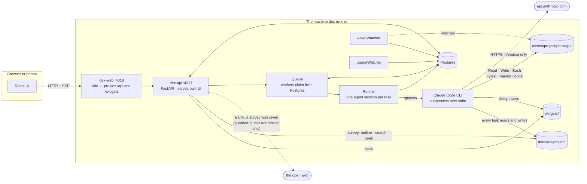
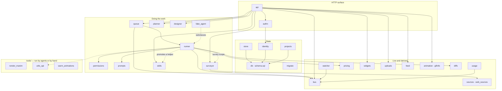
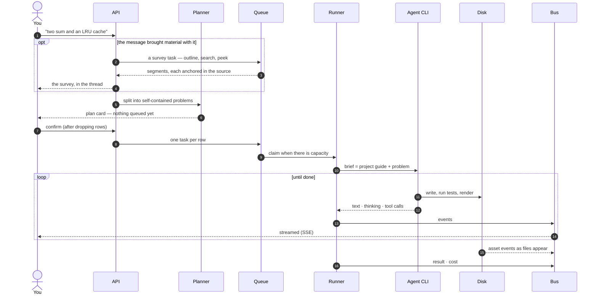
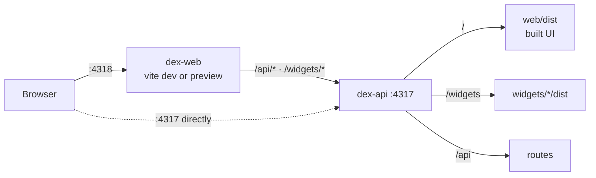
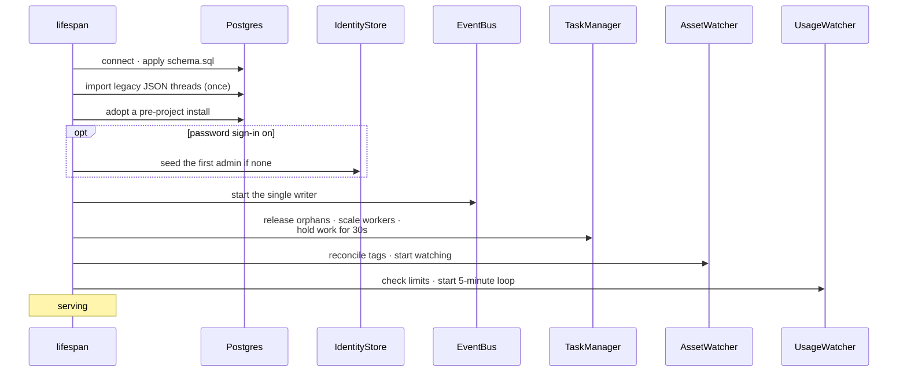
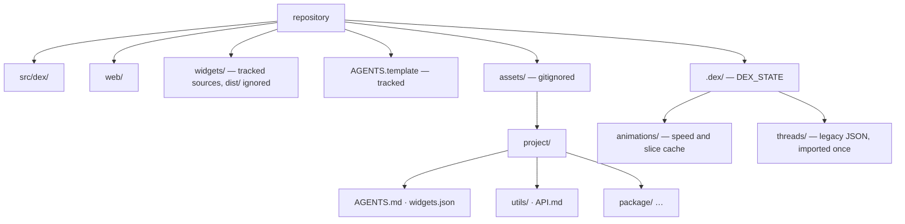

# 00 · System overview

## Summary

dex is an asynchronous task server that drives the **Claude Agent SDK** to
produce study material — algorithm packages, 3D yoga poses, music scores, or
whatever a project's guide describes. You drive it from a browser or a phone;
the work happens on the machine dex runs on.

A request travels **message → plan → confirmed tasks → agent sessions →
files on disk**, and every step is streamed back to the UI as it happens. A
message that arrives with material attached — a document, a link — gains one
step in front: a **survey** reads the shape of that material so the plan can be
cut out of it rather than guessed at. See [14](14_survey_and_anchors.md).

Only inference leaves the machine, with one exception: a survey may fetch a URL
the operator named, behind a guard that refuses every non-public address. The
agent loop, each tool call, test runs and renders all execute locally in the
task's own directory.

This document is the map. Each feature has its own document:

| Doc | Feature |
|---|---|
| [01](01_auth.md) | Authentication and roles |
| [02](02_task_lifecycle.md) | Task queue and lifecycle |
| [03](03_agent_runner.md) | Agent runner |
| [04](04_planning_chat.md) | Planning chat |
| [05](05_project_design.md) | Projects and the design chat |
| [06](06_widgets.md) | Project widgets |
| [07](07_event_stream.md) | Live event stream |
| [08](08_shared_utilities.md) | Shared utilities |
| [09](09_costs_and_limits.md) | Costs, tokens and usage limits |
| [10](10_data_model.md) | Data model |
| [11](11_animations.md) | Animations |
| [12](12_review_feed.md) | Review feed |
| [13](13_source_material.md) | Source material the operator supplies |
| [14](14_survey_and_anchors.md) | Pre-planning survey and anchors |
| [15](15_skills.md) | Skills — a capability as one copyable directory |

---

## Shape of the system

The CLI **cannot run as a separate service**: the SDK spawns it as a child of
the dex process and talks to it over stdio, so there is nothing for a sidecar to
listen on. It ships inside the dex environment.

---

## Modules

| Module | One line |
|---|---|
| `api` | Every HTTP route and the SSE endpoint; wires the app together |
| `authn` / `identity` | Who is calling and what they may do |
| `queue` | Claims tasks, enforces capacity, pause / resume / archive |
| `runner` | One task through the SDK, translated into events |
| `permissions` | What a task may do without asking |
| `prompts` | System prompts and briefs |
| `planner` | Message → plan of tasks |
| `sources` | A document's shape — outline, search, bounded peek |
| `web_sources` | Fetching a URL, and the guard that refuses most of them |
| `surveyor` | The survey's tool surface, and when a message gets one |
| `uploads` | Material the operator supplies, in `datasets/<project>/` |
| `skills` | A project's helpers and widgets, versioned and shareable |
| `designer` | Conversation history for design turns |
| `store` / `db` | Reads and writes; schema applied at startup |
| `projects` / `migrate` | Projects, starter guides, design threads, adopting old installs |
| `bus` | Persist-then-deliver event fan-out |
| `watcher` | New files → `asset` events, manifest tags → index |
| `usage` / `pricing` | Limit windows, cost estimates, token accounting |
| `widgets` | Which widget opens which file |
| `feed` / `animation` / `gifinfo` | The review reel and animation playback |
| `fake_agent` | A scripted runner for offline UI work |

---

## A request, end to end

---

## Processes and ports

Both run under pm2 locally (`ecosystem.config.cjs`) and inside one container in
Docker (`ecosystem.docker.config.cjs`), next to a separate Postgres container.
`dex-api` alone is a complete server — it serves the built UI — so the Vite
process exists for UI development and can be dropped in production.

Locally `dex-api` runs with `--reload`, watching only `src/dex/`, with graceful
shutdown capped at 3 seconds: the UI holds an SSE stream open, and uncapped,
uvicorn waited for it forever and the reload never completed.

---

## Startup

Shutdown runs the same list in reverse. **There is no migration tool:**
`schema.sql` is entirely `CREATE … IF NOT EXISTS`, `ADD COLUMN IF NOT EXISTS`
and idempotent `UPDATE`s, applied on every start, so it creates a fresh database
and migrates an old one with the same code. Changes to it must stay additive.

The **30-second hold** after a restart exists because a restart is usually
someone changing something, and the moment after one is the cheapest time to
catch a mistake — before a hundred agents pick up where they left off.

---

## On disk

`assets/` holds generated material — gigabytes of video and audio that change
with every run — so it is not in git and is backed up separately. A fresh clone
starts with no projects; the first one created is seeded from
`AGENTS.template`.

---

## Decisions that shape everything

| Decision | Instead of | Because |
|---|---|---|
| **Postgres holds the queue** | An in-memory queue | A restart resumes queued work; a crashed run is recoverable, not lost |
| **Events persisted before delivery** | Fan-out only | Reload and reconnect replay full history with a stable cursor |
| **The project guide defines the deliverable** | A spec in dex's prompts | One dex serves unrelated kinds of work |
| **A design turn is a task** | A separate viewer | It inherits streaming, thinking, tools, diffs and questions for free |
| **Capabilities, not role checks** | `if role == …` in routes | Widening a role is one line |
| **Widgets in an opaque-origin sandbox** | Trusting widget authors | The assumption stops being true later; the sandbox is nearly free |
| **Limits and toggles are settings** | Config and restarts | Re-read continuously, changed from the UI |
| **Reporting cannot end a run** | Letting translation errors propagate | A bad cost estimate once failed three real tasks |
| **`DEX_FAKE_AGENT` mirrors the real runner exactly** | A convenient double | A shortcut in the fake once hid a staleness bug from every test |

---

## Testing

Python tests run against a real Postgres (`dex_test`) with a scripted runner, so
they need no credentials or network; sessions sharing one test database are
serialised by a file lock, because two sessions would claim each other's queued
tasks. Widgets have their own Playwright suite. What the tests exercise is the
plumbing — queueing, preemption, replay, resumption — against the scripted
agent. **Reattaching to a real SDK session mid-run is not covered by the
suite**; it is exercised only by real use.
