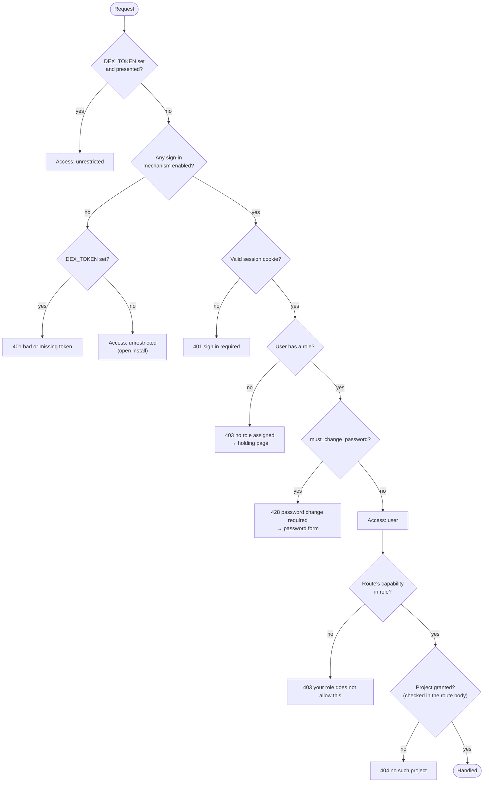
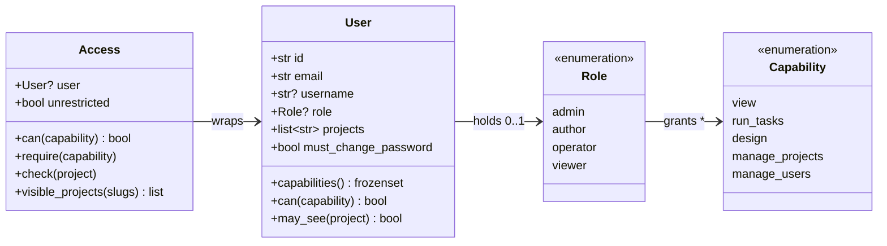
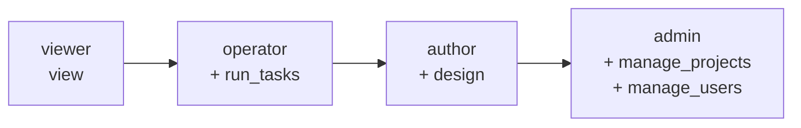
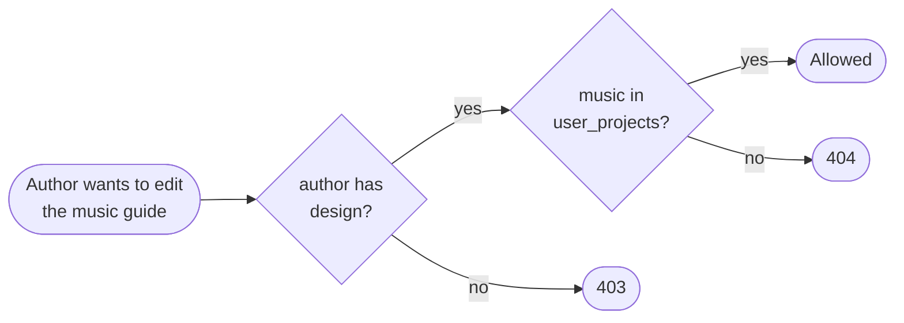
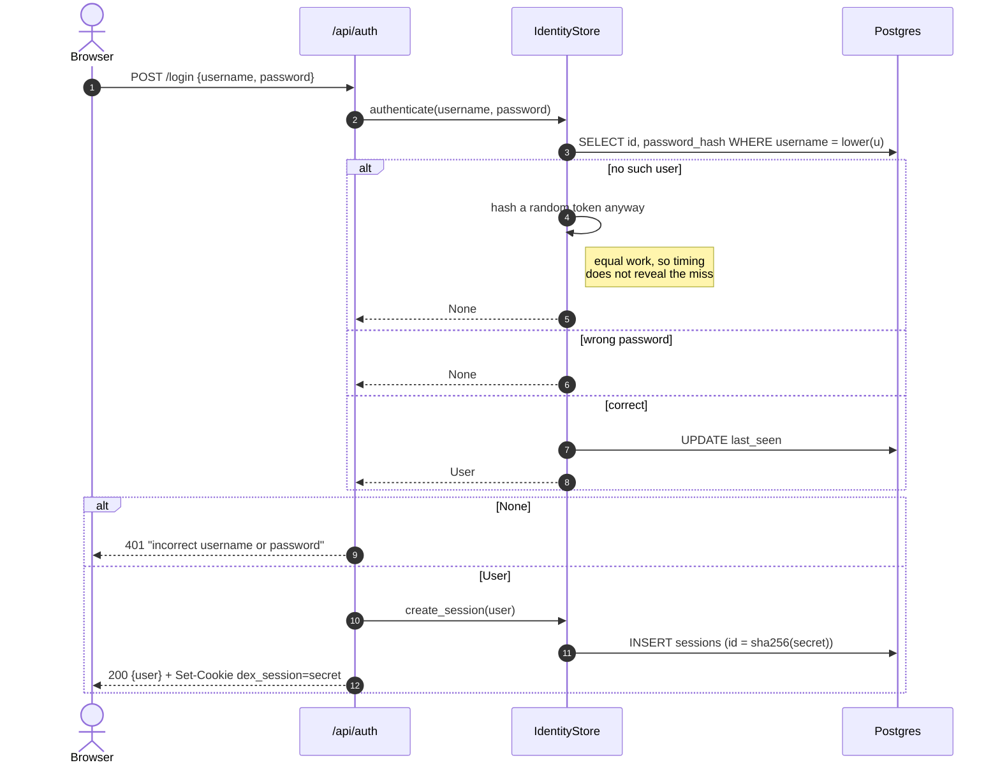
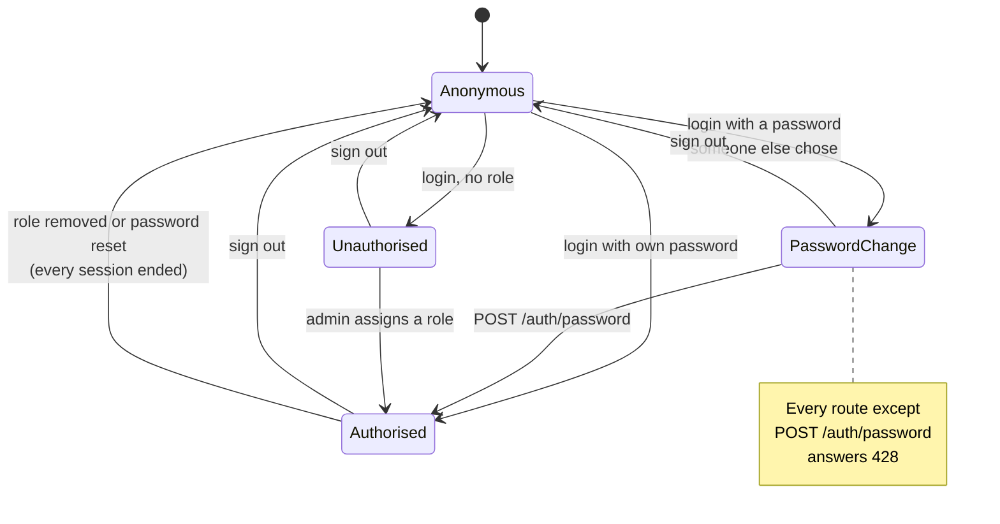
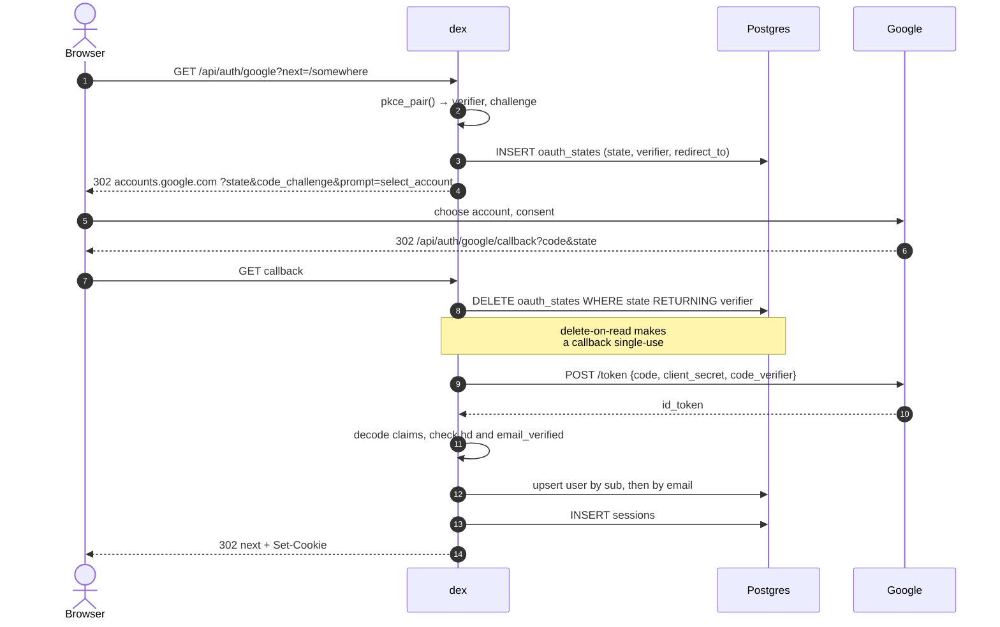
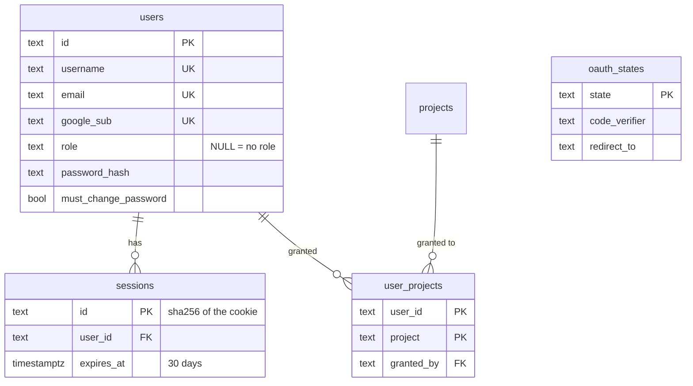
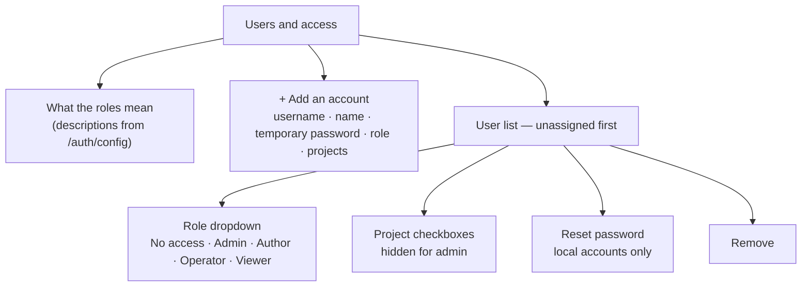

# 01 · Authentication and roles

## Summary

dex decides two things about every request: **who is calling** and **what they
may do**. Identity comes from one of three sources — a signed-in session (by
username and password, or by Google), the `DEX_TOKEN` service credential, or
nothing at all on an install with sign-in switched off. Authority comes from a
role, which grants a set of *capabilities*, narrowed by the *projects* that user
has been granted.

Both sign-in mechanisms are off by default and independent of each other. With
neither configured, dex behaves as it always has: open to anyone who can reach
the port.

| Module | Responsibility |
|---|---|
| `src/dex/identity.py` | Roles, capabilities, users, sessions, password hashing |
| `src/dex/authn.py` | The `Access` dependency, login routes, Google OAuth, admin API |
| `src/dex/api.py` | Route gating — which capability each route asks for |
| `web/src/components/SignIn.tsx` | Sign-in page, password-change gate, holding page |
| `web/src/components/UserAdmin.tsx` | Users and access: roles, grants, accounts, resets |

---

## Resolving a request

Authorisation is deliberately **not middleware**. Most routes carry an id (a
task, a thread, an asset path) rather than a project slug, so middleware would
have to guess the project from the URL. Instead one FastAPI dependency resolves
the caller to an `Access`, and each route checks the project at the point it is
actually known.

Four distinct refusals, because each needs different UI:

| Code | Meaning | What the browser shows |
|---|---|---|
| `401` | Nobody is signed in | Sign-in page |
| `403` *no role* | Signed in, not authorised | "Waiting for access" — asking again cannot help |
| `428` | Holds a password somebody else chose | The password form, and nothing else |
| `403` *capability* | The role does not cover this | Hidden in the UI; a sentence if reached anyway |
| `404` | The project was not granted | Indistinguishable from a project that does not exist |

The `404` is intentional. A `403` would confirm the project exists, which is a
small leak of project names that nothing needs.

---

## Roles and capabilities

A route never names a role. It asks for a **capability**, and one table says
which roles hold it. Adding or widening a role touches that table and nothing
else — which is exactly how `author` gained task-running: one line.

The four roles form a ladder, each adding to the one below:

**No role is not a role.** It is stored as `NULL`, never appears in `ROLES`, and
maps to the empty capability set. Keeping it out of the enumeration is what
stops it from quietly acquiring a capability later.

**A role says what; a grant says where.** Both must allow an action:

An admin needs no grants: their access is the role, and `set_role('admin')`
deletes any grants they had so a later demotion leaves nothing stale behind.

### Route gating

| Capability | Routes |
|---|---|
| `view` | Every read — projects, packages, assets, feed, widgets, tasks, events |
| `run_tasks` | `POST /tasks`, task actions, resume / rerun / cancel / answer / approve, `/chat/plan`, `/chat/confirm`, chat threads |
| `design` | `PUT /projects/{slug}/guide`, messages in a design thread |
| `manage_projects` | `POST /projects`, `DELETE /projects/{slug}`, `PUT /settings` |
| `manage_users` | `/auth/users` — list, create, role, grants, reset, delete; `/costs` |

`POST /threads/{id}/messages` is the one route that decides **inside the body**:
a design thread needs `design`, a chat thread needs `run_tasks`. The user's
message is published only after that check, so a refused message never lands
in the transcript.

---

## Username and password sign-in

Enabled by `DEX_PASSWORD_AUTH=1`. Passwords are hashed with PBKDF2-HMAC-SHA256
from the standard library (480,000 rounds, 16-byte salt) and stored
self-describing — `pbkdf2_sha256$rounds$salt$digest` — so the round count can be
raised without stranding existing rows.

One message for every failure. Telling "no such user" apart from "wrong
password" turns the login form into an account-enumeration endpoint.

### The first admin, and forced password changes

Something has to get the first admin in. With password sign-in on and **no
admin in the database**, startup seeds one — `admin` / `admin` unless
`DEX_SEED_ADMIN_*` say otherwise — and logs it as a warning.

That account is a door, not a credential:

`must_change_password` is set for the seeded admin, for every account an admin
creates, and by every admin password reset — in each case two people know the
password. The change-password route deliberately does **not** use the access
dependency, since that dependency is what returns the 428. It re-issues the
session after changing the password, because `set_password` ends every session
including the one making the request.

Seeding is guarded twice: it runs only when `count_admins() == 0`, so an install
never grows a second default admin, and it refuses to promote an existing
account already named `admin` — which would hand whoever holds that password the
installation.

---

## Google sign-in

Enabled when both `DEX_GOOGLE_CLIENT_ID` and `DEX_GOOGLE_CLIENT_SECRET` are set.
The standard confidential-client authorization-code flow, with PKCE.

The ID token's signature is **not** verified, and that is safe only because of
where it comes from: dex exchanges the code with Google's token endpoint
directly over TLS using its client secret, so the channel is already
authenticated. If a token is ever read from a redirect fragment or a client
instead, the signature must be verified.

A new Google user lands with no role. `DEX_ADMIN_EMAILS` promotes listed
addresses on sign-in — promotion only, so an admin demoted in the UI is not
restored by a stale environment variable.

---

## Sessions

Sessions are **rows, not tokens**. A JWT would save a table and cost revocation,
which is the thing that matters: stripping a role has to take effect on the next
request, not whenever a signature expires.

- The cookie holds a secret; the table holds only its SHA-256. A dumped database
  cannot be replayed as anyone's session.
- The role and grants are re-read on **every request**.
- Removing a role, deleting a user, or resetting a password ends every session
  that user had.
- Cookies are `HttpOnly`, `SameSite=Lax` (Strict would drop the cookie on the
  Google callback, which is a cross-site redirect), and `Secure` when
  `DEX_PUBLIC_ORIGIN` is HTTPS.

One exception to per-request freshness: the **event stream** resolves the
caller's visible projects once, when the stream opens. Re-checking grants for
each of the thousands of events per second it carries would be a query storm.
A grant changed mid-stream applies on reconnect, which is why taking a role
away also ends the user's sessions — that forces the reconnect.

---

## The admin interface

**Settings → Users and access**, shown to holders of `manage_users`.

Guard rails enforced server-side, not just in the UI:

- The **last admin** cannot be demoted or deleted — on a deployment whose only
  other way in is an env var and a restart, that is a one-way door.
- An admin cannot delete themselves.
- Grants replace rather than merge, because the UI sends the state of a set of
  checkboxes and a missing slug means it was unticked.
- A Google-only account has no password to reset (`409`).

---

## Configuration

| Variable | Effect |
|---|---|
| `DEX_PASSWORD_AUTH` | `1` enables username and password sign-in |
| `DEX_SEED_ADMIN_USERNAME` / `_PASSWORD` | The first admin, when none exists (`admin` / `admin`) |
| `DEX_GOOGLE_CLIENT_ID` / `_SECRET` | Both enable Google sign-in |
| `DEX_PUBLIC_ORIGIN` | Builds the OAuth redirect URI; `https://` makes cookies `Secure` |
| `DEX_ADMIN_EMAILS` | Google addresses promoted to admin on sign-in |
| `DEX_GOOGLE_HD` | Restrict Google sign-in to one Workspace domain |
| `DEX_TOKEN` | Service credential; bypasses roles entirely |

Locally, pm2 loads these from `.env.auth` and `.env.google`. Renaming either to
`*.off` parks it; the change needs `pm2 delete dex-api` and a fresh start,
because `pm2 restart` does not re-read the ecosystem file's environment.

---

## Improvement opportunities

- **An install with neither mechanism configured is open to anyone who can
  reach the port**, and nothing says so at startup. The banner prints the URL
  it is serving on; it does not print that the URL needs no credentials. One
  line there would turn a silent default into an informed one.
- **A capability change reaches an open SSE stream only on reconnect.** That is
  recorded in the code and is the reason removing a role ends the user's
  sessions — but it means a *narrowing* that does not end the session leaves a
  stream broader than the grant until something interrupts it.
- **Project grants are checked per request, not per row.** An asset path names
  its project in the first segment, so the check is a string comparison; a
  project renamed under a live grant would silently stop matching.

