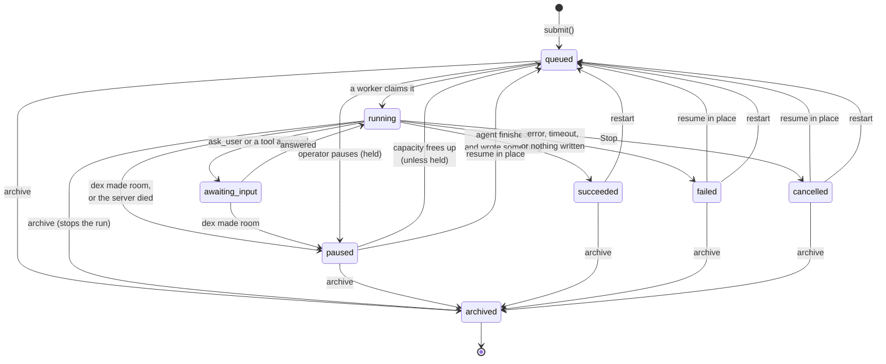
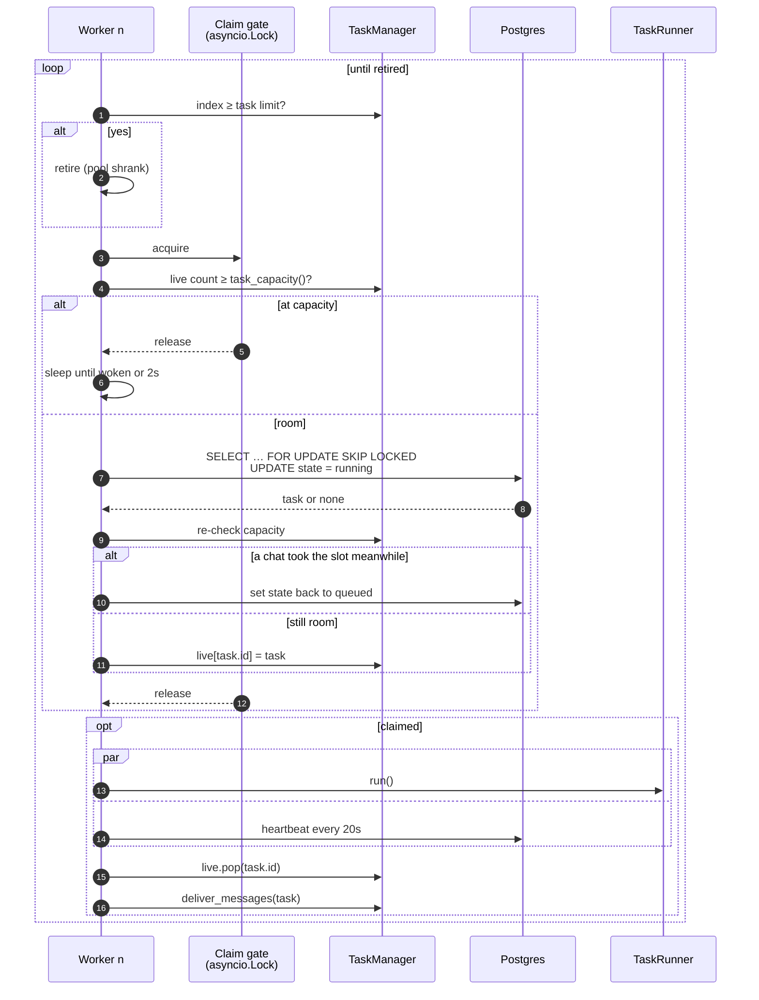
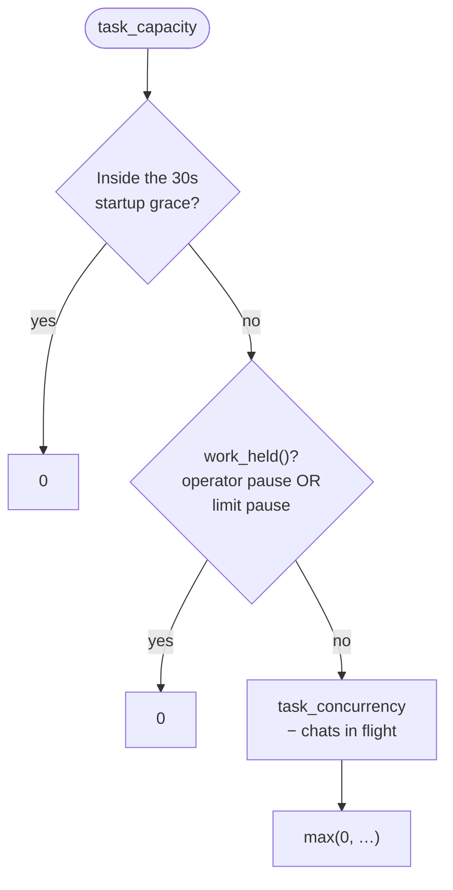
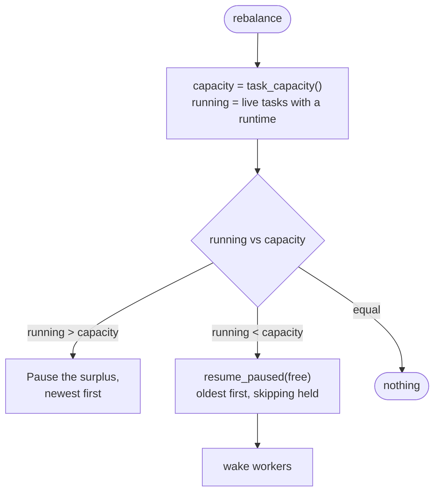
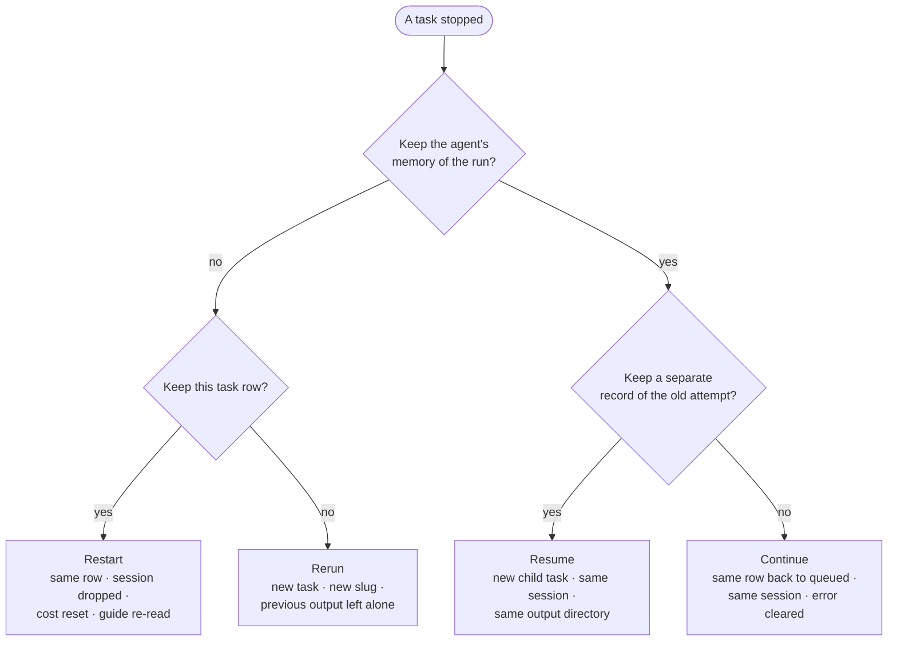
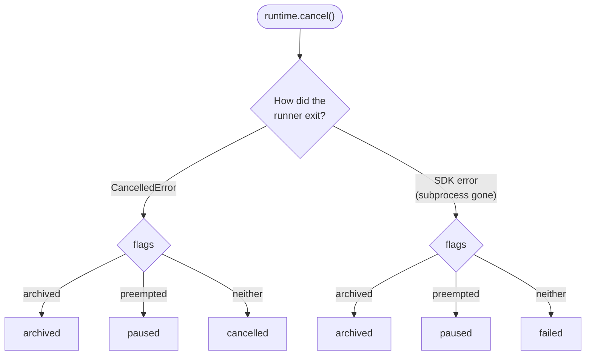
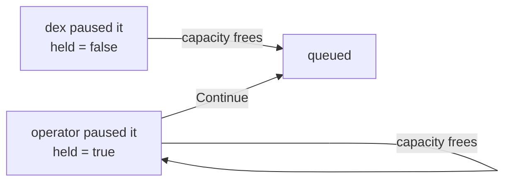
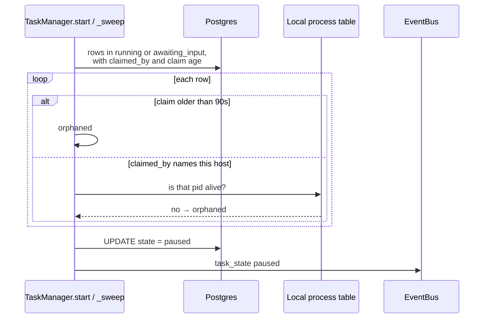
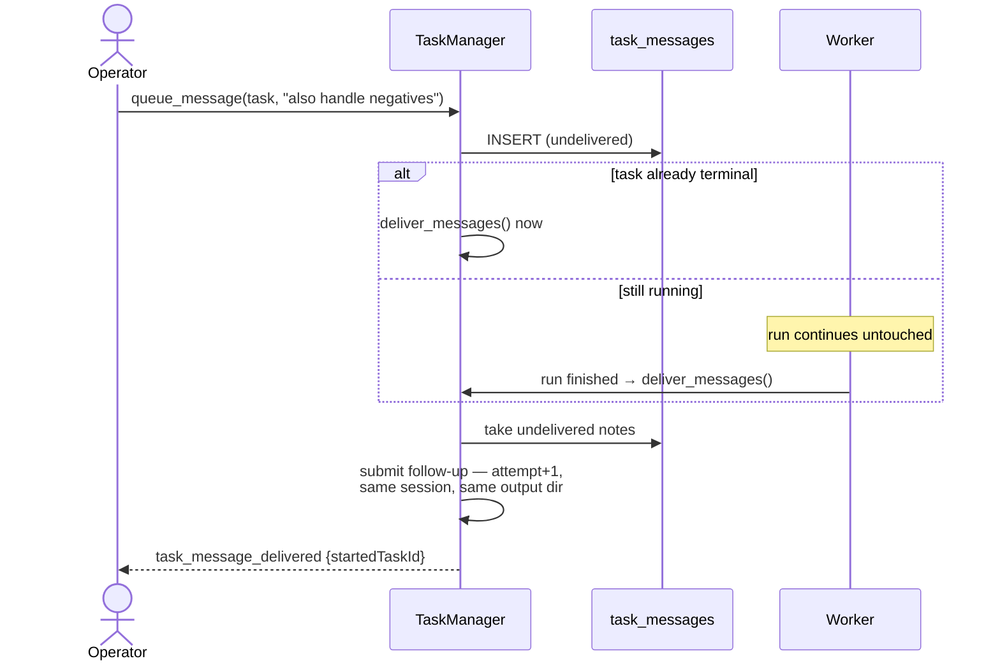

# 02 · Task queue and lifecycle

## Summary

A **task** is one unit of agent work: a brief, a directory to write into, and
an agent session that produces a package. The queue decides *when* each task
runs; this document covers what a task can be, how it moves between states, and
how dex decides how many run at once.

The central decision is that **queue state lives in Postgres, not in memory.**
Workers claim rows with `FOR UPDATE SKIP LOCKED`, so a restart picks up where
it left off, several processes can share one database, and a run the server
never finished is left resumable instead of vanishing.

| Module | Responsibility |
|---|---|
| `src/dex/models.py` | `Task`, `TaskState` and what each state permits |
| `src/dex/queue.py` | `TaskManager` — workers, capacity, pause, resume, archive |
| `src/dex/store.py` | `TaskStore.claim`, `release_orphans`, `SettingsStore` |
| `src/dex/limits.py` | `DynamicLimiter`, the gate chats go through |

---

## States



`TaskState` groups states by what may be done with them, and the UI's buttons are
driven by those groups rather than by listing states:

| Property | States | Offered as |
|---|---|---|
| `terminal` | succeeded, failed, cancelled, archived | *Rerun* — a new task |
| `waiting` | queued, paused | runs again without being asked |
| `resumable` | failed, cancelled | forking *Resume* |
| `continuable` | paused, failed, cancelled | *Continue* — same row back in the queue |
| `pausable` | queued, running, awaiting_input | *Pause* |

### A clean exit is not a result

A package task that ends its turn having written nothing is failed, not
succeeded — `EMPTY_PACKAGE` in `runner.py` says so in the error. The agent
raising nothing only means it stopped talking; it is the package that says
whether the work happened.

The way this goes wrong is always the same: the agent decides to wait for
something — a file a sibling task is writing, a result that has not landed —
and ends its turn in order to do the waiting. Nothing re-invokes a finished
task, so that wait never ends, and before this check the run came out green
with nothing in it. The brief now tells the agent this outright, and the two
have to keep saying the same thing: the prompt promises the task is marked
failed, and this is where that promise is kept.

"Wrote something" is measured against a snapshot of the package taken before
the agent starts, not against the directory being empty. A resumed attempt
continues its parent's package and siblings sharing one open onto a directory
that already has files in it: asked only whether anything is there, both would
pass without lifting a finger.

Only the scopes that own a package are judged this way. A project-wide sweep, a
design turn and a survey write somewhere else or write nothing at all, which is
what `Task.builds_package` is for — the same test that decides where the task
writes decides whether that directory is worth checking.

**`paused` means one thing: start it again.** A task stopped by dex to make room
and a task stranded by a crashed server need the same action, so they share a
state. What separates an operator's pause from dex's is the `held` flag — see
[Two kinds of pause](#two-kinds-of-pause).

**`archived` is not a failure and not a deletion.** The package stays on disk
and in the Library; the task leaves every listing. The database refuses to move
a row out of `archived`, and only *Rerun* — which creates a new task — is
offered from it.

---

## Claiming work



The claim query:

```sql
SELECT id FROM tasks WHERE state = 'queued'
ORDER BY (started_at IS NOT NULL) DESC, seq
FOR UPDATE SKIP LOCKED LIMIT 1
```

- **Work that has run before goes first.** A task parked by a pause has already
  spent tokens and holds an agent session worth continuing, so it finishes
  before anything untouched starts.
- **`seq`, not `created_at`, is the tiebreak.** Tasks submitted in one
  transaction share a timestamp; a `BIGSERIAL` makes submission order real.
- **`SKIP LOCKED` does not promise strict FIFO** across concurrent workers — it
  promises that no two workers take the same row.

Capacity is checked **inside the gate** and **reserved inside the gate**, so a
second worker cannot read a stale count and claim past the ceiling. The re-check
after the claim exists because a chat can take the last slot during the
database round trip; giving a claim back costs nothing because nothing has
started.

### Waking workers

Idle workers sleep on a **private `asyncio.Event` each**, not a shared
`Condition`. A shared Event cleared by one waiter swallows the wakeup for the
rest, and cancelling `Condition.wait()` has to re-acquire a lock during which a
notification can be consumed rather than delivered. Private events share
nothing, so there is nothing to contend for and nothing to lose. Every sleep
also has a timeout, because a limit raised by *another process* signals nothing
here.

---

## How many run at once



This is **the priority ladder**: a planning or chat call outranks generation
work, so every chat in flight removes a task slot. Chats pass through
`chat_limiter`, whose `on_change` triggers `rebalance()` immediately rather than
at the supervisor's next tick.



**Newest first** because it loses the least work and is the most likely to be
cheap to redo.

The same mechanism implements three features without special cases:

| Feature | How |
|---|---|
| Global **Pause** | `work_held()` → capacity 0 → `rebalance` parks everything |
| **Usage-limit hold** | Same flag, set by the usage watcher (see [09](09_costs_and_limits.md)) |
| **Startup grace** | Capacity 0 for 30s after a restart, so a mistake can be caught before a hundred agents resume |

### Scaling the worker pool

The pool holds exactly as many workers as the limit allows. `_scale()` spawns
missing indices; shrinking is left to the workers, which retire at the top of
their loop once their index is above the limit. **Lowering the limit therefore
never cuts a running task short** — a busy worker finishes and then retires.

`set_concurrency()` calls `_scale()` directly rather than waiting for the
supervisor's two-second poll, so a raised limit takes effect at once.

---

## Operator actions

The actions differ in what they keep. Choosing the wrong one either repeats a
wrong turn or throws away useful context.



| Action | Row | Agent session | Output dir | `attempt` |
|---|---|---|---|---|
| `resume` | new child (`parent_id`) | resumed | parent's | +1 |
| `resume_in_place` | same | resumed | same | +1 |
| `restart` | same | **dropped** | same | +1 |
| `rerun` | new | fresh | **new slug** | +1 |
| `archive` | same, terminal | — | untouched | — |

`restart` drops the session deliberately: it is what you reach for when the run
went somewhere wrong, and carrying the conversation would carry the wrong turn.

### Stopping a run correctly

Cancelling an `asyncio` task is the only way to stop a run, and the SDK often
reports a vanished subprocess as an *error* rather than a cancellation. So the
**intent is recorded on the task before cancelling**, and the runner reads it on
whichever path it exits by:



| Caller | Sets | Resulting state |
|---|---|---|
| `pause()` — dex making room | `preempted` | paused |
| `pause_task()` — operator | `preempted` + `held` | paused, not auto-resumed |
| `stop()` — server shutdown | `preempted` | paused |
| `archive()` | `archived` | archived |
| `cancel()` | nothing | cancelled |

`archived` is a separate flag from `preempted` because they mean opposites:
preempted means "start this again when there is room".

### Two kinds of pause



Without `held`, the next free slot picked an operator-paused task straight back
up and the Pause button did nothing.

---

## Surviving a crash

A server killed mid-run leaves rows in `running`. Two mechanisms recover them:



- **At startup**, immediately. When the claim names a process on this host, its
  liveness is checked directly, so recovery does not wait for the heartbeat to
  go stale.
- **Every 90 seconds**, by the sweeper, so a task stranded by *another* process
  is recovered without restarting this one.

The heartbeat refreshes `claimed_at` every 20 seconds and carries the current
`activity` into the row, so a plain REST read shows what the agent is doing
rather than whatever it was doing at the last state change.

### Shutdown order

`stop()` cancels the **supervisor first**, then marks every live task
`preempted`, then drains workers. Cancelling workers first would race the
supervisor, which respawns finished workers — including ones that just finished
*because* they were cancelled — and the replacement would never be drained.

> **Known limitation.** When the agent's CLI subprocess dies before the shutdown
> handler marks the task, the runner sees an error with no `preempted` flag and
> records `failed`. This is rarer now that `stop()` marks tasks before
> cancelling, and it is more likely under `--reload`, where every save under
> `src/dex/` is a shutdown.

---

## Follow-up notes

A note typed into a running task does not interrupt it. It is stored in
`task_messages` and delivered when the task stops.



---

## Improvement opportunities

- **`--reload` kills in-flight tasks, and development routinely does.** The
  banner warns, but a task died mid-run during this session's work and retried
  as attempt 2 — costing a full agent session. A guard that refuses to reload
  while a task is running, or a dev flag that drains first, would make editing
  the server safe with work in flight.
- **`held` survives a restart; the reason for it does not.** A task the
  operator paused comes back paused with no record of why, which is the same
  screen as one dex paused for capacity until you read the flag.
- **Orphan sweeping is time-based.** A worker that is slow rather than dead
  looks identical to one that died, and the heartbeat interval is the only
  thing separating them.

