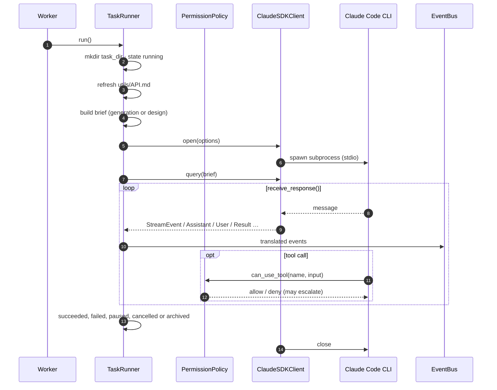
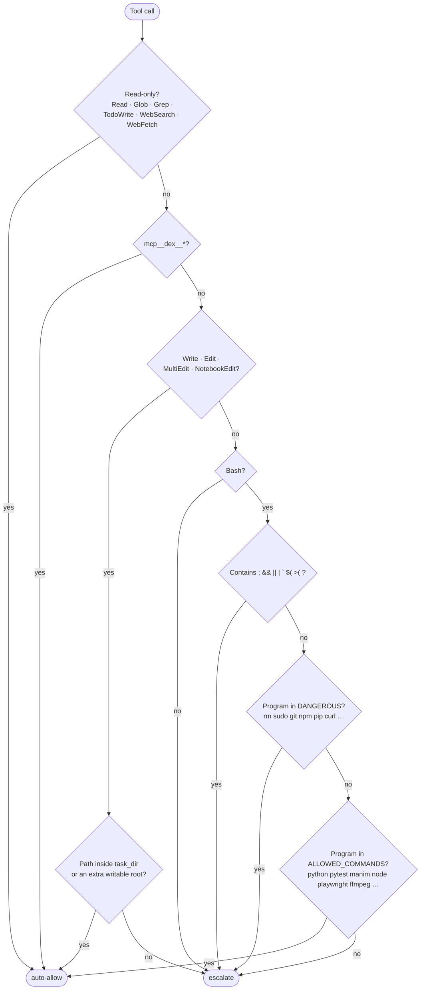
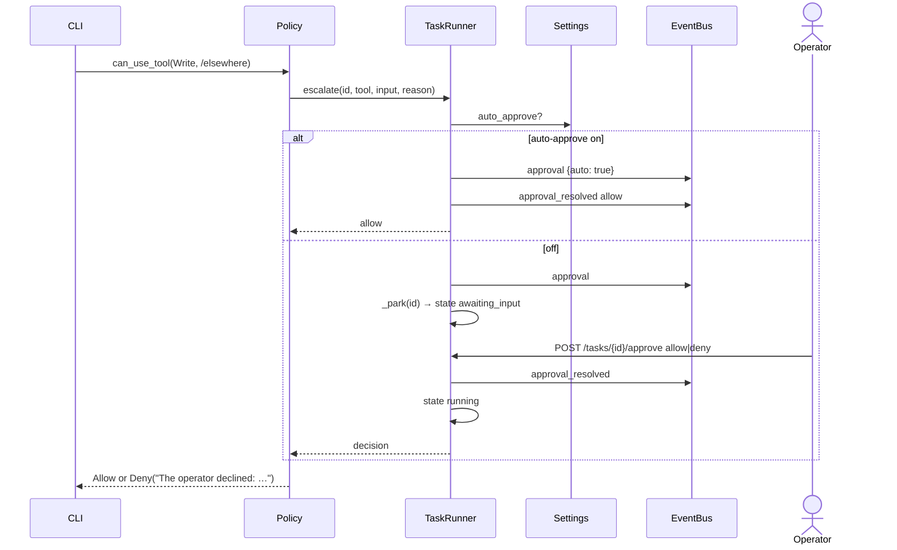
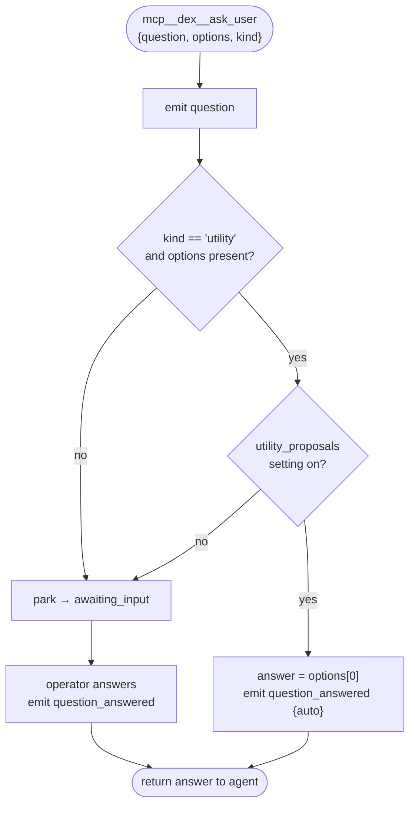
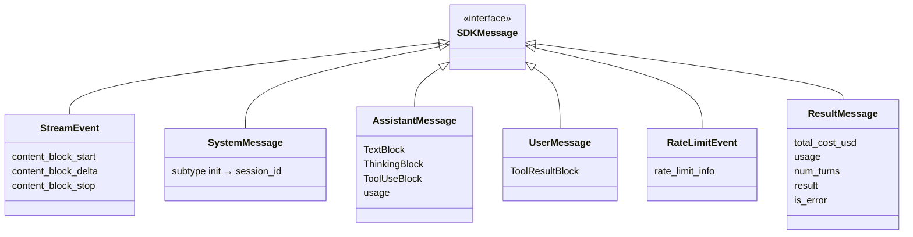
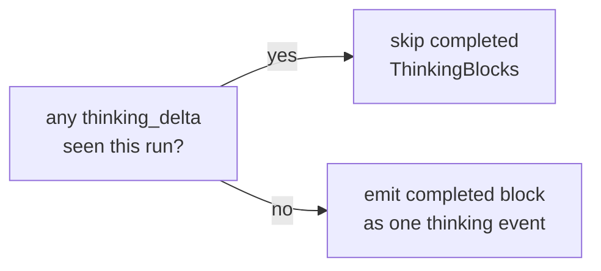
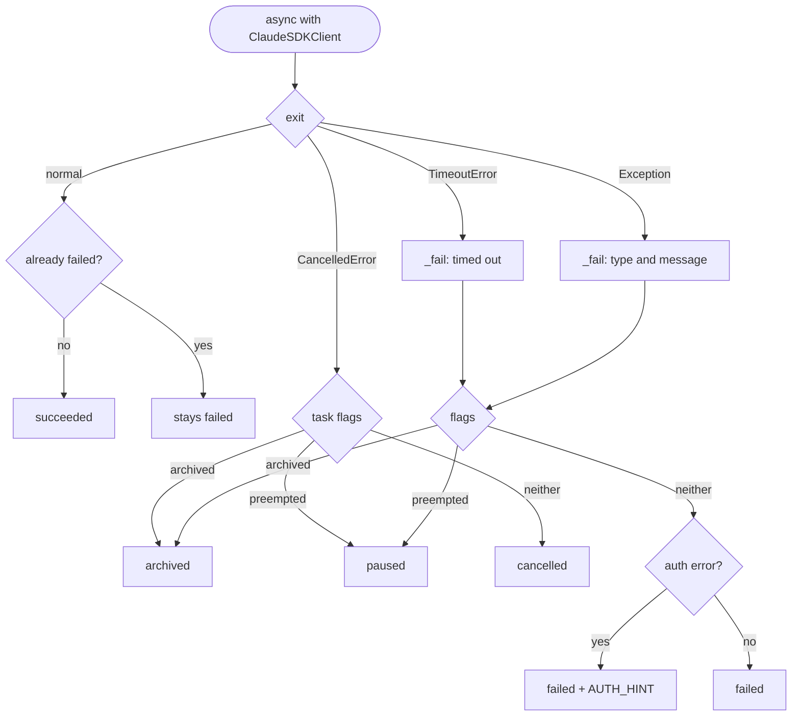
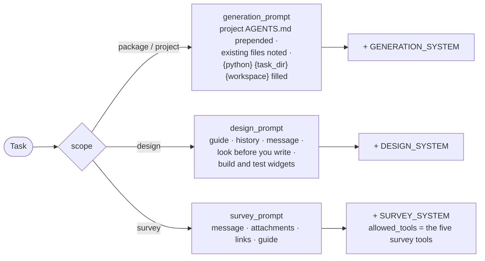

# 03 · Agent runner

## Summary

The runner takes one claimed task and drives it through a **Claude Agent SDK
session** to completion. It owns three jobs:

1. **Build the session** — model, effort, working directory, system prompt, the
   brief, and a resume handle when there is one.
2. **Police it** — every tool call passes through a permission policy that
   auto-approves the work a task legitimately needs and escalates the rest.
3. **Translate it** — every message the SDK yields becomes a bus event, so the
   UI can render streamed text, collapsed thinking, tool calls, diffs,
   questions and cost as they happen.

Only inference leaves the machine. The agent loop, every tool call, test runs
and renders all execute locally inside the task's directory.

| Module | Responsibility |
|---|---|
| `src/dex/runner.py` | `TaskRunner` — session, events, operator prompts, outcome |
| `src/dex/permissions.py` | `PermissionPolicy` — the `can_use_tool` callback |
| `src/dex/prompts.py` | System prompts and briefs for generation and design turns |
| `src/dex/diffs.py` | A before/after preview of a file edit |
| `src/dex/pricing.py` | List-price estimate and token accounting |
| `src/dex/fake_agent.py` | Scripted runner for offline UI work (`DEX_FAKE_AGENT=1`) |

---

## Anatomy of a run

### Session options

| Option | Value | Why |
|---|---|---|
| `cwd` | the task's directory | A relative path lands in the package. Starting at the repo root once left a 15 MB `media/` beside dex's own source. |
| `system_prompt` | `claude_code` preset + `GENERATION_SYSTEM` or `DESIGN_SYSTEM` | Keep Claude Code's tool competence; add dex's rules |
| `include_partial_messages` | `true` | Token deltas, so text streams instead of arriving a block at a time |
| `thinking` | `adaptive`, `display: summarized` | Without a display the CLI omits thinking from the stream entirely — one run spent 122s thinking with the panel showing nothing |
| `effort` | settings, else config | Read at task start, so a run keeps the effort it was planned with |
| `resume` | `resumed_from` | Continue the earlier conversation instead of starting over |
| `setting_sources` | `[]` | Ignore any local `.claude` config; the brief is the spec |
| `mcp_servers` | `dex` → `ask_user`, `utility_proposals_enabled` | The only way the agent reaches the operator |
| `can_use_tool` | policy, wrapped to emit diffs | See below |

The whole run is bounded by `task_timeout_s`.

---

## What a task may do on its own

- **Reads are free anywhere in the workspace**; **writes are confined** to the
  task's own directory. A project-wide task's directory is the whole project.
- A design turn adds `widgets/` as an **extra writable root**, because widget
  code is shared across projects and cannot live inside any one of them.
- **Every** task adds `datasets/<project>/` as an extra writable root — not
  only tasks that were given an upload. A task that downloads a source, or
  builds an index beside one, is doing the work it was asked to do; one that
  had to ask before touching it would stop on its first real step. See
  [13](13_source_material.md).
- The Bash check is on the **first word**, so any chaining or substitution
  character escalates — it could smuggle a second command past the check.
- The program is matched by **basename**, so the guides name
  `{workspace}/node_modules/.bin/playwright` directly. `npx` stays off the list
  because it downloads a missing package.
- Paths are resolved before comparison, so `../` cannot walk out of the
  directory.

### Escalation

`auto_approve` is read **at the moment of escalation**, not at task start, so
turning it on releases runs already in flight. `set_auto_approve(True)` also
resolves every approval already parked. It never answers a *question* — that
still needs a person.

### Parking

Both questions and approvals use one primitive: `_park(key)` creates a future,
records it in `task.pending`, moves the task to `awaiting_input`, and awaits it.
The HTTP route resolves the future through `TaskManager.answer()`. Futures exist
only in the process running the task, which is why `merge_live()` overlays them
onto rows read from the database.

---

## Asking the operator

The agent reaches a person only through the `dex` MCP server:

The shared-utility question is still **asked** when dex answers it, so the
decision is recorded where the operator can see it — it simply does not park the
task on a doorbell nobody needs to hear. The guides fix the option order so the
first is the affirmative one. See [08](08_shared_utilities.md).

---

## Translating the stream

| SDK message | Events emitted | Side effects |
|---|---|---|
| `StreamEvent` block start | — | Remember `index → uuid:index` |
| `StreamEvent` text delta | `text_delta` | — |
| `StreamEvent` thinking delta | `thinking_delta` | Sets `_thinking_streams` |
| `StreamEvent` block stop | `block_end` | — |
| `SystemMessage` init | — | Persist `session_id` at once |
| `AssistantMessage` | `cost` (estimate) · `tool` · `thinking` if not streamed | `activity` = tool title |
| `UserMessage` | `tool_result` | — |
| `RateLimitEvent` | — | Record into the limit snapshot |
| `ResultMessage` | `cost` (authoritative) · `result` | Store cost, tokens, turns; post the design reply |

### Avoiding duplicates

Text arrives twice — as deltas, then as a completed `TextBlock` — so completed
text blocks are **always skipped**.

Thinking is harder. It usually streams, but some transports deliver it only as a
finished `ThinkingBlock`. Matching the block's text against what had streamed
duplicated every block, because the SDK yields the `AssistantMessage` *before*
the block's trailing `content_block_stop`, so the comparison ran against text
not yet recorded. The fix is a single flag:

One delta anywhere proves the deltas are coming.

### Persisting the session immediately

`session_id` is written to the row the moment `init` arrives. If the server dies
mid-run, that is the only handle on the work the agent has already done, and it
is what `resume` needs.

### Reporting never kills the run

`_observe()` wraps translation: a malformed message, a pricing error, or a
formatting slip costs a log line and a non-fatal `error` event. Errors from
*receiving* messages still fail the run — those mean the agent itself stopped.
State changes are emitted synchronously and **persisted in the background**, so
a slow write never blocks the agent loop.

---

## Outcomes

`_fail()` checks the flags because the SDK reports a subprocess that vanished
under a cancellation as an ordinary error. Missing credentials — the most common
first-run failure — get a hint naming the real fix, since the SDK's own wording
("Please run /login") points the wrong way for a server.

Whatever the outcome, `finally` cancels every pending future so nothing stays
parked on a run that has ended.

### When the database disagrees

`set_state` emits before it writes. If the write is refused — the task was
archived out from under the run — `_correct_state()` reads the row back and
re-emits the real state. Without it the screen showed *paused* while the row
said *archived*, which made archiving look like it did nothing.

---

## Generation brief vs design brief

A **survey** is the one scope whose tools are named rather than judged.
`allowed_tools` is set to the five survey tool names alone — no Read, no Bash, no
Grep — so the permission callback above never has an opportunity to allow
anything else. That is what makes "a thousand-page document never enters the
context" a property of the run rather than a request in a prompt. It also caps
at 24 turns: a survey that has not converged by then is not going to.
See [14](14_survey_and_anchors.md).

The generation brief deliberately says nothing about *what* to build. That is
the project guide's job; a deliverable spec baked in at this level once applied
to every project, and a yoga pose was asked for as an algorithm study package.
When a project has no guide, the brief says so and tells the agent to ask rather
than invent a format.
