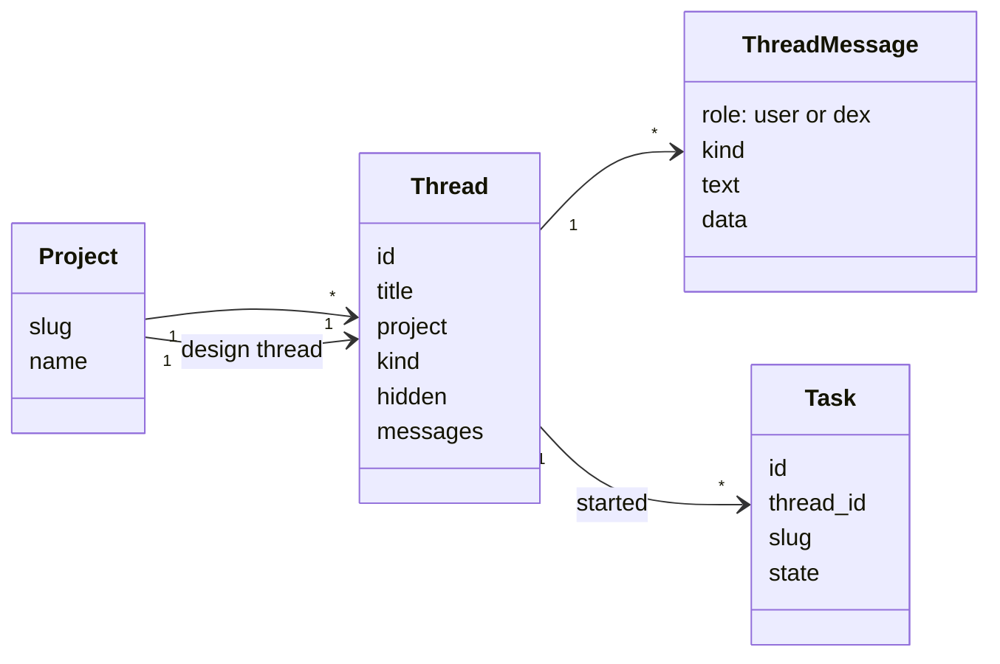
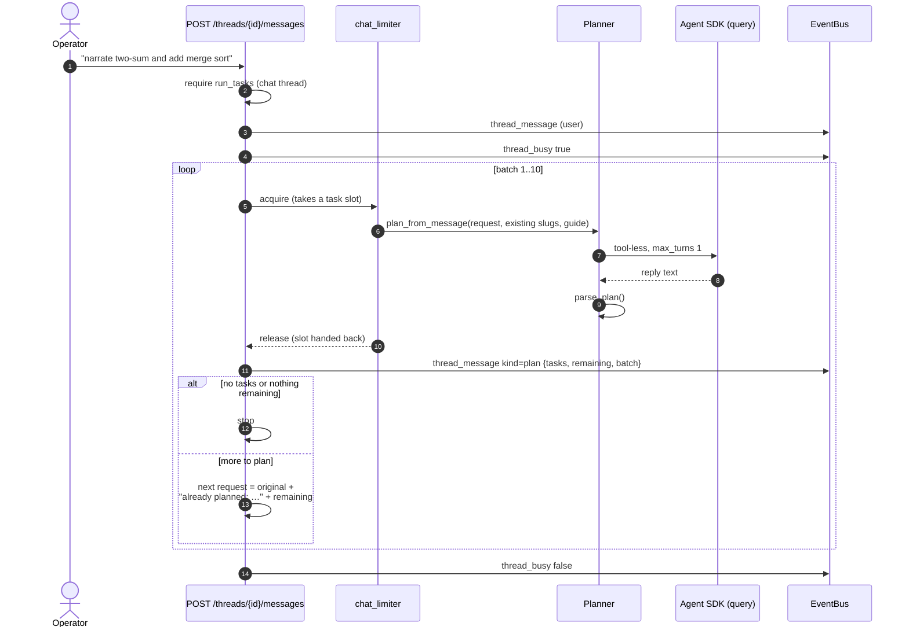
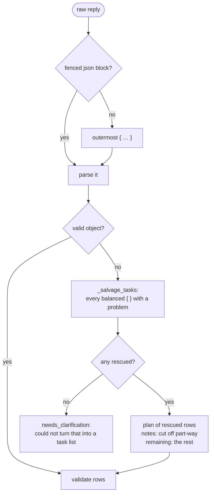
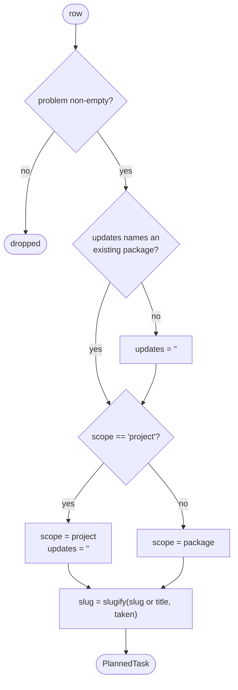
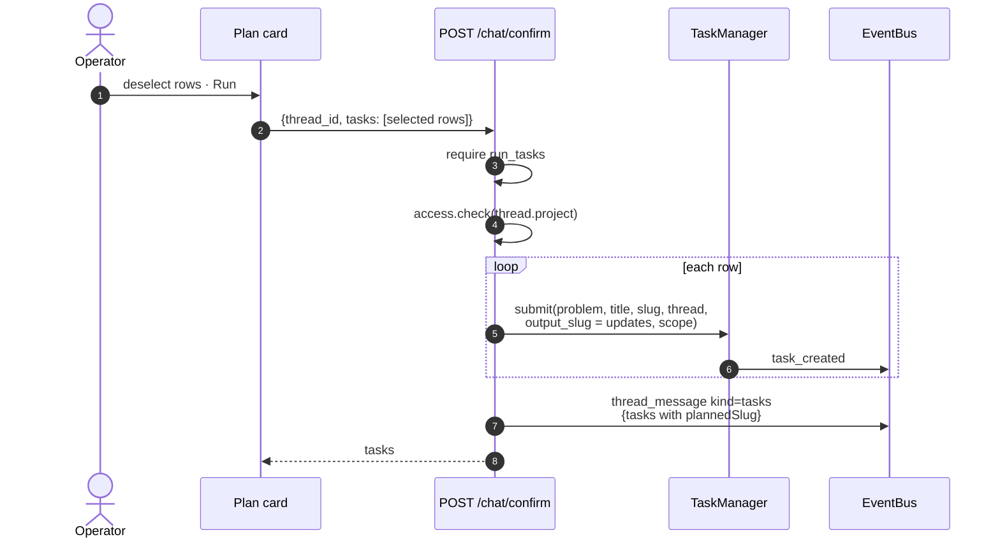

# 04 · Planning chat

## Summary

The chat is how work gets into dex. The operator describes what they want in a
**thread**; a planner turns the message into a **plan** — a list of independent
tasks — which appears as a card in the thread. Nothing runs until the operator
confirms the card, optionally after deselecting rows. Confirmed rows become
queued tasks that run in parallel.

Planning and running are separate on purpose. Planning is cheap, fast and
reversible; running spends real money on an agent session per task. The plan
card is the checkpoint between them.

| Module | Responsibility |
|---|---|
| `src/dex/planner.py` | `plan_from_message`, `parse_plan`, salvage of truncated replies |
| `src/dex/prompts.py` | `PLANNER_SYSTEM`, `planner_prompt` |
| `src/dex/api.py` | Threads, `_plan_turn`, `/chat/confirm` |
| `src/dex/store.py` | `ThreadStore` — threads and messages |
| `web/src/components/Chat.tsx` | Thread view and plan cards |

---

## Threads

| Thread `kind` | Purpose | A message produces |
|---|---|---|
| `chat` | Plan and run work | A plan card |
| `project_design` | Shape the project itself | A design task — see [05](05_project_design.md) |

| Message `kind` | Rendered as |
|---|---|
| `text` | Markdown |
| `plan` | A plan card with checkboxes and **Run** |
| `tasks` | "Started N tasks", with task chips |
| `error` | An error notice |

**Threads are hidden, never deleted.** Deleting cascaded messages away and
orphaned tasks, which lost real work when a tap landed in the wrong place.

---

## From message to plan

### The planner is tool-less

`allowed_tools=[]`, one turn, `permission_mode="dontAsk"`. Planning reads
nothing and writes nothing, so it cannot wander into the filesystem. What it
needs is handed to it: the message, the project's guide, and the directory names
that already exist.

### It takes a task slot

Planning goes through `chat_limiter`, and every chat in flight subtracts one
from task capacity. The operator is waiting on a plan, so it outranks
background generation; a running task may be paused to make room and resumes
the moment the plan returns. See [02](02_task_lifecycle.md#how-many-run-at-once).

### Batches

A request can imply far more work than fits one reply — "every pose in the
Ashtanga primary series". The planner reports what it did not reach in
`remaining`, and dex plans again, up to **10 batches**, each posted as its own
card. Every later batch is told which slugs are already taken so it does not
repeat them. A failure in a later batch leaves the earlier cards standing.

---

## Parsing a plan

The planner is asked for JSON, and parsing is deliberately forgiving: a
twelve-minute planning run once produced a reply cut off mid-array, and throwing
it away wasted all of it.

`_balanced_objects` uses a **stack**, not a depth counter. When a reply is cut
off the outer object never closes, so anything that only reports depth-zero
objects reports nothing — exactly the case this exists for.

### Validating each row

Every rule here stops the planner **widening what a task may touch** by
guessing:

- **`updates`** must name a package that exists. A rewrite writes *into* that
  directory; without this, "regenerate X" built `x-2` beside `x`, which is how
  one problem ended up with three directories.
- **`scope`** accepts only `project` as an alternative to `package`. Anything
  the planner invents would silently widen a task's write access.
- A **project-scoped** task clears `updates`, since it edits every package
  rather than one.

---

## Confirming a plan

The project is checked **again** at confirm even though planning already checked
it: this is the route that spends money, and the thread id comes from the
client.

### Finding a card's own tasks

`slugify` appends a suffix on collision, so a plan row for `x-narrate-2` can
produce a task with slug `x-narrate-2-2`. The confirm response records
`plannedSlug` beside each task. Without it the card matched its rows against the
wrong slugs, showed already-queued work as never started, and offered to run it
a second time.

### Selecting rows

Every row starts selected; **Deselect all / Select all** sits beside **Run**, so
the common case of running a few rows from a large batch is two clicks rather
than dozens.

---

## Failure handling

| Failure | Result |
|---|---|
| Planner transient error | Retried by `_with_retries` |
| Credentials missing | Thread error with `AUTH_HINT`; HTTP 503 |
| Other planner error, first batch | Thread error; HTTP 502 |
| Other planner error, later batch | Thread error; earlier cards kept |
| Unparseable reply | A clarification message instead of a card |
| Batch limit reached with work left | "Stopped after 10 plans. Still outstanding: …" |

`thread_busy` is published around the whole turn and followed by every open
tab, so a second tab — or the same tab after a reload — shows planning in
progress rather than an idle composer.
