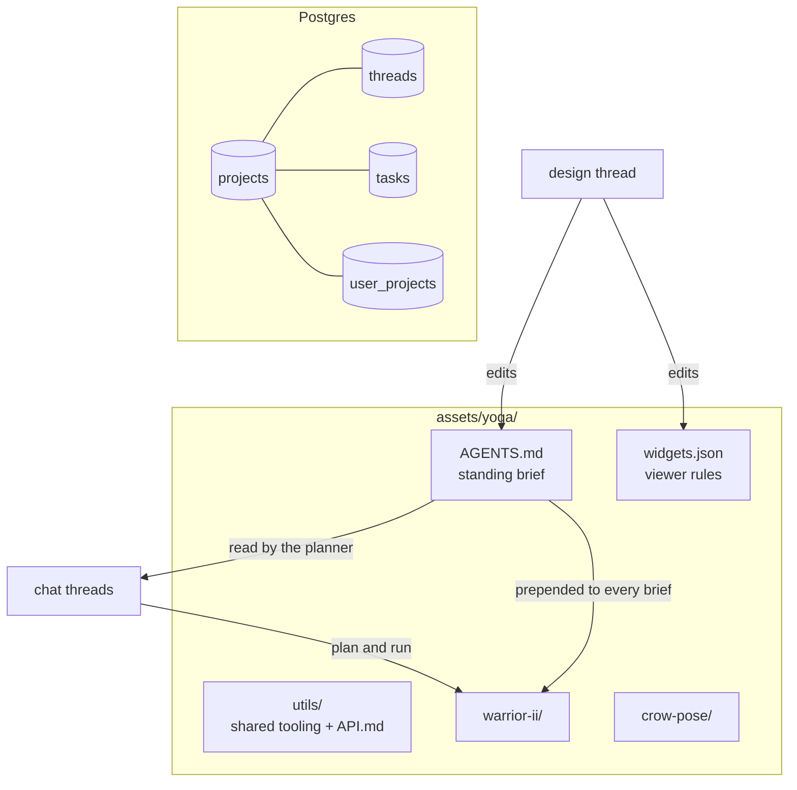
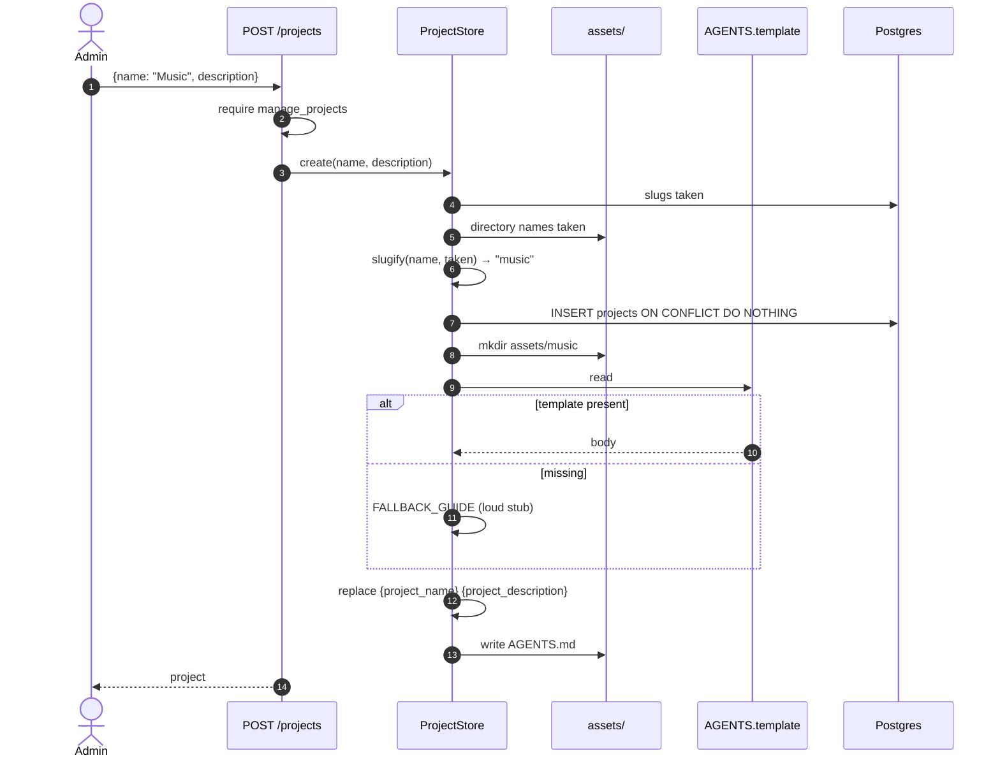
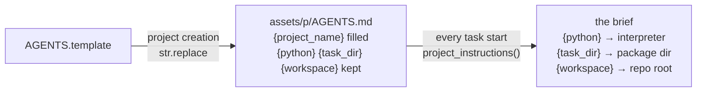
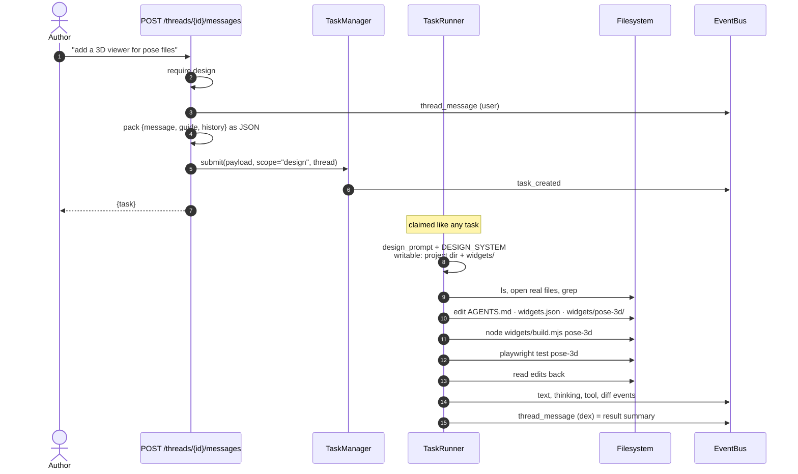
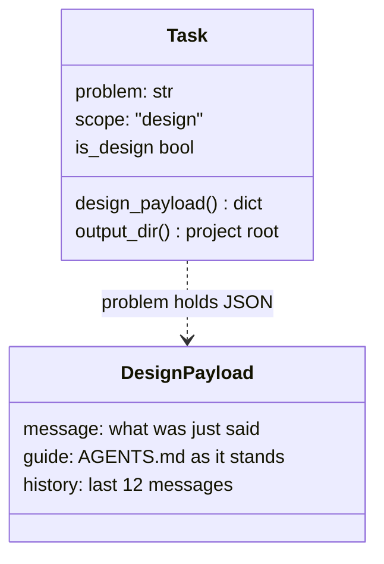
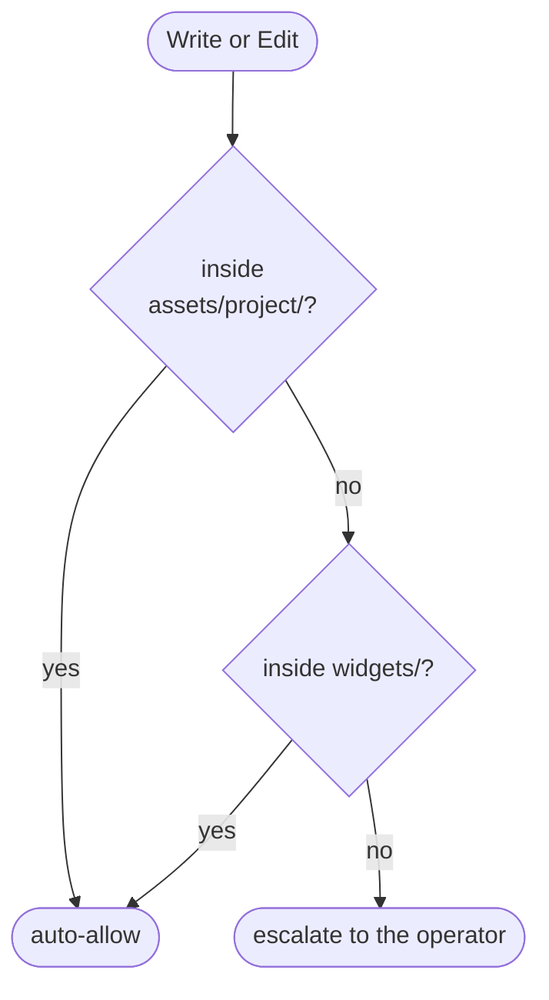
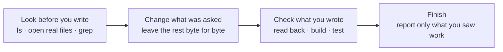

# 05 · Projects and the design chat

## Summary

A **project** is a named body of work: a directory under `assets/` holding a
standing brief, `AGENTS.md`, and one directory per package the project has
produced. The guide is what makes one dex serve unrelated kinds of work — algorithm
study packages, 3D yoga poses, music scores — without dex itself knowing about
any of them.

Each project has exactly one **design thread**: a conversation that shapes the
project rather than producing work in it. A turn in that thread runs as an
agentic task that can read the repository, edit the guide, author UI widgets,
build and test them, and report what it verified.

| Module | Responsibility |
|---|---|
| `src/dex/projects.py` | `ProjectStore`, seeding a guide from `AGENTS.template` |
| `src/dex/migrate.py` | `ensure_design_thread`, adopting a pre-project install |
| `src/dex/api.py` | Project routes, `_design_turn` |
| `src/dex/prompts.py` | `DESIGN_SYSTEM`, `design_prompt` |
| `src/dex/designer.py` | `history_text` for the design brief |
| `AGENTS.template` | The starter guide copied into every new project |

---

## What a project is

Switching project switches everything the UI shows — threads, tasks, feed,
library, guide — and the project is also the unit of access control
([01](01_auth.md)). Project directories live under the gitignored `assets/`, so
a clone starts with none.

---

## Creating a project

### Placeholders filled in two passes

Both passes use `str.replace`, not `str.format`. The template was once a
Python string passed through `.format()`, where every per-task placeholder had
to be written `{{python}}` to survive — and an edit that forgot was a crash at
project creation time.

The fallback guide is **deliberately loud**. A project with no guide makes every
task stop and ask what to build, so an empty file would be worse than a stub
that says why it is empty.

### What the template gives a new project

| Section | Purpose |
|---|---|
| The environment is ready | Tools already installed, so tasks do not spend turns checking |
| What to produce | Left for the design chat to fill in |
| Viewers for this project's files | How widgets are authored, registered, built, tested |
| Shared utilities | The promote-at-the-end protocol ([08](08_shared_utilities.md)) |
| Conventions | Shell rules, paths, and asking over guessing |

---

## The design thread

`ensure_design_thread` runs whenever a project's threads are listed and creates
the thread the first time, with an opener message. It is idempotent: one
`project_design` thread per project, pinned above the chat threads.

### A design turn is a task

It used to be **a single tool-less call** that returned the whole guide back.
That could not author anything, could not check the files it described, and had
nothing to show while it worked. Running it as a task gives it tools *and* the
entire activity surface — streamed text, collapsed thinking, tool calls, diffs,
questions — because that surface belongs to tasks. What makes a turn a design
turn is only its brief and a wider write mandate.

> `designer.py` still contains the old one-shot `draft()` and `parse()`. Only
> `history_text()` is used now.

### Packing the conversation into one field

A task has one `problem` string; a design turn needs three things. They travel as
JSON in `problem` and are unpacked by `Task.design_payload()`:

Nullable columns for fields only one scope uses would be three empty columns on
every other row. A `problem` that is not JSON — a design task created before this
format — is read as the message on its own, which is still a usable turn.

### What the designer may touch

The brief names three things: `AGENTS.md`, `widgets.json`, and
`widgets/<name>/`. Writing anywhere else — another project, a package inside
this one, dex's own source — stops for approval, which the brief describes as a
sign the designer is somewhere it did not mean to be.

### The brief's working rules

"Look before you write" is the correction for the one-shot designer, which wrote
rules for a project it had never looked at. Reading is free and unrestricted, so
a couple of minutes of looking is the difference between a rule that fits and a
plausible one that does not.

### The reply lands in the thread

When the task's `ResultMessage` arrives, the runner appends its summary to the
design thread as a `dex` message. The thread reads as a conversation; the task
panel still holds the full run for anyone who wants the tool calls.

---

## Guides are gitignored

`assets/*` is gitignored, so **edits a design turn makes to a project's
`AGENTS.md` exist only on the machine that made them**. Only `AGENTS.template`
is tracked. An improvement worth giving every future project has to be made to
the template by hand.

---

## Adopting an older install

Before projects existed, packages sat directly under `assets/`.
`adopt_existing_project` runs at startup and registers the default project over
that layout, so an upgrade needs no manual step and no files move.
