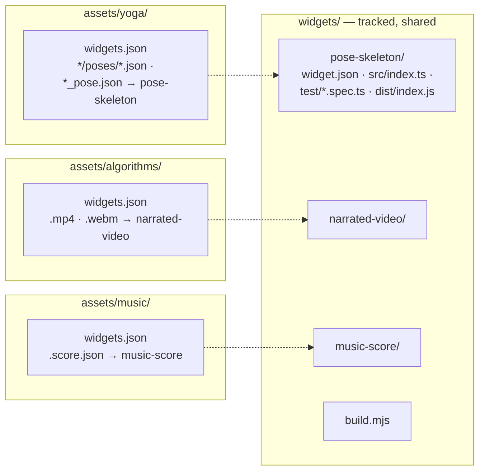
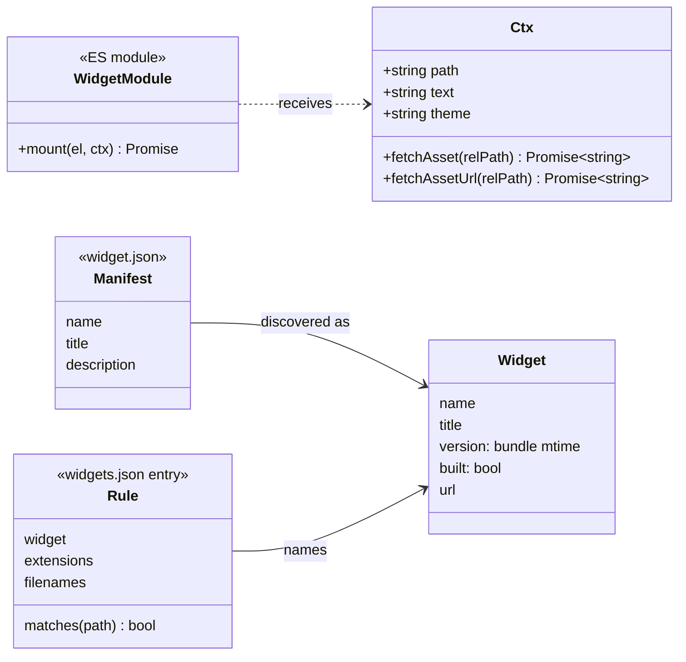
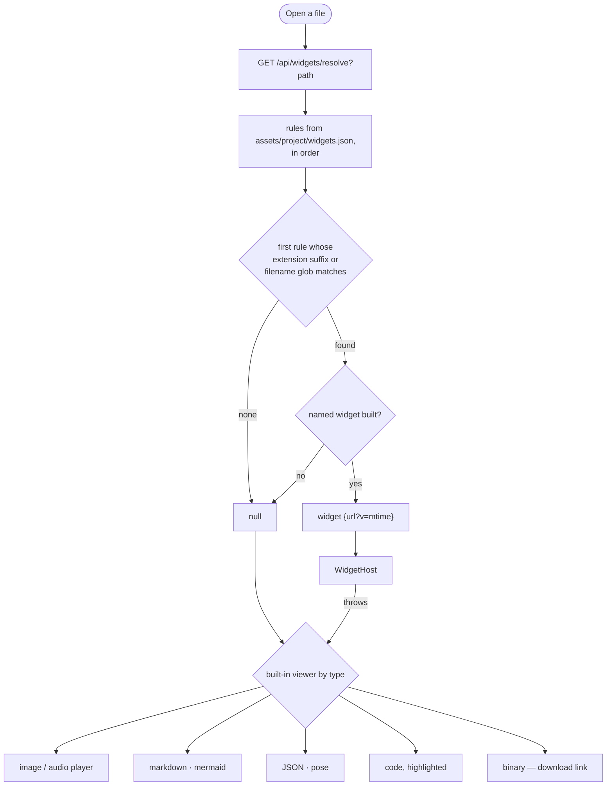
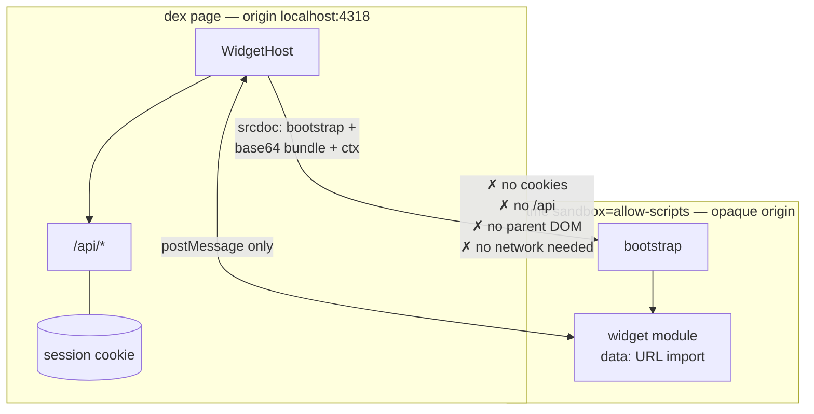
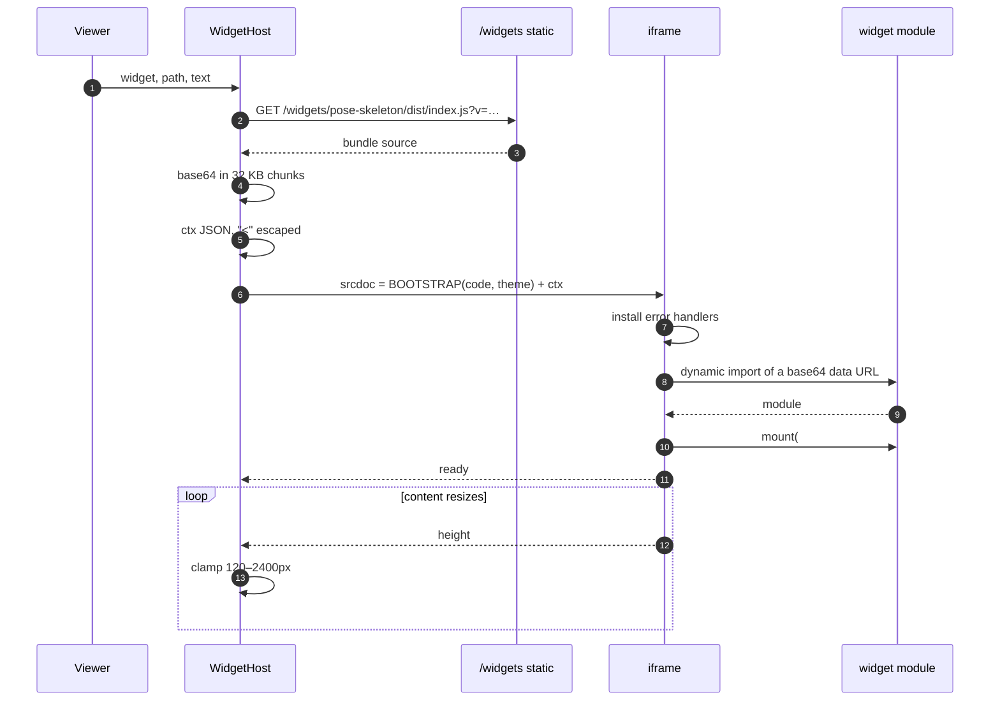
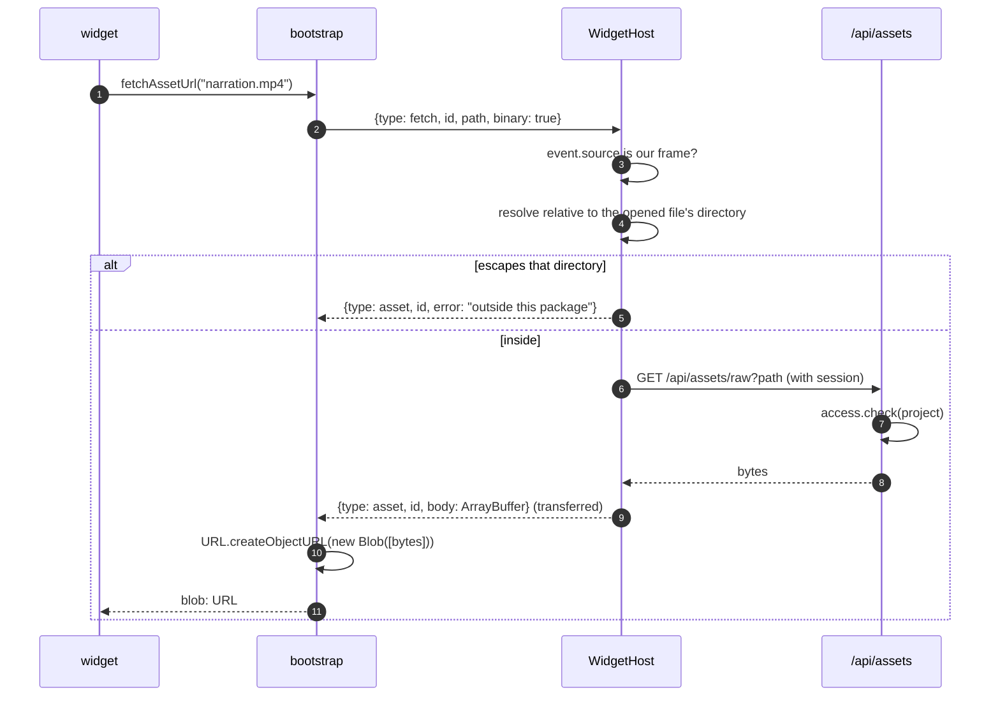
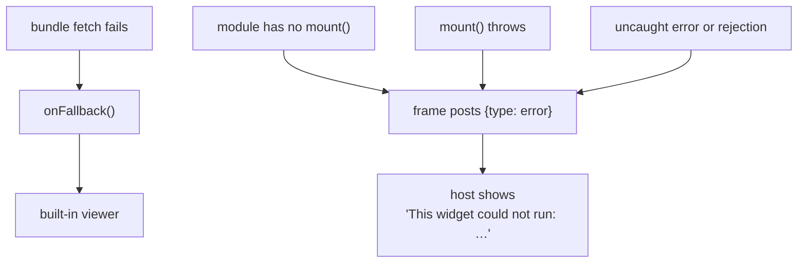
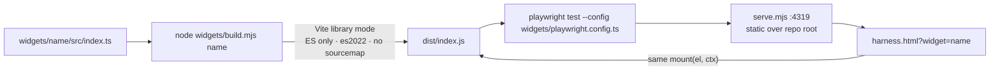

# 06 · Project widgets

## Summary

> **Widgets live inside skills, and are served from there.** A widget's source
> and its built bundle are in `skills/<name>/<version>/widgets/<widget>/`;
> enabling a skill adds its binding to the project's `widgets.json` and copies
> nothing. The browser fetches
> `/api/widgets/<skill>/<version>/<widget>/index.js`.
>
> There used to be a top-level `widgets/` holding a materialised copy of each,
> served by a `StaticFiles` mount. It meant a bundle could be built in one
> place and served from the other, and one silently was. `widgets/` now holds
> only the tooling: the builder, the test harness and its server.
>
> Everything below still describes how a widget *works* — the contract, the
> sandbox, the resolution rules — which is unchanged. Where it comes from is
> [15](15_skills.md).

A **widget** is a small ES module that turns one kind of file into something
worth looking at: a pose JSON into an orbitable 3D skeleton, a narrated MP4
into a player with synchronised captions, a score sidecar into sheet music with
a cursor that follows the audio. Without one, a file opens in the built-in
markdown or code viewer.

Widgets are **pluggable at runtime** — building one makes it live on the next
page that asks, with no server restart — and **sandboxed**: each runs in an
iframe with an opaque origin, so it cannot read the session, call the API, or
touch the page around it.

The design deliberately splits two halves:

| Half | Lives in | Owned by |
|---|---|---|
| **Code** — what a widget is | `widgets/<name>/` at the top level | Shared across every project |
| **Rules** — which files it opens | `assets/<project>/widgets.json` | Each project, independently |

| Module | Responsibility |
|---|---|
| `src/dex/widgets.py` | Discover built widgets, read rules, resolve a file |
| `src/dex/api.py` | `/api/widgets`, `/api/widgets/resolve`, `/widgets` static mount |
| `web/src/components/Viewer.tsx` | Choose widget or built-in viewer |
| `web/src/components/WidgetHost.tsx` | The sandbox, bootstrap, and bridge |
| `widgets/build.mjs` | Bundle each widget to one ESM file |
| `widgets/harness.html`, `serve.mjs`, `playwright.config.ts` | Testing |

---

## Layout

`dist/` is gitignored, so a fresh clone must build widgets before any of them
work — until then every file falls back silently.

### The contract

A widget author writes `src/index.ts` exporting `mount` and a `widget.json` —
nothing else. There is no per-widget build config.

---

## Resolving which viewer opens a file

- **First match wins.** Order in the file is the priority, which is easier to
  reason about — and to write from a conversation — than a priority number whose
  effect nobody can see.
- **Extensions match the end of the filename**, so multi-part suffixes work:
  `.pose.json` is what separates a pose from every other JSON file.
- **An unbuilt widget resolves to `null`.** A half-finished widget degrades to
  the code viewer rather than an empty frame.
- **A widget wins over the built-in player.** `.mp4` was once claimed by the
  image branch before the widget check ran, so a rule naming a video silently
  did nothing.
- **Resolution is asked on every open**, never cached, so a widget built a
  moment ago works now.

### Cache busting

`import()` and `` terminate the host document early.
- **Chunked base64.** `String.fromCharCode(...bytes)` on a 646 KB bundle passes
  646,000 arguments and overflows the stack. The small widget worked and the
  three.js one did not.

---

## The asset bridge

A widget often needs more than the file it was opened on — the MIDI a score
names, the captions beside a video. It asks the host, and the host decides.

- **Authorisation stays in one place.** The frame has no credentials, so every
  file it reaches goes through the host, which uses the signed-in session and
  the same project check as any other asset read.
- **Confined to the package.** Paths resolve relative to the opened file and may
  not leave its directory, so a widget cannot read the rest of the project.
- **Binary is transferred, not copied.** The `ArrayBuffer` moves to the frame,
  and the frame builds the blob URL itself — a plain `/api/...` `src` would be
  cross-origin and credentialless, and would 401 as soon as sign-in is on.
- **Only our own frame is heard.** Messages whose `source` is not this iframe's
  window are ignored.

---

## Failure

Every error is reported rather than swallowed. A silent blank frame is the worst
failure mode for code an agent just wrote.

---

## Building and testing

- **One bundle, no external imports.** The frame cannot fetch, so everything is
  inlined.
- **No sourcemaps.** They would double the bytes inlined into the frame, and
  stack traces already surface through the error bridge.
- **The harness mounts a widget exactly the way dex does**, so a passing test
  means the real host will run it. Tests use real project files where they
  exist, because a widget that only handles the data its author imagined is the
  failure that actually happens.
- **Fixtures resolve from `import.meta.url`**, never a bare relative path: a
  design task runs the suite from its own package directory, where `assets/…`
  points at nothing.

### Who builds them

The design chat ([05](05_project_design.md)) writes widget code, runs the build
and the tests, and adds the rule to `widgets.json`. `node` and `playwright` are
on the task allowlist and `widgets/` is writable for design turns, so the whole
loop runs without stopping for approval.
