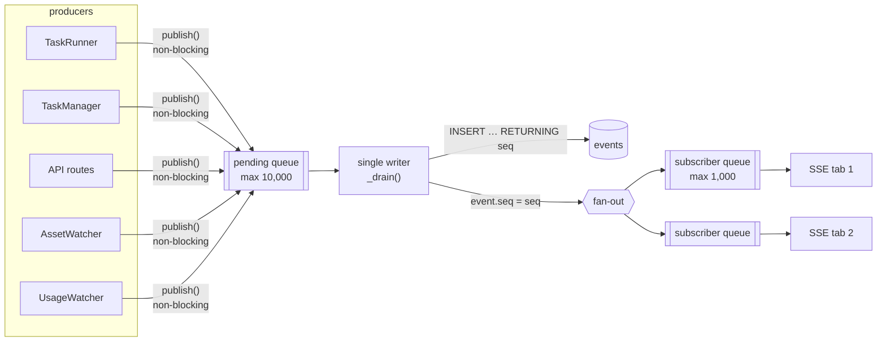
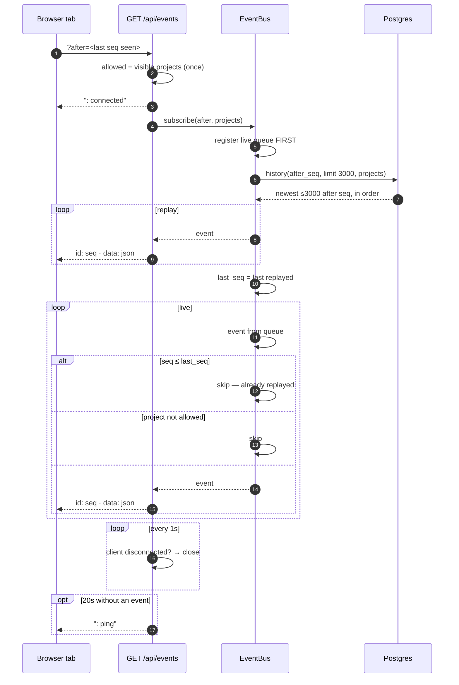
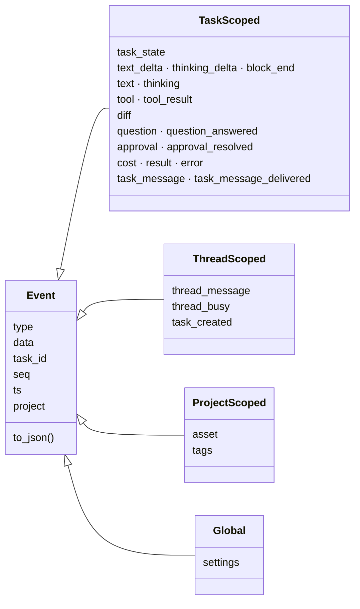
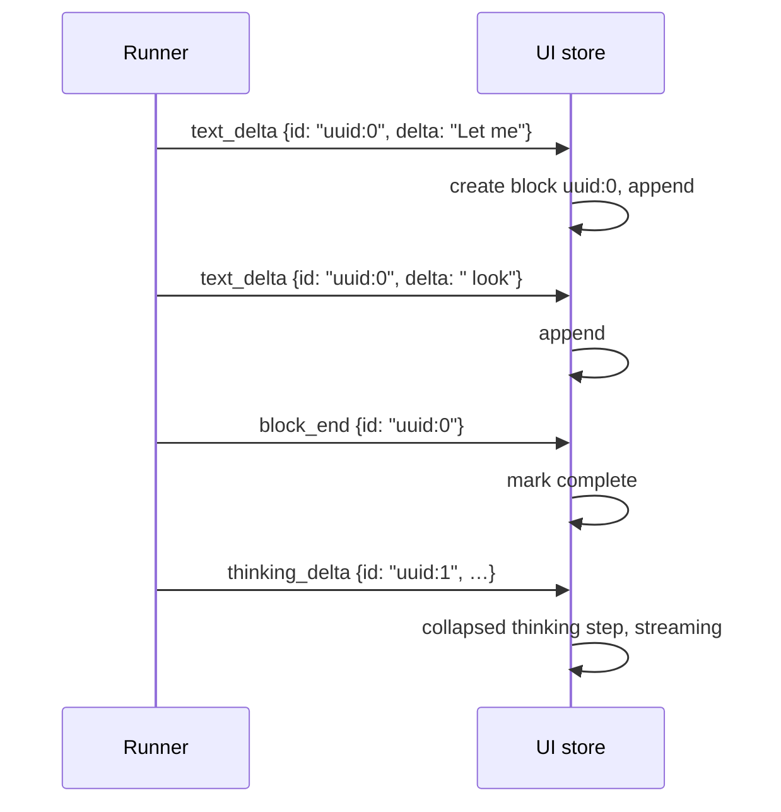
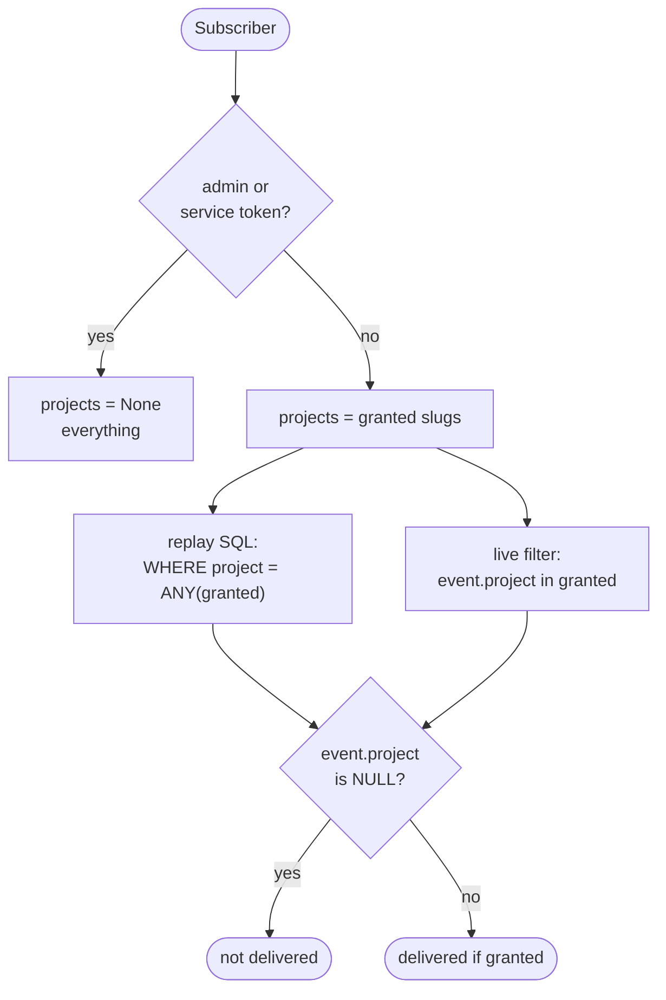

# 07 · Live event stream

## Summary

Everything the UI shows while work is happening — streamed text, thinking, tool
calls, diffs, state changes, questions, cost, new files — arrives as **events**
over one Server-Sent Events connection per tab.

Every event is **written to Postgres before it is delivered**, and Postgres
assigns its sequence number. That makes `seq` mean the same thing to a client
reconnecting after a server restart as it does to one that never dropped, and
it is why a reload replays a run's full history instead of starting blank.

| Module | Responsibility |
|---|---|
| `src/dex/models.py` | `Event`, `EventType` |
| `src/dex/bus.py` | `EventBus` — persist, fan out, replay |
| `src/dex/api.py` | `GET /api/events` (SSE), `GET /api/tasks/{id}/events` |
| `web/src/api.ts` | `openStream` — EventSource with resume |
| `web/src/store.ts` | The reducer that folds events into UI state |

---

## Path of one event

**One writer**, so rows land in the order they were published and `seq` is
monotonic in publish order.

**`publish()` never blocks.** A producer is often the agent loop, and a slow
database or client must not stall the agent. The costs of that choice are
explicit:

| Queue full | Behaviour | Rationale |
|---|---|---|
| Pending (10,000) | Event dropped, warning logged | The agent keeps working |
| A subscriber (1,000) | That subscriber misses it | A stalled tab must not back-pressure the agent |

A tab that missed live events recovers them on reconnect, because they are in
Postgres.

---

## Subscribing: replay, then live

- **The live queue is registered before history is read.** An event published
  during the replay query lands in the queue and is not lost; the `seq ≤
  last_seq` check drops any that replay already delivered.
- **Replay is newest-biased.** When more than 3,000 events qualify, the most
  recent are returned. Returning the oldest left a client permanently behind: it
  replayed ancient history, set its cursor there, and discarded every live event
  as already seen.
- **Disconnects are polled every second**, not only when an event or ping
  arrives. Otherwise a closed tab kept its generator and bus subscription alive
  until the next ping.
- **Pings every 20 seconds** stop proxies and sleeping phones from dropping the
  stream.
- Response headers `Cache-Control: no-cache, no-transform` and
  `X-Accel-Buffering: no` stop intermediaries buffering it.

---

## Event catalogue

### How streamed blocks assemble

Block ids combine the message uuid and the content-block index, so two blocks in
one message and blocks across messages never collide.

---

## Project scoping

For a signed-in user who is not an admin, the stream is filtered to the projects
they were granted — on **both** routes an event can take:

The project is carried **on the event** because live fan-out is in-process with
no database round trip; filtering cannot join to `tasks`. A migration backfilled
`events.project` from each event's task, so history filters the same way live
events do.

The visible set is resolved **once per connection**. Re-reading grants for each
of thousands of events per second would be a query storm, so a grant change
applies on reconnect — and removing a role ends the user's sessions to force one.

> ### Known gap: untagged events never reach scoped users
>
> An event published without `project` is dropped for every restricted
> subscriber. That is intended for `settings`, and the runner tags everything it
> emits. But several other producers publish without a project today:
>
> | Producer | Events |
> |---|---|
> | `TaskManager` | `task_state` from pause, resume, restart, archive, cancel, orphan sweep; `task_message`; `task_message_delivered`; `approval_resolved` from auto-approve |
> | API | `thread_message` (plan cards, "Started N tasks"); `thread_busy` |
> | `AssetWatcher` | `asset`, `tags` |
>
> **Effect:** with sign-in on, an operator or author sees a running task's text
> and tool calls live, but not their plan card appearing, not a pause or cancel
> they pressed taking effect, not new files lighting up — until they reload.
> Admins are unaffected, which is why it goes unnoticed. The fix is to pass
> `project=` at each of those call sites; the thread's or task's project is
> already in scope at every one.

---

## One task's full history

`GET /api/tasks/{id}/events` returns one task's events however long ago it ran,
independent of the stream — 2,000 by default, up to 10,000 with `?limit=`. Opening an old task's panel uses
this rather than the 3,000-event replay window, which is sized for catching up,
not for archaeology.
