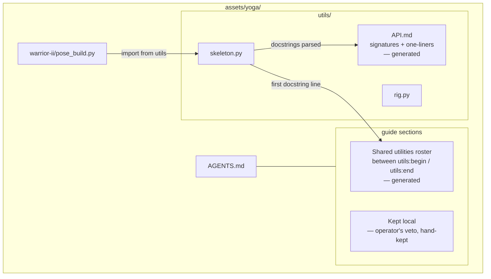
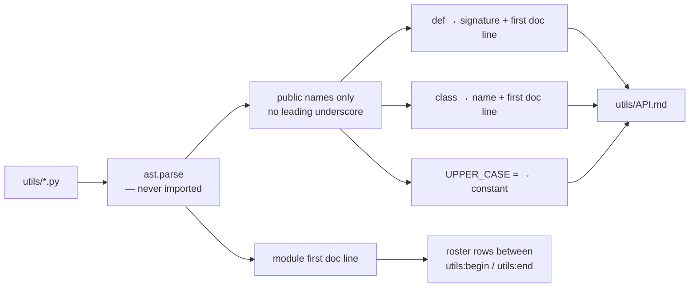
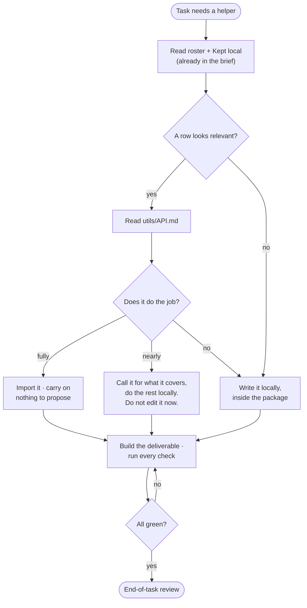
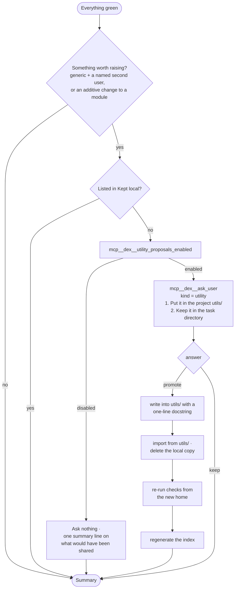
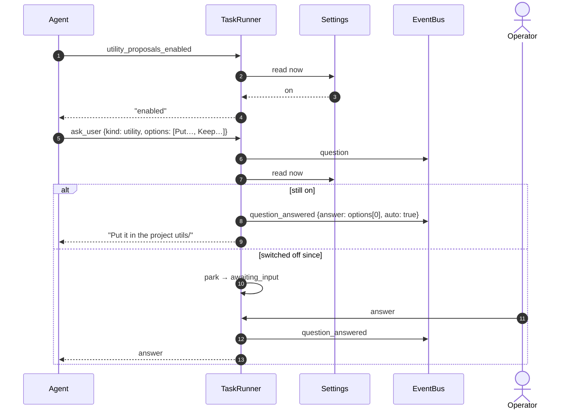
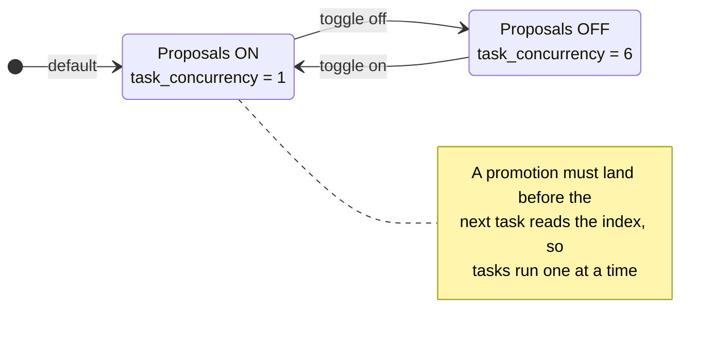
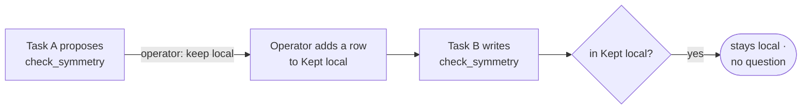

# 08 · Shared utilities

## Summary

> **`utils/API.md` earns its place, and is still generated.** It is the
> *signature* index — every public function, its arguments, and one line about
> it, at about a tenth of the modules' bytes. A `SKILL.md` says what a skill is
> *for* and what it will not do; the index says what you can actually call.
> Different jobs, and a task needs both.
>
> Each module's heading now names the skill it came from
> (``## `rig` — from `yoga-figure` ``), because `utils/` is materialised from
> several skills and a promotion targets one. Without it nothing joins the
> skills in the brief to the module names a reader has in hand.
>
> **Utilities ship inside skills now.** A module lives in
> `skills/<name>/<version>/utils/`, and `assets/<project>/utils/` is
> materialised from the skills a project has enabled — so it is derived state,
> and a task promoting a helper writes to the skill. Everything below still
> describes the protocol: when a helper is worth sharing, how it is proposed,
> and how a refusal is recorded. See [15](15_skills.md) for where it lands.

Tasks in one project keep writing the same helpers: a validator every package
needs, a conversion step, a geometry solver. Copied from package to package they
drift into six subtly different versions. The **shared utilities protocol** lets
a task promote a helper into the project's `utils/` — but only **at the end of
the task, after the code has actually run**, and only with a decision recorded
where the operator can see it.

The protocol lives almost entirely in **the project guide**, which every agent
reads. dex supplies three mechanisms around it: a generated index so finding a
utility is cheap, an MCP tool to check whether proposals are switched on, and an
automatic answer to the promotion question while they are.

| Piece | Where |
|---|---|
| The protocol text | `AGENTS.template` → each project's `AGENTS.md` |
| Index generator | `src/dex/tools/utils_api.py` |
| Index refresh before every task | `TaskRunner._refresh_utils_index` |
| `utility_proposals_enabled`, auto-answer | `TaskRunner._ask_user_server`, `_auto_answer` |
| Setting and its concurrency coupling | `PUT /api/settings`, `SettingsStore.UTILITY_PROPOSALS` |

---

## Project layout

Three tiers of increasing cost, read only as far as needed:

| Tier | Content | Cost |
|---|---|---|
| Roster in `AGENTS.md` | One line per module | Free — already in the brief |
| `utils/API.md` | Every public signature and constant, first docstring line | ≈ 11% of the source |
| The module itself | Everything | Last resort, one module |

This tiering came from measurement: yoga's `utils/` grew to 21.9 KB in a quarter
of an hour, and every task that glanced at it paid for all of it.

---

## Generating the index

- **Parsed, not imported.** A module with a heavy import or a syntax error costs
  nothing and cannot execute anything.
- **Generated, not hand-kept.** A hand-written index drifts the moment someone
  edits a module and forgets.
- **Refreshed before every task** by the runner, so it cannot fall behind a
  module a previous task changed. It writes only on a real difference, so the
  steady state touches nothing and the watcher stays quiet.
- **Opt-in for the roster.** A guide without the marker comments is left exactly
  as it is — a hand-edited file is never guessed at.
- To change what a row says, change the module's **docstring**. Editing the
  table is undone by the next task.

---

## The protocol, from the agent's side

**Nothing goes into `utils/` mid-task.** An untested module promoted into shared
space is worse than none, and stopping to ask halfway interrupts work that has
not yet shown the helper is worth sharing.

### The end-of-task review

Rules that make shared code stay shared:

| Rule | Because |
|---|---|
| **Return data, not verdicts or prose** | The next caller wants a different verdict and can only get it by editing |
| **Take a default, not a rule** | Thresholds belong in keyword arguments |
| **Do one thing** | Two composable functions beat one with a mode flag |
| **A second knob for one caller means it is not this function** | A utility that grows a knob per package is edited by every task |
| **Changes must be additive** | Packages you cannot see import it, and you cannot test them |
| **Prefer composing to changing** | Calling it and finishing locally is the utility working as intended |

---

## What dex does

### Answering the question automatically

The question is still **asked and recorded** when dex answers it. That keeps an
audit trail in the task panel without interrupting the operator for a decision
they already made by leaving the setting on.

Both the tool and the auto-answer read the setting **at the moment they run**,
not at task start, so switching it off silences runs already in flight.

The guide fixes `kind` and the option order because they are how dex recognises
the question and which option is affirmative. Get either wrong and the question
goes to the operator as an ordinary interruption — a safe failure.

### Approval for the writes

Promotion writes land outside the task directory, so each still passes through
the permission policy ([03](03_agent_runner.md)) and stops for approval unless
auto-approve is on. **A declined write is itself the answer**: the helper goes
back into the package, `utils/` is left as it was, the checks run again, and the
summary says so.

A project-scoped task already owns the project directory, so its writes need no
approval — it still asks, for the record.

---

## The setting and concurrency

The loop only works **in sequence**. Two tasks running side by side each read
the index before either promotes, and both write their own copy. Turning
proposals on therefore sets task concurrency to 1; turning them off restores 6.
An explicit `task_concurrency` in the same request is applied afterwards and
wins, and `rebalance()` runs immediately so the new limit takes effect at once.

---

## The veto

The **Kept local** table is the operator's, and the only hand-maintained part of
the protocol. A row there closes the question permanently: a task finding its
helper listed leaves it in the package and says nothing more.

This is what makes a "no" stick. Without a record, every future task that wrote
the same helper would ask again.

Agents are told never to add, edit or remove rows. Guides are gitignored with
the rest of `assets/`, so the table is local to the machine.
