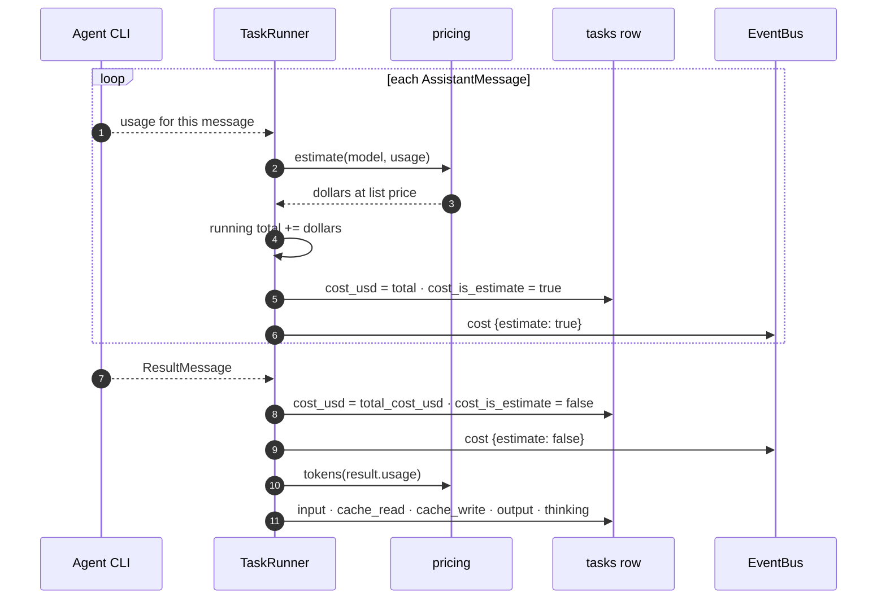
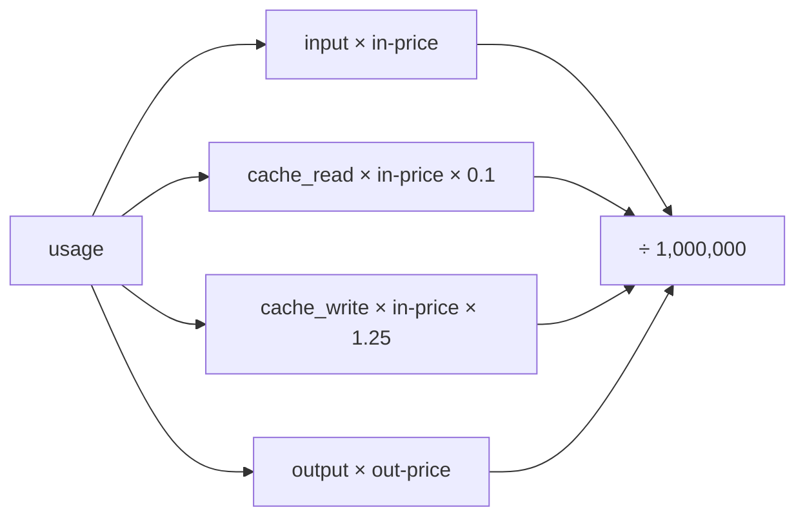
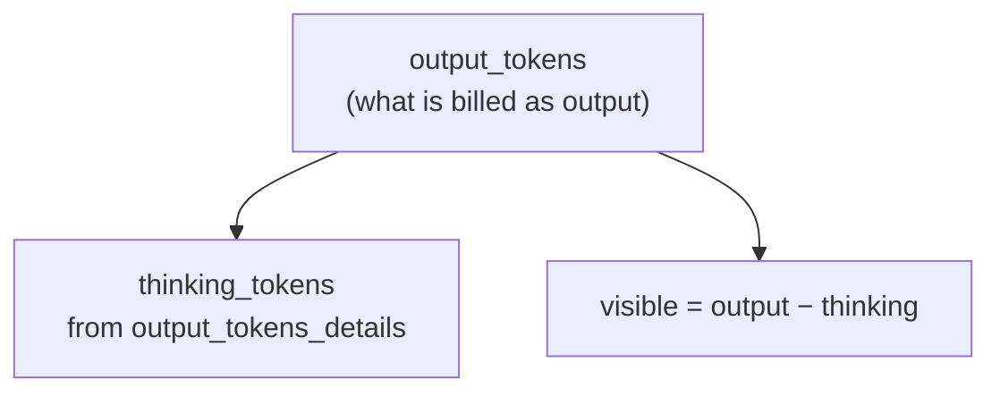
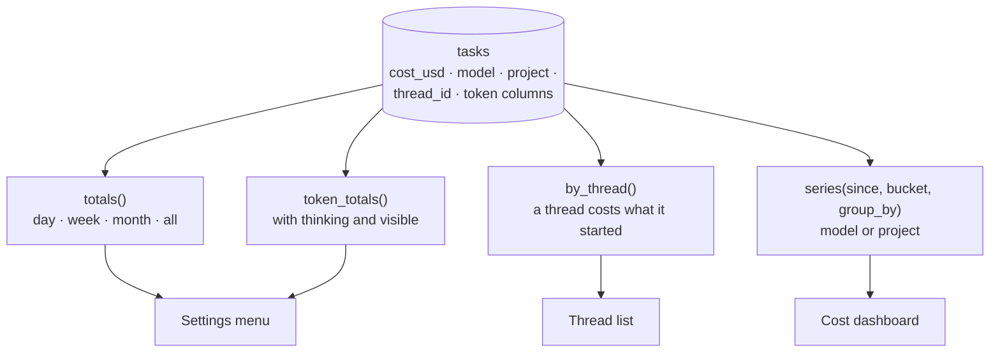
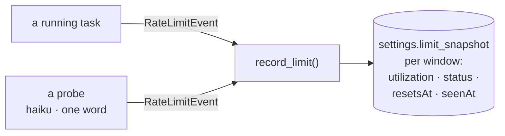
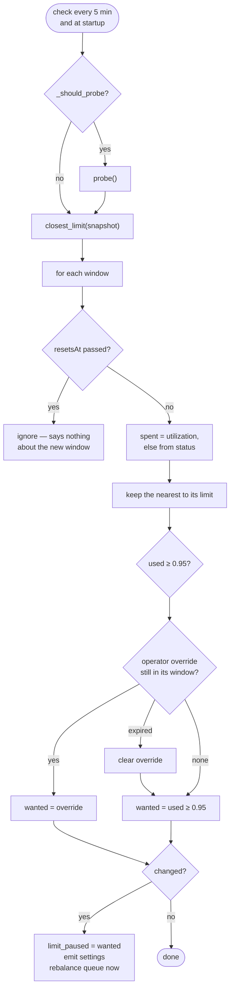
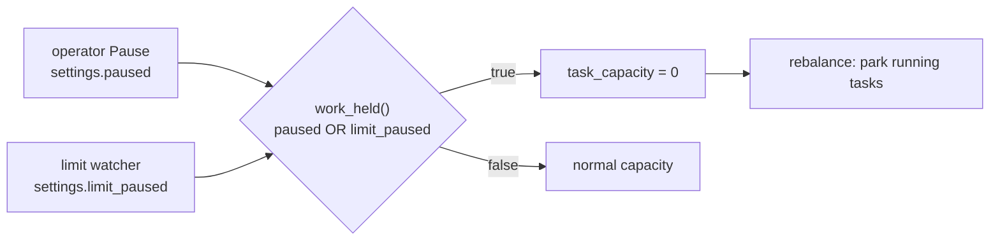
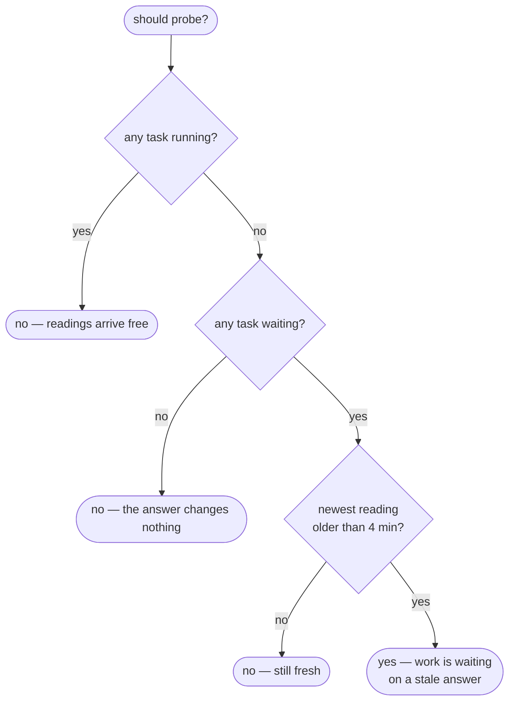
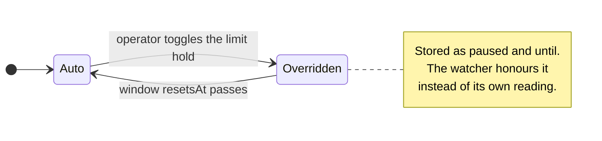

# 09 · Costs, tokens and usage limits

## Summary

Agent work spends money, and on a Claude subscription it also spends **limit
windows** that, once exhausted, fail every task in flight. dex tracks both:

- **Cost** — a running estimate while a task works, replaced by the agent's own
  authoritative total when it finishes.
- **Tokens** — input, cache reads and writes, output, and **thinking split out of
  output**, so "what did the thinking cost" is answerable.
- **Usage limits** — dex reads how much of each window is gone and **holds new
  work just short of the edge**, releasing it by itself when the window rolls
  over.

| Module | Responsibility |
|---|---|
| `src/dex/pricing.py` | List prices, `estimate()`, `tokens()` |
| `src/dex/runner.py` | `_accrue`, result handling, rate-limit readings |
| `src/dex/store.py` | `CostStore`, `SettingsStore.record_limit`, `work_held` |
| `src/dex/usage.py` | `UsageWatcher` — hold, release, probe |
| `web/src/components/CostDashboard.tsx` | Spend over time, by model or project |

---

## Cost over a task's life

The estimate exists only so a task shows a plausible number while it works
rather than nothing for minutes. Anything derived from it is labelled an
estimate, and the result's figure supersedes it.

### The estimate

`price_for(model)` matches exactly first, then the **longest known key contained
in the id**, so dated snapshots and provider prefixes still price correctly;
unknown models fall back to a default.

A pricing failure costs only the estimate — `_accrue` is guarded separately so
it never takes down the tool and text events in the same message.

---

## Thinking tokens

**Thinking is a subset of output, never an addition to it.** The API bills
thinking as output, so nothing was ever missing from the dollar total; it simply
could not be split out. Summing `output_tokens + thinking_tokens` double-counts
every thought.

| Rule | Where |
|---|---|
| Read tokens from the **result**, not streamed messages | Only the result carries `output_tokens_details` |
| Clamp thinking to output | A subset exceeding its whole is a report dex does not understand |
| Missing counts read as 0 | Per-message usage generally lacks the detail |
| Aggregates report `visible = output − thinking` | So the three always reconcile |

Aggregates report the same windows as cost — day, week, 30 days, all time.

---

## Where spend shows up

`model` is **resolved at submit time** and stored on the row, so the breakdown
stays correct after the global or per-project default changes. `group_by` is
validated against a fixed set rather than interpolated into SQL.

Cost figures are admin-only: a non-admin reading settings gets them omitted, and
`/api/costs` needs `manage_users`.

---

## Usage limits

### Where readings come from

There is **no endpoint to query usage**. The CLI attaches a rate-limit reading to
ordinary calls, so dex learns where the limits stand only as a side effect of
work.

A reading carries `unifiedWindows` — every window with its own figure — beside
the one it is nominally about. Folding in all of them is the difference between
knowing the five-hour window is nearly gone and knowing the seven-day one is
only half spent.

### Deciding to hold

**Why 0.95, not 1.0.** A run already in flight keeps spending, so the last few
percent are what it needs to finish rather than fail part-way.

**When utilization is absent** — some plans report only a status — the status is
the fallback:

| Status | Treated as |
|---|---|
| `rejected` | 1.0 — spent |
| `allowed_warning` | 0.95 — the CLI saying "approaching", the same thing the threshold catches |
| `allowed` | 0.0 |

### Holding work

Holding is a reason for capacity to be zero, handled by the same machinery as
the operator's Pause ([02](02_task_lifecycle.md#how-many-run-at-once)). Every
caller asks `work_held()` rather than either flag, so a new reason to hold work
is one change in one place. Chats and planning are **not** held — only
generation tasks.

### Probing, sparingly

A probe is a real call — the cheapest model, one word — costing about three
cents. It is paid for only in the narrow case where the answer could change what
happens next: work is waiting, nothing is running to report on its own, and the
last reading may no longer be true. This is also what lets held work **release
itself** once a window rolls over with nothing running.

### The operator's override

Setting the hold by hand is stored as an **override**, not just a value, or the
watcher would undo it on its next pass. It expires with the window it was made
in, so one click cannot disable the guard permanently.

---

## Model and effort

| Setting | Scope | Read |
|---|---|---|
| `model` | Global default | At submit; stored on the task |
| `model:<project>` | Per-project override | At submit |
| Planner model | Global, or per project | Per planning call |
| `effort` | Global (`low` … `max`), or deployment default | At task start |

A task records the model it ran on, and effort is fixed at start, so changing
either affects new work while runs in flight keep what they were planned with.
Higher effort buys better work on hard problems and costs wall-clock and tokens
on easy ones — one high-effort run put 122 seconds of thinking before its first
token.

---

## Improvement opportunities

- **Cost is attributed to a task, and a skill has none.** A helper used by
  three projects shows its cost wherever it happened to be written, so the
  expensive capability and the expensive project are indistinguishable.
- **A survey spends before the plan card exists.** The operator sees a task
  chip and then a plan; the money spent deciding *how to split the work* is not
  separated from the money spent doing it.
- **Limit windows are read, not predicted.** dex holds work just short of the
  edge but cannot tell a task that will take ten minutes from one that will
  take an hour, so a long task started just inside the window still fails.

