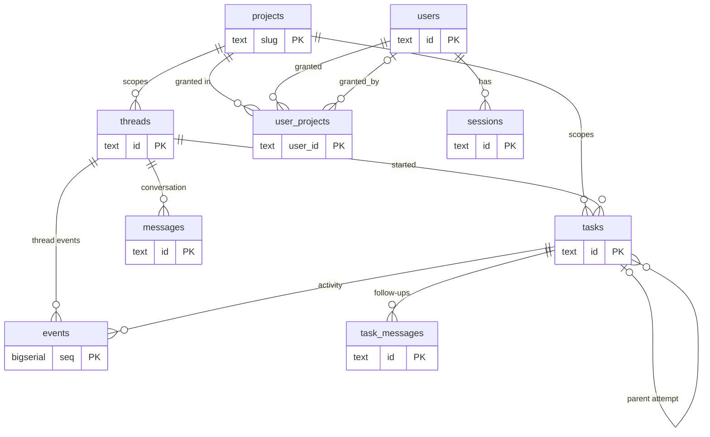
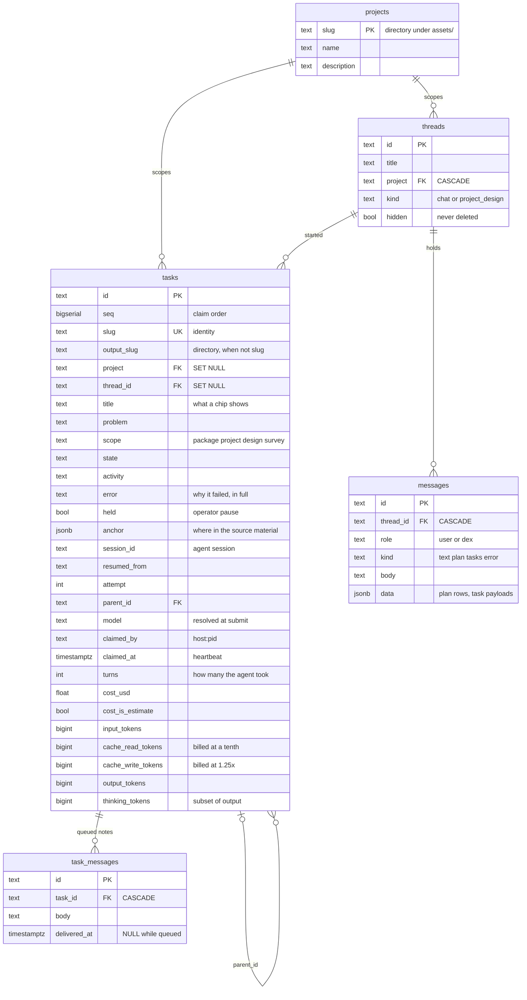
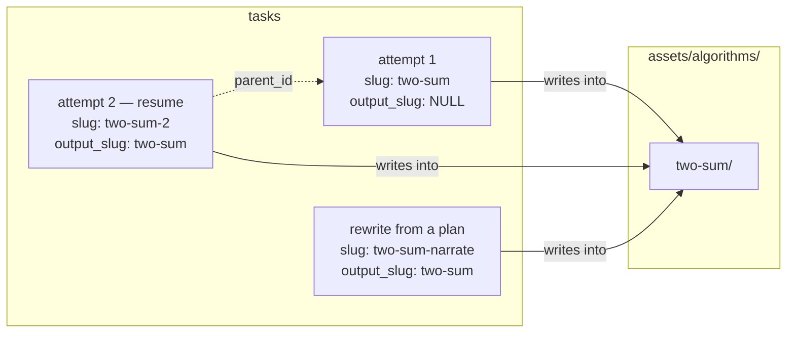
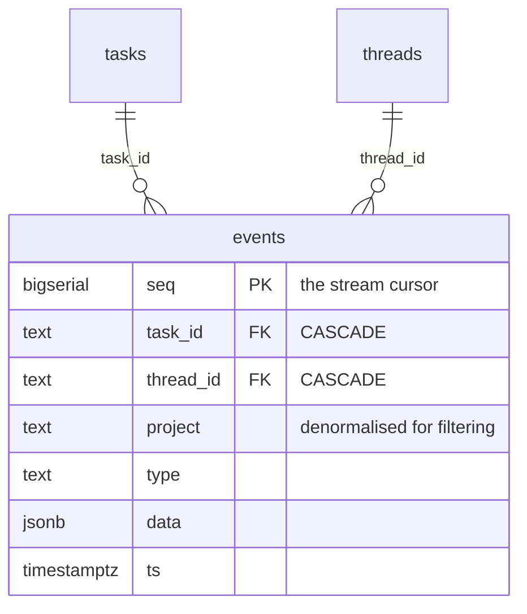
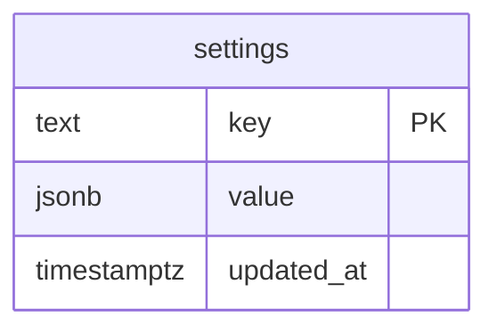
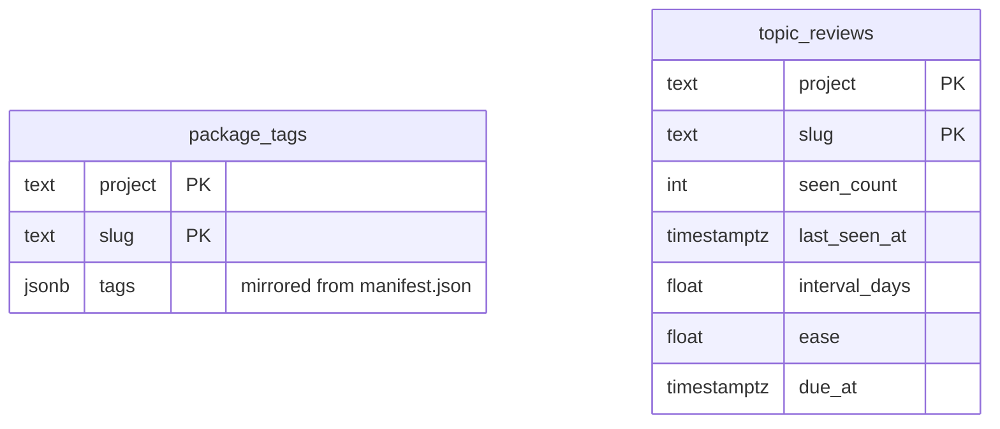
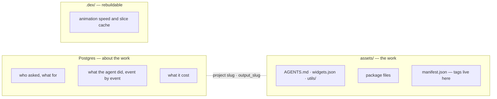
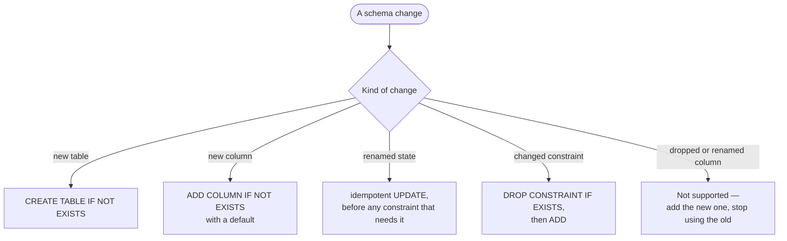

# 10 · Data model

## Summary

dex keeps its durable state in **Postgres** and its work product on **disk**.
The database holds everything about the work — projects, conversations, tasks
and their full event history, settings, users — while `assets/` holds the
packages the work produced.

The schema lives in one file, `src/dex/schema.sql`, applied on **every
startup**. There is no migration tool: every statement is `IF NOT EXISTS` or an
idempotent `UPDATE`, so the same file creates a fresh database and upgrades an
old one. The consequence is a hard rule — **changes must stay additive**.

| Area | Tables |
|---|---|
| Work | `projects`, `threads`, `messages`, `tasks`, `task_messages` |
| Activity | `events` |
| Configuration | `settings` |
| Library and feed | `package_tags`, `topic_reviews` |
| Identity | `users`, `user_projects`, `sessions`, `oauth_states` |

---

## Everything at once

Four tables relate to nothing by foreign key: `settings`, `oauth_states`,
`package_tags` and `topic_reviews`. The last two are keyed by
`(project, slug)` — the name of a package directory — because a package exists
on disk whether or not a task row still does.

---

## Work

### `slug` is identity; `output_slug` is a directory

This is the distinction most worth remembering.

- `slug` is **unique** and names the task.
- `output_slug` names the directory it writes into; `NULL` means "same as
  `slug`". A resumed attempt, or a plan row that `updates` an existing package,
  gets a slug of its own but continues the existing directory instead of opening
  an empty one beside it.
- **Anything keyed on the wrong one looks in the wrong place.** The watcher, for
  example, attributes a file to a task by `COALESCE(output_slug, slug)`, never by
  slug alone.

### Why the columns are shaped this way

| Column | Instead of | Because |
|---|---|---|
| `seq BIGSERIAL` for ordering | `created_at` | Tasks submitted together share the transaction clock and could be claimed out of order |
| `threads.hidden` | `DELETE` | Deleting cascaded messages away and orphaned tasks; a mistaken tap lost real work |
| `tasks.model` stored at submit | Reading the current default | Cost breakdowns stay correct after the default changes |
| `held` | A second paused state | Both are paused; only dex's own pauses resume themselves |
| `claimed_by`, `claimed_at` | In-memory ownership | A crashed worker's task is distinguishable from a live one, across processes |
| Design turn packed into `problem` as JSON | Three nullable columns | Only one scope has them |
| Survey brief packed into `problem` as JSON | Four nullable columns | Same reason; see [14](14_survey_and_anchors.md) |
| `tasks.anchor` as `JSONB` | Columns per position | The shape differs by source: a PDF has pages, a workbook a sheet, a link neither |
| `thinking_tokens` beside `output_tokens` | Adding them | Thinking is a subset of output; summing double-counts |

The `projects` foreign keys differ on purpose: deleting a project **cascades**
its threads but **nulls** its tasks, so spend history survives the project.

---

## Activity

Every event the UI renders is a row, written before it is delivered, so `seq`
is a stable cursor across reconnects and restarts. `project` is **denormalised**
onto the row because live fan-out happens in-process without a join; a one-time
backfill from `tasks` means historical rows filter the same way. This is by far
the largest table — streamed text arrives a token delta per row, so a busy day
has run to about 300,000 rows. See [07](07_event_stream.md).

Indexes serve the two ways it is read: `(task_id, seq)` for one task's history,
and `(project, seq)` / `(seq)` for the stream.

---

## Configuration

A single key-value table, because every entry is read and written independently
and is re-read continuously rather than at startup. That is what lets limits,
toggles and models change from the UI without a restart.

| Key | Holds |
|---|---|
| `task_concurrency`, `chat_concurrency` | Capacity limits |
| `paused` | The operator's global hold |
| `limit_paused`, `limit_snapshot`, `limit_override`, `limit_probe` | Usage-limit state ([09](09_costs_and_limits.md)) |
| `auto_approve` | Grant tool approvals without asking |
| `utility_proposals` | Shared-utility promotion ([08](08_shared_utilities.md)) |
| `model`, `model:<project>`, `effort` | What agents run on |
| `animation_speed` | Default playback speed ([11](11_animations.md)) |

---

## Library and feed

`package_tags` is a **derived index**: the truth is each package's
`manifest.json`, and the watcher mirrors it here so the Library can build its
filters from one query instead of opening every manifest. It is reconciled
against disk at startup and refreshed when a manifest changes.

`topic_reviews` is spaced-repetition state per package, per project. It has no
user column — **the schedule is shared by everyone who reviews that project**.
See [12](12_review_feed.md).

---

## Identity

Documented in full in [01](01_auth.md#sessions). In short: `users.role` is
nullable and `NULL` means no role; grants live in `user_projects`; sessions
store the SHA-256 of the cookie, never the cookie itself; `oauth_states` rows
are deleted as they are read, which makes an OAuth callback single-use.

---

## What lives on disk instead

The link between the two is naming: a project's `slug` is its directory, and a
task's `COALESCE(output_slug, slug)` is its package directory. Guides and
manifests are deliberately files, not rows, because the agent reads and edits
them with ordinary file tools — and a person can too.

---

## Schema evolution

Two examples already in the file. `interrupted` was folded into `paused` with an
`UPDATE` that moves rows that had run and closes rows that had not. The role
constraint was widened for the four-role model by first migrating `user` rows to
`operator` and only then recreating the `CHECK`, which would otherwise have
rejected the rows being fixed.

---

## Improvement opportunities

- **`assets/` is gitignored, so `skills.json` does not travel.** Which version
  of which skill each project is on is per-install state — a clone gets the
  skills but not the answer to which ones are enabled. That is the one hole in
  "a project is reproducible on another install", and the admin table is
  currently the only thing that closes it.
- **The ER block is hand-maintained**, and it had drifted: three token columns
  the database has and `pricing` bills were missing from it until this pass. A
  test comparing the diagram against `information_schema` would be a dozen
  lines.
- **Deleting a project nulls its tasks so spend survives** — which means a task
  row can outlive every path it names, and `output_dir` then resolves against
  the default project.

