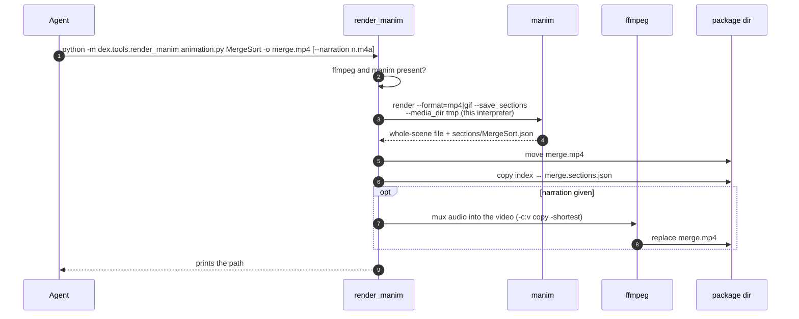
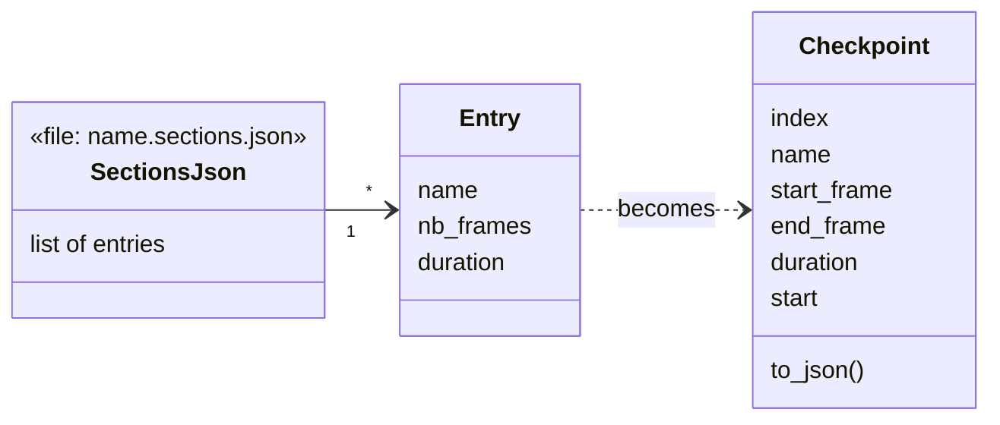
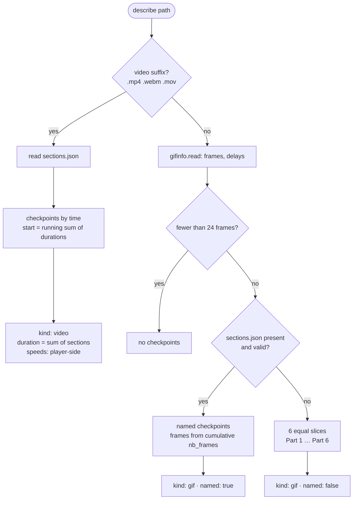
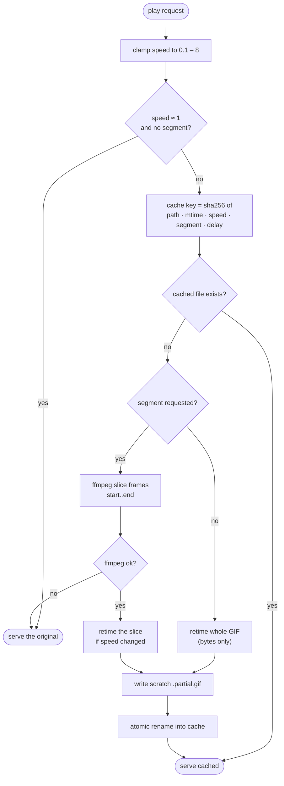
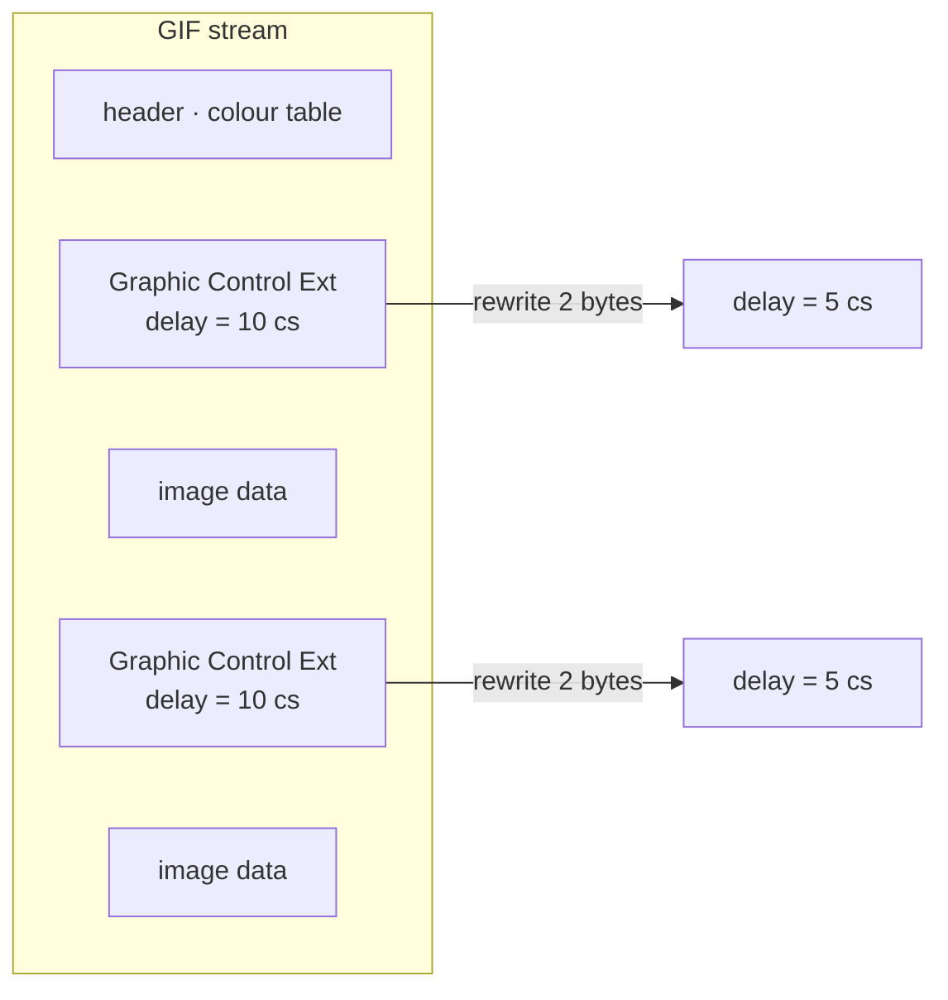
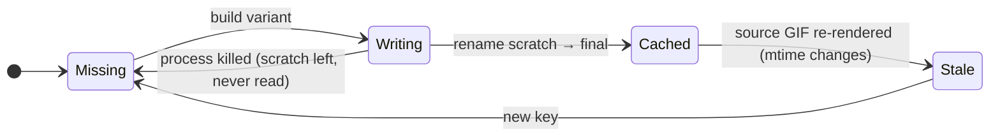
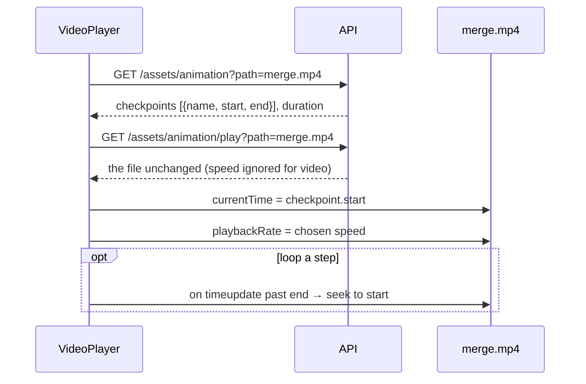
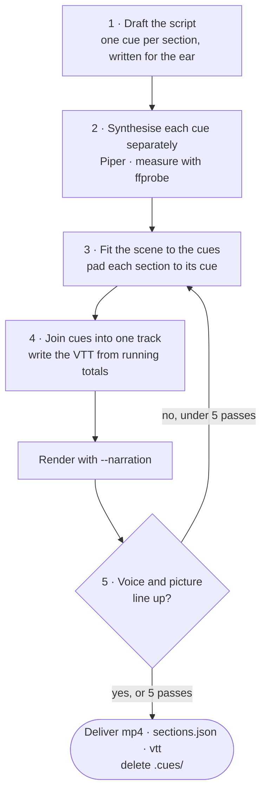

# 11 · Animations

## Summary

Algorithm packages teach through **manim animations**: one scene per approach,
walking through the idea on a small concrete input. dex lets a reader **change
playback speed** and **step through named checkpoints** — "compare", "swap",
"merge" — rather than scrubbing a clip.

Two formats exist, and they need very different machinery:

| Format | Produced when | Speed | Stepping |
|---|---|---|---|
| **GIF** | A silent animation | Server rewrites frame delays | Server slices frames with ffmpeg |
| **MP4** | A narrated animation | The player's own rate | The player seeks to a time |

A GIF has no seek and plays at the delays baked into it, and an `` offers
no controls, so every GIF variant is **derived on the server and cached**. A
video needs none of that; the server only tells the player where the sections
are.

| Module | Responsibility |
|---|---|
| `src/dex/tools/render_manim.py` | Render a scene to a chosen path; save sections; mux narration |
| `src/dex/animation.py` | Checkpoints, `describe`, speed and slice variants |
| `src/dex/gifinfo.py` | Read GIF timing and rewrite delays without decoding |
| `src/dex/tools/warm_animations.py` | Pre-build slices after a batch of tasks |
| `web/src/components/AnimationPlayer.tsx`, `VideoPlayer.tsx` | The players |

---

## Producing an animation



Why a wrapper rather than calling manim directly:

- **Deterministic output path.** manim buries output under
  `media/videos/<module>/<quality>/<Scene>.gif`, which is awkward for an agent to
  place reliably.
- **The right manim.** It runs `python -m manim` with *this* interpreter; a
  `manim` found on `PATH` may be a pyenv shim or another environment with a
  different Scene API.
- **The extension chooses the format.** `.mp4` when there is narration to carry,
  `.gif` when silent.
- **Narration is muxed in**, not left beside the video. A separate audio file
  has to be kept in sync by whoever plays it, and drifts the moment a reader
  seeks or loops a section; one file cannot drift.
- **Rendering runs in a scratch media directory**, so a stray render never
  leaves `media/` inside the package or the repository.

### Sections are checkpoints

A scene marks its steps with `self.next_section("name")`. `--save_sections`
makes manim write an index of those blocks, which the wrapper copies beside the
output as `<name>.sections.json`:



Without sections, the viewer falls back to unnamed equal slices — which is why
the algorithms guide tells the agent to mark its steps. The guide is re-read on
every run, including resumes.

---

## Describing an animation

`GET /api/assets/animation?path=` returns what the player needs to draw its
controls:



The response also carries `defaultSpeed` from settings and the speed choices:
`0.25, 0.5, 1, 1.5, 2, 4`.

---

## GIF playback variants

`GET /api/assets/animation/play?path=&speed=&segment=` serves the right bytes:



### Speed: rewrite bytes, do not decode



Playback speed lives entirely in the **Graphic Control Extension** blocks, so
changing it never touches image data. Re-encoding a 500-frame animation through
an image tool took over a minute; rewriting delays takes milliseconds.

The new delay is the **median** source delay divided by the speed, floored at 2
hundredths. Below that, browsers rewrite a delay of 0 or 1 to 10 (about 10 fps),
so a faster request would paradoxically play slower. The same clamp is applied
when *reading* durations, or any animation faster than 10 fps would be
misreported.

### Stepping: slice with ffmpeg

GIF frames are **deltas** of one another, so a slice cannot be cut from the byte
stream — it has to be decoded and re-encoded. ffmpeg does that about an order of
magnitude faster than an image tool at these sizes, roughly half a second where
the alternative took thirteen.

```
select='between(n, start, end)', setpts=N/15/TB,
split → palettegen=stats_mode=diff → paletteuse=dither=bayer
```

A **generated palette** keeps the source's colours; the default palette visibly
banded manim's gradients.

### Caching



- The cache lives in `.dex/animations/` and is **entirely rebuildable**.
- The key includes the source's **mtime**, so a re-rendered animation never
  serves a stale variant.
- Files are written to a scratch name and **renamed only when complete**, so a
  killed process cannot leave a truncated file that later looks like a valid hit.
- Every failure — no ffmpeg, an unreadable GIF, a failed write — **falls back to
  the original file**. A reader loses a control, never the animation.
- Responses carry `Cache-Control: private, max-age=300`, and the real media type
  of what was served.

### Warming

The first press of a step control pays for its slice. After a batch of tasks,

```bash
python -m dex.tools.warm_animations
```

builds every slice up front (`--speed` warms additional speeds; `--dry-run`
reports the work). It calls the same `variant()` the endpoint does, so a warmed
file is exactly the cache hit the endpoint will look for.

---

## Video playback



Nothing is re-encoded. A video's checkpoints are **times**, computed as running
sums of section durations — frames are a GIF's unit, not a player's. Its total
length is the sum of the sections, which is also how the review feed learns how
long to play it ([12](12_review_feed.md)).

---

## Narration: what the guide asks for

The renderer only muxes. Producing narration that matches the picture is the
agent's job, and the algorithms project guide spells out the method — the
narration sets the pace, and the animation is fitted to it rather than the
other way round:



Synthesising cues separately is what makes the caption timings exact: each
cue's length is measured, so every caption's start is a running total rather
than an estimate. The five-pass cap exists because five renders of a 30-second
animation is already several minutes of work.
