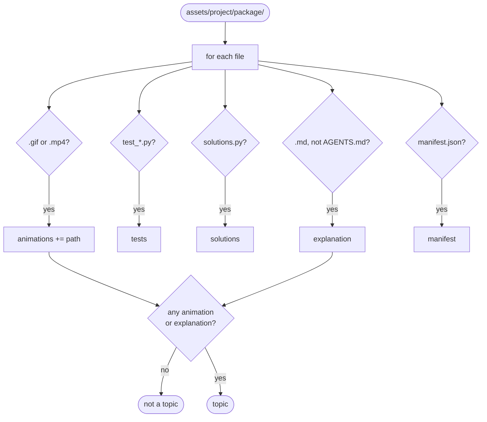
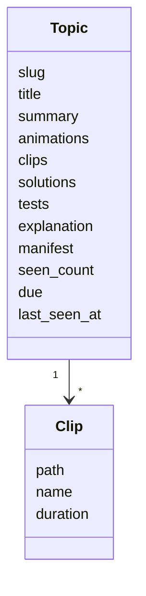
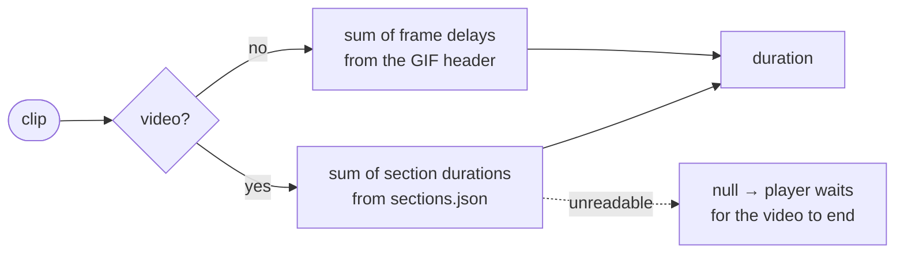
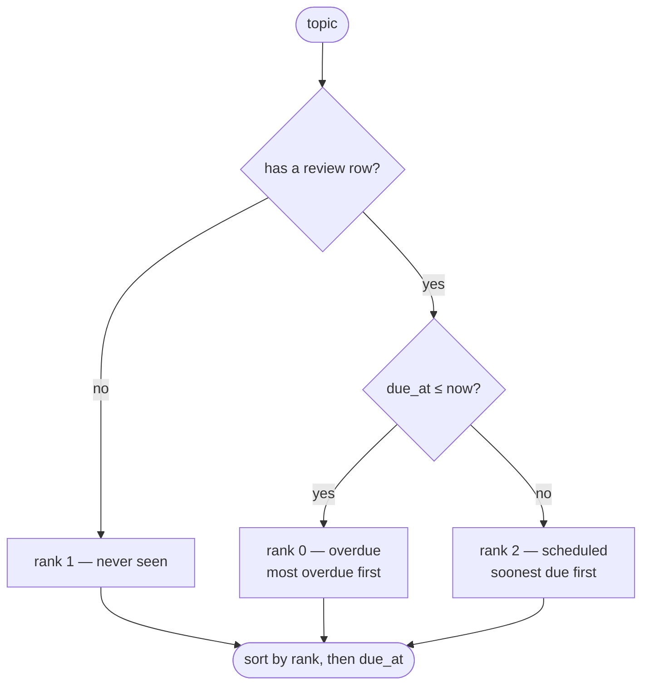
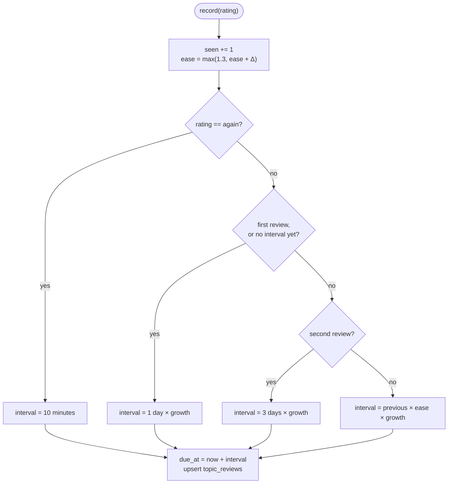
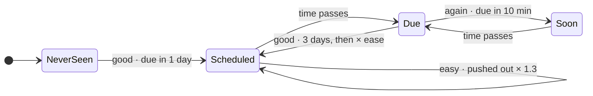
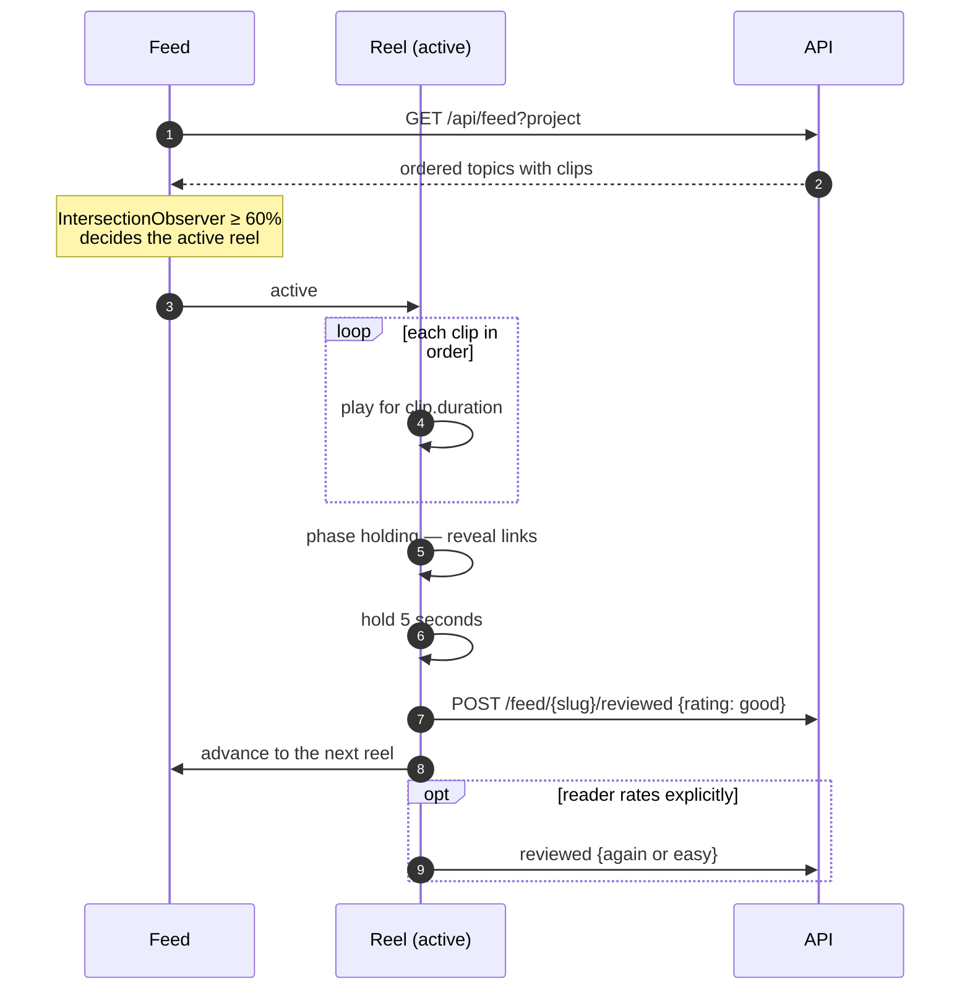

# 12 · Review feed

## Summary

The review feed turns a project's finished packages into a **vertical reel**
for revisiting what was learned. Each reel plays the package's animations, then
reveals links to the explanation, solutions and tests, holds for a few seconds,
and moves on.

The order is **by urgency, not recency**. A small spaced-repetition scheduler
puts the material closest to being forgotten first, so revisiting is weighted
towards what is slipping rather than what was made most recently.

| Module | Responsibility |
|---|---|
| `src/dex/feed.py` | `discover` topics on disk; `ReviewStore` ordering and scheduling |
| `src/dex/gifinfo.py`, `src/dex/animation.py` | How long each clip runs |
| `src/dex/api.py` | `GET /api/feed`, `POST /api/feed/{slug}/reviewed` |
| `web/src/components/Feed.tsx` | The reel, its timeline, ratings |

---

## What a topic is

A **topic** is one package directory that has something worth showing. It is
discovered from disk on every request — there is no topic table.

A package with neither an animation nor an explanation has nothing to show in a
reel, so it is skipped.

**Title and summary** come from the manifest's `problem`. Its first sentence is
the summary; it becomes the title only when it is genuinely short (48
characters), because problem statements are a paragraph more often than a
title. Otherwise the directory name, title-cased, reads better.

### Measuring clips

The reel once timed itself from a fixed fallback of eight seconds, because
nothing measured videos — and moved on eight seconds into a minute-long
animation. Every clip is now measured, and a package with one clip per approach
plays them in sequence using each one's own length.

---

## Ordering

**Overdue first, then never seen, then whatever comes round soonest.** New
material waits behind material that is slipping, which is the point: a feed
ordered by recency shows you what you just made and lets the rest decay.

---

## Scheduling

A deliberately small **SM-2**: enough to space reviews sensibly without asking
the reader to grade every card.

| Rating | Ease change | Growth | Meaning |
|---|---|---|---|
| `again` | −0.20 | 0 | Did not land: back within the session, and grows more slowly after |
| `good` | 0 | 1.0 | Seen and made sense |
| `easy` | +0.15 | 1.3 | Comfortable: push it out harder |

Ease starts at 2.5 and never drops below 1.3, so a topic marked `again`
repeatedly still grows eventually rather than being stuck on a ten-minute loop.

### A topic's schedule over time

---

## The reel

- **Auto-advance counts as having seen it**, recorded as `good`. Only an
  explicit rating records `again` or `easy`.
- **One timeline per reel**: play every clip, reveal the links, hold, advance.
  The links appear only in the hold, so they do not compete with the animation.
- **The active reel is whichever is at least 60% visible**, via an
  `IntersectionObserver` rather than scroll arithmetic.
- **Neighbouring reels preload**; the rest do not. Clip responses allow a short
  private cache so a preloaded video is not thrown away on activation.

---

## Access and scope

| Action | Needs |
|---|---|
| `GET /api/feed` | `view` and the project granted |
| `POST /api/feed/{slug}/reviewed` | `run_tasks` and the project granted |

Two consequences worth knowing:

- **Review state is per project, not per person.** `topic_reviews` has no user
  column, so everyone reviewing a project shares one schedule: one reader's
  `easy` pushes a topic out for all of them.
- **A viewer can watch the feed but does not move it.** Recording a review needs
  `run_tasks`, so a viewer's auto-advance is refused and the schedule is left as
  it was. The reel still advances, because advancing does not wait for the
  write.

If per-person schedules become wanted, `topic_reviews` gains a `user_id` in its
primary key and recording opens to `view` — which is also the natural point to
revisit the second consequence.

---

## Improvement opportunities

- **Not verified in this pass.** As with [11](11_animations.md), the
  structural claims hold — modules, routes and symbols all exist — but the
  scheduler's behaviour was not exercised.
- **The schedule is per package and per install.** Nothing carries what has
  been revisited between machines, so a project cloned elsewhere starts its
  spacing from nothing.

