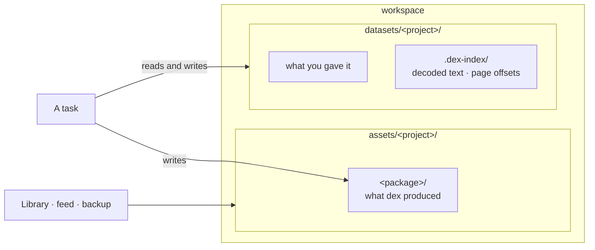
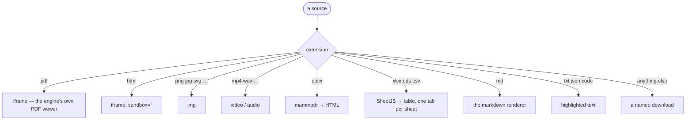

# 13 · Source material

## Summary

Some work has an input. A book to translate, a price list to index, a corpus to
draw from — material the operator brings, which dex did not generate and must
not treat as though it had.

That material lives in `datasets/<project>/`, uploaded from the `+` button in
any composer. Tasks read *and* write there. The UI renders it in the same pane
it uses for generated assets, so a PDF can be read without leaving dex.

| Module | Responsibility |
|---|---|
| `src/dex/uploads.py` | Storing an upload, resolving a name, naming sources in a brief |
| `src/dex/config.py` | `datasets_dir`, `project_datasets(project)` |
| `src/dex/api.py` | `POST /uploads`, `GET /datasets`, `GET /datasets/raw` |
| `src/dex/permissions.py` | The dataset directory as an `extra_writable` root |
| `web/src/components/Attachments.tsx` | The `+` button and the chips beneath a composer |
| `web/src/components/SourceView.tsx` | Rendering one source by type |
| `web/src/components/OfficeDoc.tsx` | `.docx` and `.xlsx`, converted in the browser |

---

## Two trees, and why



`assets/` is what dex made; `datasets/` is what it was given. Keeping them
apart is not tidiness. The assets tree feeds the Library, the review feed and
the asset backup — dropping a supplied PDF into it would present the operator's
own file back to them as though dex had generated it, and back it up as
generated work.

The split has one consequence worth stating: **nothing in `datasets/` appears
in the Library or the feed.** It is reachable from the thread that uploaded it
and from the preview pane, and that is all.

---

## Uploading

`POST /api/uploads?project=<slug>` takes a multipart batch. One call per set of
files chosen together, so a brief can name them as one group.

```mermaid
sequenceDiagram
    autonumber
    actor O as Operator
    participant C as Composer
    participant API as POST /uploads
    participant FS as datasets/&lt;project&gt;/

    O->>C: picks three files
    C->>API: multipart, one request
    API->>API: access.check(project)
    loop each file
        API->>API: safe_name() · size check
        API->>FS: write, suffixing a name already taken
    end
    API-->>C: [{name, path, bytes}]
    C->>C: chips under the textarea
    O->>C: types the message and sends
    C->>API: message + upload names
```

Nothing is parsed at upload time. What a PDF *means* is the agent's problem,
and guessing at it here would only be a guess that has to be right.

| Rule | Why |
|---|---|
| `safe_name()` keeps the last path component only | A browser may send `../`, and directory traversal is the whole risk |
| Non-ASCII names survive | The file that prompted this was `默读_…_和图书.pdf`; mangling it loses the operator's own filing |
| A taken name gets `-2`, never an overwrite | Both files were chosen deliberately; silently losing one is unnoticeable |
| 64 MB a file | The whole file is held in memory while it is written |

### Names, not paths, cross the wire

The browser sends back **filenames**, and `uploads.resolve()` re-resolves each
one inside the project's own directory. A name that climbs out, or points at
another project, resolves outside and is dropped. Nothing raises: a message
naming a file that has since been deleted should still send.

---

## What a task is told

The paths go into the brief, not into the transcript. `uploads.with_sources()`
appends a `## Sources` section naming each absolute path, so the agent knows
where to read; the thread keeps only what was typed, because every reread of a
conversation carrying a wall of absolute paths is a conversation nobody reads.

Sources are **read where they are**, never copied into the package. A task that
moved them would both duplicate them and lose the line between what was given
and what was produced.

### Every task may write there

`datasets/<project>/` is an `extra_writable` root in the permission policy, for
every scope — not only tasks that were given an upload. A task that downloads a
source, or builds an index beside one, is doing the work it was asked to do,
and one that had to ask before touching it would stop on its first real step.

The same paragraph appears in `AGENTS.template` and in every project's
`AGENTS.md`, so the agent knows it before it tries.

---

## Reading it back

| Route | Returns |
|---|---|
| `GET /api/datasets?project=` | `{name, bytes, mtime}` per file; dotfiles and `.dex-index/` excluded |
| `GET /api/datasets/raw?project=&name=` | The bytes, typed, `inline` |

`inline` is load-bearing. Starlette writes no `content-disposition` at all
without a `filename`, and writes `attachment` with one — and `attachment` makes
the browser download the PDF instead of rendering it in the frame. Both halves
are passed.

---

## The preview pane

Source files open in the same `viewer` pane as generated assets, through a
`{kind: 'source', project, name, anchor?}` target. A source is addressed by
project and name rather than by path, because it is not in the assets tree and
has no path-shaped identity in the UI.



### A PDF must not be sandboxed

The first cut sandboxed every framed file. Chromium renders PDFs with a
privileged internal viewer that a sandboxed frame is **not allowed to
instantiate**, so `sandbox` on a `.pdf` produces a blank pane — with nothing in
the console, and no error anywhere. Measured side by side: `sandbox=""` and
`sandbox="allow-scripts"` both blank, unsandboxed renders.

So the sandbox is split by type. Uploaded **HTML** keeps `sandbox=""` — it is
markup dex did not write and may carry scripts from whoever produced it.
**PDFs** get none, and nothing is given up: a PDF document cannot reach the
embedding page's DOM.

### Office formats are converted, not framed

No browser renders `.docx` or `.xlsx`. Both are converted in the browser and
both libraries are heavy, so `SourceView` loads them lazily — they arrive only
when such a file is actually opened, and never sit in the main bundle.

| | Library | Chunk | Note |
|---|---|---|---|
| `.docx` | mammoth | ~390 kB | Emits a small fixed tag set from the document's own styles |
| `.xlsx` `.ods` `.csv` | SheetJS | ~490 kB | One tab per sheet |

SheetJS is installed **from `cdn.sheetjs.com`, not npm**. The registry copy is
frozen at 0.18.5 and carries two unfixed advisories (prototype pollution,
ReDoS); the vendor publishes fixes only from their own CDN. The dependency line
is a URL on purpose.

Pre-2007 binary `.doc` and `.xls` are a different container that neither
library reads. They fall through to a download, which is honest about it.

---

## Attachments in the thread

A message carries its attachments as `data.attachments` — names only. They
render as chips under the bubble rather than inside it: the text is what was
said, the files are what came with it.

Clicking a chip opens the preview pane. It is addressed with the **thread's**
project, not the picker's — the server filed the upload under the project the
thread belongs to, so reading it back under whatever is selected now would look
in the wrong directory the moment the two differ.

---

## What is not covered

- **Task-level messages show a raw `## Sources` block.** `task_messages` has no
  `data` column, so a file attached to a follow-up appears as markdown in the
  queued note rather than as a chip. Visible, but ugly.
- **Top-level `datasets/` files** — the ones sitting outside any project
  directory — belong to no project, so no task can reach them.

---

## Improvement opportunities

- **The 64 MB cap is a memory cap, not a policy.** The whole upload is held
  while it is written, so the number is what the process can afford rather than
  what a source might reasonably be. Streaming to disk would let it go.
- **Legacy `.doc` and `.xls` have no preview**, and the download they fall back
  to is the same one an unknown format gets — nothing says *why* they cannot be
  shown.
- **A file attached to a task-level message still renders as raw markdown.**
  `task_messages` has no `data` column, so the `## Sources` block appears in
  the queued note instead of as chips.
- **Nothing ever deletes an upload.** `datasets/<project>/` only grows, and the
  decode cache under `.dex-index/` grows with it.

---

## See also

- [14](14_survey_and_anchors.md) — planning work out of this material
- [03](03_agent_runner.md) — the permission policy that makes it writable
- [10](10_data_model.md) — where uploads and anchors are recorded
