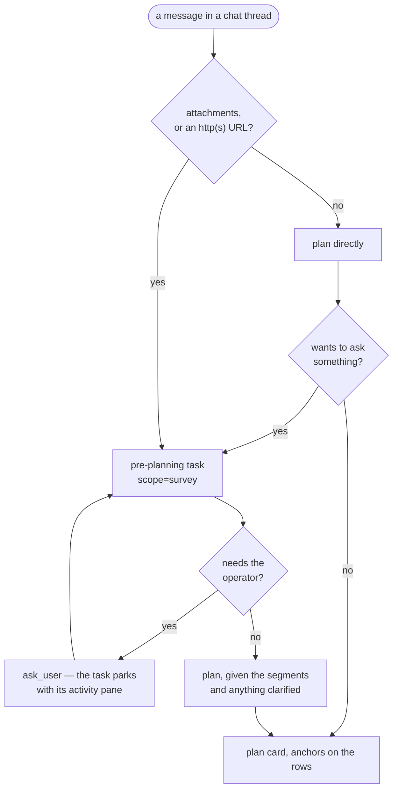
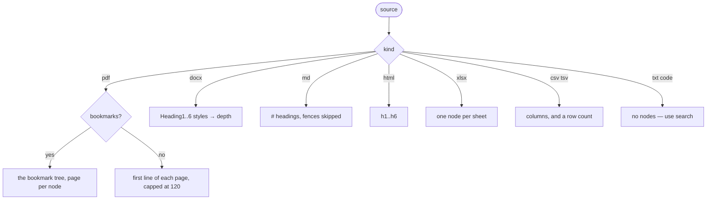
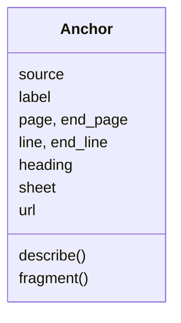
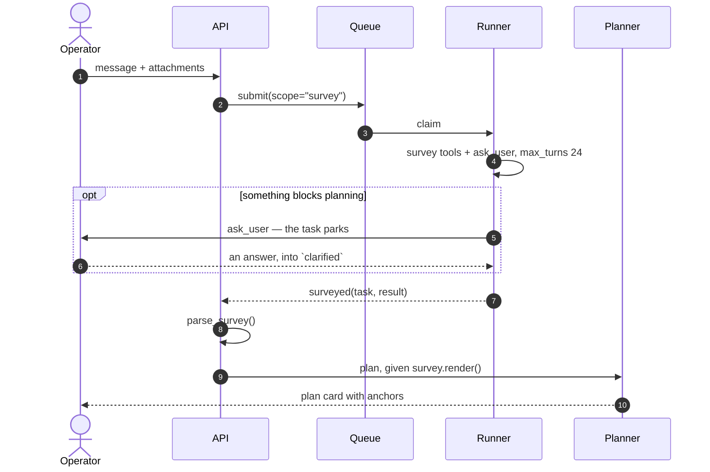
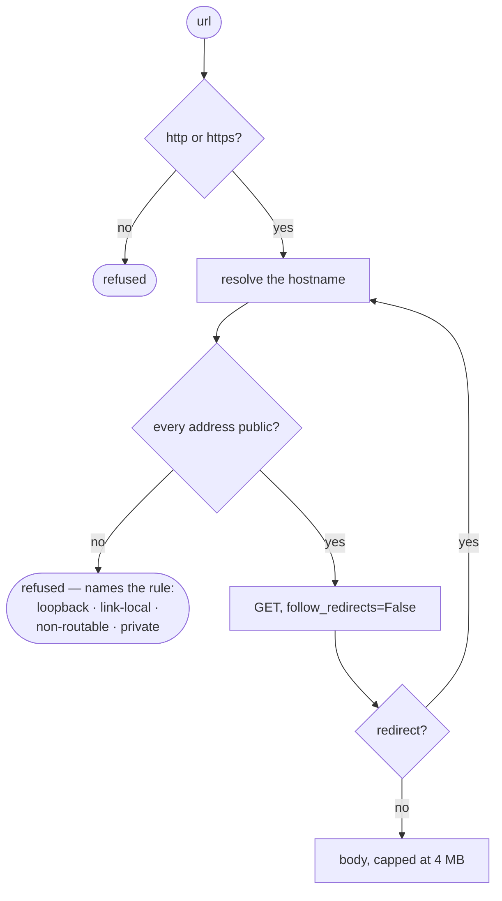

# 14 · Survey and anchors

## Summary

The planner is one tool-less turn. Given "translate this" and a 920-page PDF,
all it ever saw was a filename — so it produced one enormous task, or three
arbitrary ones, and the operator had no way to tell which.

A **survey** runs first. It is a short agent session with five reading tools,
no filesystem access, and `ask_user`, whose job is to answer one question: what
is in here, and where does it divide? It returns **segments**, each carrying an **anchor**
into the original. The planner turns segments into tasks and the anchors ride
along, so the operator sees `pp. 12–48 · Chapter 3` on the plan card and can
open the page before choosing the task.

The material is never read whole. Surveying the 920-page book costs about two
thousand tokens.

| Module | Responsibility |
|---|---|
| `src/dex/sources.py` | `outline` · `search` · `peek`, anchors, the decode cache |
| `src/dex/web_sources.py` | Fetching a URL, and the guard that mostly refuses to |
| `src/dex/surveyor.py` | The tool server, the routing rule, parsing the verdict |
| `src/dex/prompts.py` | `SURVEY_SYSTEM`, `survey_prompt`, the planner's anchor rules |
| `src/dex/runner.py` | `scope="survey"` — restricted tools, and the hand-off |
| `src/dex/api.py` | `_survey_turn`, `_plan_from_survey` |

---

## When it runs

A message with no material is planned directly — but if the planner comes back
wanting to ask something, it is **escalated** into a pre-planning task rather
than asking in the chat. A clear message never pays for a task it did not need;
an ambiguous one gets the step that can actually resolve it.

`surveyor.needs_survey(text, attachments)` decides the first branch, and it is
**hardcoded**. It
takes no project and no guide — there is nowhere in the signature to put one,
and a test asserts that. A message that brings material with it is a different
kind of request from one that does not: the material exists, it has a shape,
and planning without looking at that shape is guessing. Every project behaves
the same way so that a plan card means the same thing wherever the operator is.

A URL only counts as `http(s)://`. Mentioning a domain in passing —
"compare it with numpy.org's approach" — must not start a crawl nobody asked
for.

Design threads are never surveyed: they read the guide, not the operator's
source material.

---

## Why it is cheap

Five reading tools, and **no Read, no Bash, no Grep**. For a survey task the runner
sets `allowed_tools` to the survey tools alone, so the document cannot be
pulled into the context whole — not because the prompt asks it not to, but
because nothing in the tool surface can.

| Tool | Returns |
|---|---|
| `list_sources` | The attached files, with sizes |
| `outline` | The heading or bookmark tree, an anchor on every node |
| `search` | Regex hits as *anchors plus one line* — never the surrounding page |
| `peek` | A bounded excerpt at one anchor, capped at 4,000 characters |
| `outline_url` | The same, for a link the operator gave |

`ask_user` sits beside them — see *Asking* below. It is the one tool here that
does not read.

`search` deliberately returns no context. A search that did would be a way to
read the document a hit at a time, which is the thing this exists to avoid.

### Measured

Against a 137 MB, 920-page price book:

| | |
|---|---|
| Decode + outline, once | **11 s** → 2.64 M characters (~660k tokens) |
| Search across all 920 pages | **0.0 s**, page-anchored hits |
| What the model sees | ~120 lines |

Decoding happens once. The text and a page-offset map are written to
`datasets/<project>/.dex-index/`, so the second question about a document costs
a file read. The cache is authoritative while it is newer than its source.

---

## Asking

**Pre-planning is the only step that may ask the operator anything.**

The planner cannot: it is one stateless call, so it cannot follow up, and an
answer typed underneath its question reaches a *different* call that remembers
none of it. That is not hypothetical — a Wikipedia hub surveyed into twenty
linked articles came back as a single task, because by the time the operator
had answered "Romanian" the twenty parts were no longer in front of anything.

A survey can ask, and for the right reasons: it has read the guide, it has
looked at the material, and it runs as a task — so `ask_user` parks it with an
activity pane the operator can open, exactly as a generation task does.

What it learns comes back in `clarified`, which `render()` puts at the top of
what the planner reads. An answer that does not come back through there is an
answer nobody acted on.

### Escalation

When the planner returns `needs_clarification` with no tasks, dex starts a
pre-planning task carrying that question — titled `Ask: …` rather than
`Survey: …` — and its `options` seed what `ask_user` offers as buttons. The
task then plans as usual.

`may_escalate=False` on the plan that *comes out of* pre-planning stops the
regress: that run has already had its chance to ask, so its question falls
through to the thread as plain text instead of starting another round.

### The survey stays in the task

Its account is working, not an answer, and it is all in the task's own
activity. What reaches the chat is the plan — a wall of segments above it only
buries the thing the operator has to decide on.

---

## Outlines

Every node carries how much text sits under it. A planner splitting a document
needs to know which chapter is eighty pages and which is two paragraphs.

A PDF whose extractable text is far smaller than its page count is reported as
"likely a scan needing OCR". Saying so is far more useful than an empty
outline, because it changes what the work has to be.

When the outline is thin the survey is expected to go looking — `search` for
`table of contents`, `^chapter`, `^part \d`, then one `peek` to read what it
found. That is the case these tools exist for.

---

## Anchors

An anchor says where something is, in whatever terms its source has.

| Source | What identifies a place |
|---|---|
| PDF | `page`, `end_page` |
| Document, markdown, text | `line`, `end_line` |
| Workbook | `sheet` |
| Web page | `url` |

Flattening these into one lowest common denominator was rejected: a byte offset
means nothing to a reader and nothing to the viewer either. `label` carries the
human reading — `pp. 12–48 · Chapter 3` — and `fragment()` produces what opens
that spot in the pane (`#page=12`).

`to_json` fills an empty `label` from `describe()`, so the field the UI prints
is never blank. A round trip is therefore not identity, by design.

### Through the planner

The planner copies a segment's anchor onto the task **unchanged** — same
source, same numbers. `_anchor_of()` normalises what comes back (a model may
send a page as a string, or a half-filled dict) and drops an anchor that names
no position: the UI turns one into a button that opens the document, and a
button pointing at nothing is worse than no button.

The prompt also requires the pages be restated in `problem`. The generation
agent reads only `problem` and never sees the anchor, so a task whose brief
says "translate the document" translates all 920 pages.

### Where they end up

| Surface | Shows |
|---|---|
| Plan card | A 📍 button per row — opens the source at that page |
| `tasks.anchor` | Persisted through confirm, as `JSONB` |
| Files tab | The input first, a divider, then what the task produced |

In the Files tab a document anchor opens the preview pane; a **URL is a link**,
because dex serves the operator's own uploads and will not proxy somebody
else's site into a frame.

---

## Running as a task

A survey is a task (`scope="survey"`), for the same reason a design turn is: it
is a real agent run with tools, so as a task it gets the whole activity surface,
the cost accounting and the retry path rather than three thinner
reimplementations beside the chat. The operator can watch it decide.

It carries its brief packed into `problem` as JSON — message, attachments,
URLs, guide — unpacked by `Task.survey_payload()`. Same reasoning as the design
turn's payload: one string field, several things to say, and no appetite for
four nullable columns only one scope ever fills.

The hand-off goes `runner → queue.surveyed → api._plan_from_survey`, mirroring
the existing `announce` hook. The queue has no planner and the runner has no
thread store, so the step from "the sources divide like this" to "here are the
tasks" belongs to whoever owns both — the API.

A failure to plan from a survey does not fail the survey. The run succeeded and
its activity is on record.

---

## Fetching a URL

This is the one part that reaches *out* from the server, and dex sits on a
tailnet beside its own Postgres. "Fetch this URL" is the classic way to ask a
server to read something on its own network on your behalf.

**Every hop is checked, not just the first.** A public hostname that 302s to
`169.254.169.254` is the whole attack, and a client with
`follow_redirects=True` walks straight into it — which is why `fetch` follows
them by hand.

The address checks run most-specific-first. `ipaddress` counts link-local,
loopback and the unspecified address as private too, so testing `is_private`
earlier refused the cloud metadata endpoint while reporting it as merely
"private". Blocked either way; what changes is whether the refusal says what
was attempted.

| Cap | Value |
|---|---|
| Body | 4 MB |
| Redirect hops | 5 |
| Pages per site survey | 25 |
| Timeout | 15 s |

**Known residual: DNS rebinding.** A name that answers with a public address
when it is checked and a private one when it is connected to. Closing it needs
the socket pinned to the address that was checked, which httpx does not expose.
The operator is naming these URLs themselves and dex is not a public service,
so the check-then-connect window is a residual rather than the hole.

### The page that was named comes first

A URL outline lists **the page itself first**, its headings nested under it,
then the pages discovered from it — sitemap when the site publishes one,
same-origin links at depth 1 otherwise.

This was wrong at first in four ways, and all four lost the page the operator
actually pointed at:

- Its `h1`–`h6` sat at depth 0 *beside* the child URLs, so the page never
  existed as a unit of work.
- A landing page with no headings contributed **nothing** — the common shape
  for a docs hub.
- A site's sitemap almost always lists its own landing page, so when it did
  appear it was buried among hundreds.
- A non-HTML URL — a PDF at a link — returned zero nodes.

`_others()` drops the page's own sitemap entry so it is not listed twice, and
the survey prompt states the rule as well: a link the operator gave is itself a
segment, and it comes first.

---

## Improvement opportunities

- **DNS rebinding is the known residual**, recorded above: the guard checks the
  addresses a name resolves to and the socket is opened separately. Closing it
  needs the connection pinned to the address that was checked.
- **No survey has run end to end against a live model.** The tool surface, the
  parser, the routing and the hand-off are all tested; what a real survey
  produces from a real document is not yet known.
- **An anchor is never re-checked.** A task can open a source at the page a
  survey named, but nothing notices if the file was replaced between the survey
  and the run — the page number would then point somewhere else entirely.
- **`peek` is bounded per call, not per run.** Forty peeks read a great deal of
  a document; the cap makes each one cheap rather than making the pass
  cheap.

---

## See also

- [13](13_source_material.md) — where the material lives and how it renders
- [04](04_planning_chat.md) — the planning turn the survey feeds
- [02](02_task_lifecycle.md) — what `scope` means to the queue
