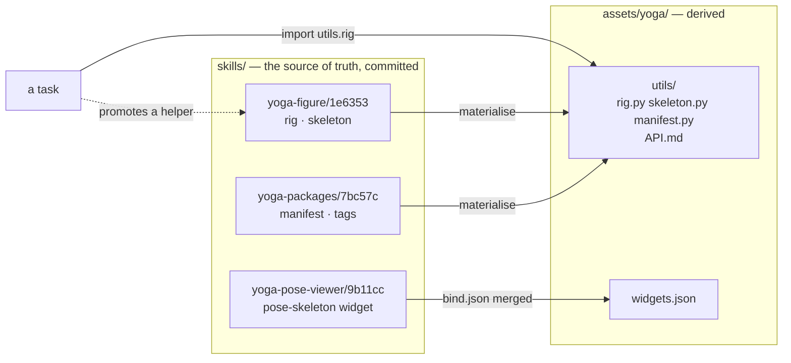
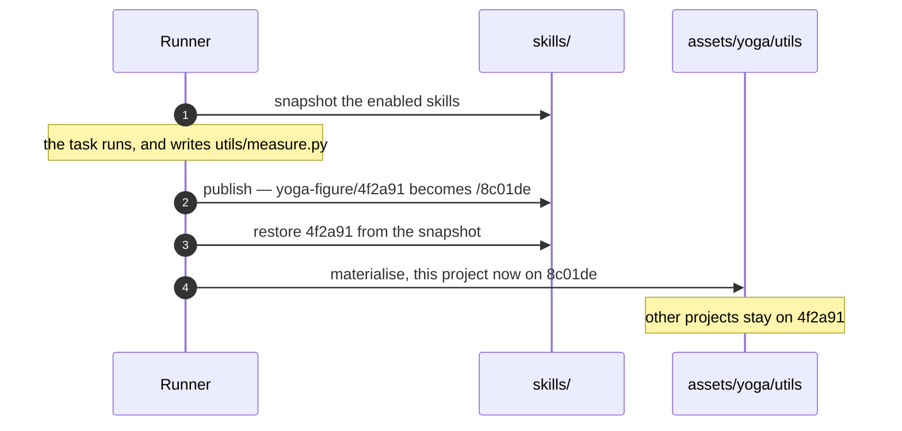
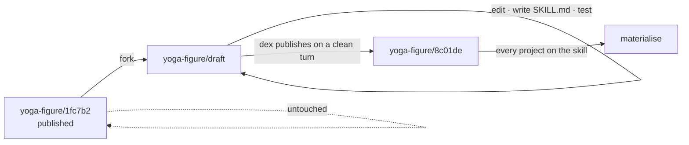

# 15 · Skills

## Summary

A project's capability — the helpers its tasks import, the widgets that open
its files, the paragraphs of guide explaining both — is today spread across
four directories and one thing that does not exist anywhere: the Python
packages it needs. Copying "what makes yoga work" to another dex means finding
all of it by hand and guessing the rest.

A **skill** is that capability as one committed directory, shareable between
projects and between installs. It is the *source of truth*: when a task
promotes a helper, the helper lands in the skill and the skill's version
changes. What a project sees in `utils/` is materialised from the skills it has
enabled.

| Module | Responsibility |
|---|---|
| `src/dex/skills.py` | Read a skill, hash it, enable and disable it, materialise `utils/` |
| `src/dex/api.py` | `GET /skills`, `POST /skills/{name}/projects/{slug}` |
| `src/dex/runner.py` | Each enabled skill's `SKILL.md` appended to the brief |
| `web/src/components/SkillAdmin.tsx` | The admin list, with a checkbox per project |

---

## What a skill is

```
skills/yoga-figure/1fc7b2/          # <name>/<version> — see Versions
  SKILL.md            # what it is, and how an agent uses it
  skill.json          # {name, version, updated, description, requires}
  requirements.txt    # numpy, scipy — declared, at last
  utils/
    rig.py
    skeleton.py
    tests/
  widgets/
    <name>/
      widget.json
      src/index.ts
      dist/index.js   # committed, see below
      test/
  bind.json           # the widgets.json rules this skill contributes
```

Everything is committed, `dist/` included. Building a widget needs node and
vite; an install that has to run a bundler is an install that fails on a
machine without one, and the bundle is the thing being shipped. The source
ships beside it so the next change is reviewable.

---

## Where it lives, and where it is used



**`assets/<project>/utils/` is derived state.** This is forced, not chosen.
147 generated packages do `sys.path.insert(0, HERE.parent)` and then
`import utils.rig`; that path is a runtime contract for work already on disk,
so utils cannot move into `skills/` and be imported from there. Materialising
keeps every one of those packages working while the skill stays the thing that
is edited.

It is also not a new idea here: `utils/API.md` is *already* generated on every
run by `_refresh_utils_index`. This extends the same treatment to the modules
beside it.

### What that costs

A task that edits `utils/rig.py` in place loses the edit at the next
materialise. So the guides must send utils changes to the skill, and the
runner's `extra_writable` must include the enabled skills' `utils/`
directories. This is the one genuinely invasive part of the change and the
part to get right first.

---

## Versions

Every skill carries a **5–6 character content hash**, and a version is a
**subdirectory**: `skills/yoga-figure/1fc7b2/`. That is what makes two versions
able to sit side by side, which is what migration is — a newer one arrives from
another install, both are on disk, and a project moves across when somebody
ticks it. A version kept only inside `skill.json` would mean the arriving copy
overwrote the one in use.

Nested rather than a flat `yoga-figure@1fc7b2` at the top level, so `skills/` lists
the capabilities an install has — one entry each, not one per version of each.
Ten versions of three skills is three directories here and thirty in a flat
layout.

**The directory is the identity** — the parent names the skill, the child names
the version. `skill.json` records both, so a copied directory can be checked
against what it claims to be, but a rename is what changes a version, never an
edit to the manifest. A version directory whose name is not a real digest has
not been published yet; `publish()` renames it to one.

The hash covers each file's contents and its path *relative to the skill root*,
so the directory's own name does not feed into it. No circularity.

Conflicts are explicitly **not** dex's problem. Two installs that both edit a
skill produce two hashes and diverge; reconciling them is git's job.

### Publishing, when dex is what changed it

A task writes into the versioned directory it was told about, so by the time it
finishes that directory no longer matches its own name. Publishing renames it
to the new version — and the version it *was* has to survive that, or every
other project still recorded against it breaks.

So the runner copies the enabled skills aside before the agent can write to
one. Skills are small (668 KB is the largest here), which makes that a cheap
way to keep "two versions coexist" true even when dex itself is the one
changing them.



**A promotion moves only the project whose task made it.** Before the version
was in the directory name, publishing moved every project with that skill
enabled at once. Now the others stay where they are until somebody ticks them
across — which is what makes it a decision taken rather than one that happens
to them.

---

## Naming

A widget is named for **what it views**, never for the act of viewing.
`bitext`, `music-score`, `pose-3d` — not `viewer`, not `display`. Two skills
offering the same widget name collide, and the collision is refused when the
second is enabled, naming both skills and asking for a rename. There is no
merge rule and no precedence order; an install with two things called `viewer`
is an install where nobody can say which one opens a file.

The same applies to util module names: two enabled skills cannot both provide
`utils/manifest.py`.

---

## Enabling

A skill is enabled per project, by an admin.

| Route | Does |
|---|---|
| `GET /api/skills` | Every skill: name, version, updated, description, and which projects use it |
| `POST /api/skills/{name}/projects/{slug}?version=` | Enable that version — check collisions, merge `bind.json`, materialise |
| `DELETE /api/skills/{name}/projects/{slug}?version=` | Disable — remove its modules and rules, re-materialise what is left |

Enabling a version **replaces** whatever version of that name the project was
on. A project is on one version of a skill; two would provide the same modules
and the collision check would refuse them anyway.

Admin-only, like the cost dashboard and user administration: enabling a skill
changes what every task in that project can import, which is not a per-operator
decision.

The UI is **a row per skill**, with the versions as a dropdown. An install that
has published a skill ten times has one capability, not ten, and ten rows would
bury the thing an operator acts on — the ticks — under the skill's own history.

The dropdown opens on the current version and **follows a publish**: the list
reloads after any change, so the default is always the version you would want
and an older one is a deliberate choice rather than something you drift into. A
row showing an older version is marked *older*, and a project on a different
version of the same skill shows which, because ticking moves it.

### What enabling writes

1. `assets/<project>/utils/` — each enabled skill's modules, then a regenerated
   `API.md` across all of them.
2. `assets/<project>/widgets.json` — the union of the enabled skills'
   `bind.json` rules, first-match-wins in enable order.
3. `assets/<project>/skills.json` — which skills are on, and at which version.
   That pairing is what makes a project reproducible on another install: the
   name alone would not say which of two directories it meant.

---

## What an agent is told

**Three documents, and two tiers.**

A brief carries, in order:

1. **`AGENTS.common.md`** — the same in every project: the environment, the
   operator's source material, how viewers bind, how a helper becomes shared.
2. **`assets/<project>/AGENTS.md`** — what *this* project produces, and its
   conventions. Nothing else.
3. **The skill roster** — one line per enabled skill: name, description, where
   it is.

Then, on demand, the agent reads a skill's **`SKILL.md`**.

That last split is the two tiers, and it is how agent harnesses generally do
this — Claude Code's own skills work the same way. The roster costs a line per
skill however many there are, and is what makes an agent *know* a capability
exists; putting every `SKILL.md` in every brief would be thousands of tokens of
instructions for capabilities most tasks never touch, growing without limit.

So the **description is load-bearing**: it is the only thing an agent sees when
deciding whether to look further.

Making each skill a *tool* was the alternative and is worse: tool definitions
cost more than a roster line, sit in every request whether relevant or not, and
"call the tool to find out what it says" is reading the file with extra
plumbing in the way. The agent already has `Read`.

### Why the common guide exists

`AGENTS.md` used to be one file copied into every project. Measured before the
split: **289 lines were identical across all four guides**, and 66–81% of each
came from the template. A fix to one of them reached nobody else.

Per-section similarity made the seam obvious:

| Section | Similarity across the four | Went to |
|---|---|---|
| Data directory · Viewers · Shared utilities | 93–100% | the common guide |
| What to produce · Conventions · preamble | 0–28% | stayed per project |

| | before | after |
|---|---|---|
| `algorithms` | 825 | 406 |
| `music` | 498 | 59 |
| `traduceri` | 533 | 107 |
| `yoga` | 616 | 200 |
| `AGENTS.template` | 420 | 12 — a seed, not a protocol |

It is `AGENTS.common.md`, not `AGENTS.md`, because the repository root already
has an `AGENTS.md`: instructions for whoever is working on dex itself.

---

## Authoring a skill

A published `skills/<name>@<hash>/` is what some project is running on and what
another install may have copied. Its version *is* a hash of its contents, so
editing it in place leaves the name describing something that no longer exists.

So the design chat works on a copy:



1. **Fork** — copy the published version to `skills/<name>/draft/`. A new
   skill starts as an empty draft.
2. **Change only the draft.** A directory whose version is not a real digest
   *is* a draft; nothing else is.
3. **Write the `SKILL.md`**, because every task using the skill reads it.
4. **Test with fixtures**, in the draft, before finishing.
5. **Stop.** dex publishes on a clean turn: it computes the real version,
   renames, sweeps build artefacts a rename carried along, and moves every
   project.

### Who moves, and why it differs

| Changed by | Moves |
|---|---|
| A task promoting a helper | Only its own project |
| A design turn | **Every project on that skill** |

A task writing a helper is doing it in passing, so changing other projects
underneath them would be a decision nobody took. A design turn changed the
skill on purpose and tested it — leaving projects behind would mean the thing
just designed is running nowhere.

A draft that hashes to a version already on disk changed nothing that matters;
it is discarded and the projects move onto what is already there.

### Editing them

The design thread's guide pane is a picker: the project's own brief, and a tab
per enabled skill. Selecting one shows its `SKILL.md`.

**Saving a skill's instructions publishes a new version of it.** Never in
place — a published version is what some project is running on and what another
install may have copied, and its version is a hash of its contents, so an edit
would leave the name describing something that no longer exists. The route
forks, writes the fork, and publishes; every project on that skill moves, and
the version being read stays on disk. The pane says so before you type and
reports what moved after you save.

| Route | Does |
|---|---|
| `GET /api/projects/{slug}/skills` | What this project has on, for the picker |
| `GET /api/skills/{name}/doc?version=` | One skill's `SKILL.md` |
| `PUT /api/skills/{name}/doc?version=` | Fork, write, publish, move every project on it |

Switching tabs is blocked while there are unsaved edits, because switching
would drop them.


---

## What is in skills now

Every widget and every shared module in the install, across all four projects.

| Skill | Carries | Needs |
|---|---|---|
| `yoga-figure` | `rig.py`, `skeleton.py` | — |
| `yoga-packages` | `manifest.py` — tags and manifest validation | — |
| `yoga-pose-viewer` | the `pose-skeleton` widget | — |
| `music-synth` | `synth.py` | numpy, scipy |
| `music-packages` | scorepack · harmony · player + the `music-score` widget | numpy, pretty_midi |
| `traduceri-bitext` | `bitext_checks.py` + the `bitext` widget | — |
| `traduceri-sources` | `chunking.py`, `mediawiki.py` | bs4 |
| `narrated-video` | the widget, and nothing else | — |

Requirements were found by parsing each module's imports, not by reading its
docstrings — these modules teach by example, and `import numpy` inside a
docstring is not a dependency.

The split follows one rule: a skill that is *mechanism* stays separate from a
skill that is a *project's conventions*. `music-synth` renders MIDI to audio
and is useful to anything making audio; `music-packages` knows what a Music
package is and is useful to nobody else. Same seam in yoga and traduceri.

### The pose viewer stops being built in

There are two pose viewers today, and the better one is in the wrong place.

| | Where | What |
|---|---|---|
| The good one | `web/src/components/PoseViewer3D.tsx` | 246 lines, ships inside dex, colours left and right differently, draws from shared `BONES` / `LANDMARKS` tables |
| The demo | `widgets/pose-3d/` | 164 lines, its own bone table. Its docstring: *"rebuilt as a widget to prove the contract against something real"* |

**Both are in use right now**, and which one you get depends on the filename.
`assets/yoga/widgets.json` binds the demo to `*_pose.json`, `*_posture.json`
and `.pose.json`; everything else falls through to `isPose()` and the built-in:

| Pose files | Drawn by |
|---|---|
| 83 | the demo widget |
| 38 | the built-in viewer |

Two different drawings of the same skeleton, split by a naming accident. That
is the strongest argument for doing this at all.

So the third skill is the good one, **ported into a widget**:

| Skill | Contents |
|---|---|
| `yoga-pose-viewer` | A widget carrying the built-in viewer's drawing, bound to `*_pose.json`, `*_posture.json`, `.pose.json` |

This is the part of the pilot that earns the most. Dex core currently knows
what a yoga pose *is* — four places do:

- `web/src/pose.ts` — `LANDMARKS`, `BONES`, `isPose`
- `web/src/types.ts` — the `Pose` type
- `web/src/components/PoseViewer3D.tsx` — the viewer itself
- `web/src/components/Viewer.tsx` — the lazy import and the `isPose` branch

All four go. Afterwards the viewer has no opinion about poses at all: a project
says which widget opens which file, and that is the only thing that decides.
One project's subject matter stops being compiled into everybody's UI.

`widgets/pose-3d/` is deleted with it. Keeping a second, worse drawing of the
same figure as a "reference implementation" is how there came to be two in the
first place; the ported widget is the worked example.

### What committing `dist/` costs

Worth stating before it is a surprise. A widget is bundled whole, because it
runs in a sandboxed frame with an opaque origin and cannot import anything at
runtime — so a widget that draws in 3D carries its own copy of three.js:

| Bundle | Size |
|---|---|
| `yoga-pose-viewer` (three.js) | ~550–630 kB |
| `music-score` (no 3D) | 18 kB |

Committed, that is a real half-megabyte per 3D widget, and two skills that both
draw in 3D carry two copies. The alternative — building on install — needs node
and vite wherever a skill lands, which is the worse trade for something meant
to be portable.

### `dist/` is not part of a version

A bundle embeds the path of the source it was built from. That path contains
the version, and the version is a hash of the directory — so publishing renamed
the directory, which changed the bundle, which changed the hash, which demanded
another publish. A skill with a widget could never reach a stable version.

So **a version describes a skill's source**, and `dist/` is excluded from the
hash for the same reason `__pycache__` is: it is build output. Nothing needs
the hash to notice a rebuild — `available()` reports whether a widget is built,
and its URL carries the bundle's own mtime as the cache key.

A consequence worth knowing: **moving a widget skill invalidates its bundle**,
because the embedded path changes. Rebuild after any relocation.

---

## Migration — how it went

Each step was verified before the next, and all five are done.

1. **Extract, change nothing.** `skills/yoga-figure` and `skills/yoga-packages`
   built from what was on disk; the modules asserted byte-identical to the live
   ones, `requirements.txt` frozen by an AST scan of real imports rather than
   grep (these modules teach by example, and `import numpy` inside a docstring
   is not a dependency — both yoga skills need nothing beyond the standard
   library). `assets/yoga/` had zero changes.
2. **Materialise, and prove it a no-op.** `assets/yoga/utils/` came out
   byte-identical, `widgets.json` untouched, and mtimes preserved — which
   matters because `_refresh_utils_index` rebuilds `API.md` whenever a module
   is newer than it, so rewriting every file every run would rebuild the index
   on every task for nothing.
3. **Port the viewer.** `yoga-pose-viewer` carries the drawing dex used to ship
   built in; `PoseViewer3D.tsx`, `pose.ts`, the `Pose` type, the `isPose`
   branch and `widgets/pose-3d/` are all gone, and three.js left the app bundle
   with them. All 121 pose files now resolve to one viewer instead of splitting
   83/38 on a naming accident.
4. **Point writes at the skill.** Guides, `extra_writable` and the promotion
   question all name `skills/<name>/utils/`; the brief carries the enabled list
   so a task cannot name a skill that was turned off last week.
5. **The admin table**, a row per version with a checkbox per project.

Two bugs the tests caught, both worth recording because neither was visible
from reading the code:

- `resync` compared each skill against **its own manifest**, so the first
  project to resync re-stamped it and every other project with it enabled
  stayed on old modules for ever. It compares against what the *project*
  recorded now.
- The widget rule matcher only ever saw the **basename**, so `*/poses/*.json`
  could not match. `paths` was added for it — and then `excludes`, because that
  pattern also caught the `manifest.json` of a package that happens to be
  called `poses`.

---

## Open, and deliberately unanswered

- **Dependency conflicts.** Two skills pinning different numpy versions. There
  is one venv, so the answer is probably "last enable wins, and say so loudly",
  but nothing forces the question until a second skill declares a version.
- **A skill's own tests.** `utils/tests/` is in the layout above and nothing
  runs them yet.

---

## Improvement opportunities

- **Dependency conflicts have no answer yet.** Two skills pinning different
  versions of numpy share one venv, and nothing detects it. Probably "last
  enable wins, and say so loudly", but nothing forces the question until a
  second skill declares a version.
- **A skill's own tests never run.** `utils/tests/` is in the layout and
  Playwright specs sit inside widget skills; neither is tied to publishing, so
  a broken skill can be published and adopted by every project on it.
- **Two versions of a widget skill duplicate the bundle** — ~630 kB each,
  committed. Keeping a prior version for rollback is the point, but the cost is
  paid in the repository.
- **Nothing garbage-collects old versions.** They accumulate, and the only
  thing that says a version is unused is reading every project's
  `skills.json`.
- **A skill copied in by hand is trusted.** `publish` re-versions it if its
  contents disagree with its name, but nothing checks that its `requires` are
  installed or that its modules import.

---

## See also

- [06](06_widgets.md) — the widget contract a skill packages
- [08](08_shared_utilities.md) — how `utils/` and `API.md` work today
- [05](05_project_design.md) — the design chat, which will author into skills
